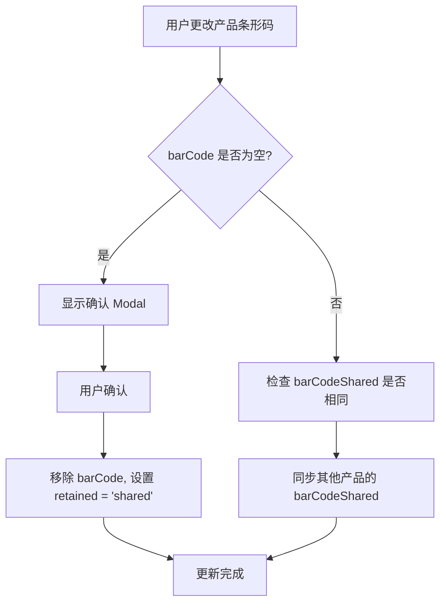
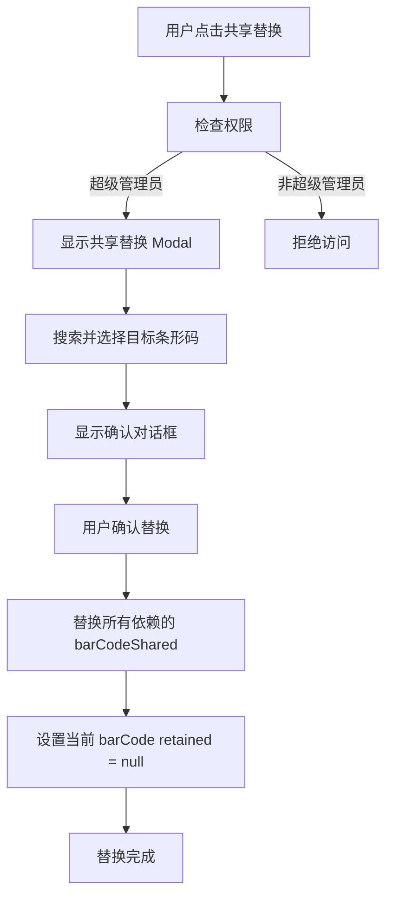

# 条形码管理系统 (BarCode Management System)

## 概述

条形码管理系统负责处理产品条形码的创建、更新、共享和替换功能。系统支持条形码的共享机制，允许多个产品使用相同的条形码，并提供条形码替换功能来管理依赖关系。

## 核心概念

### 1. 条形码状态 (BarCode Status)

- **active**: 正常使用的条形码
- **shared**: 共享保留状态，表示该条形码被其他产品作为 barCodeShared 使用
- **null**: 未使用状态

### 2. 条形码保留状态枚举 (epBarCodeRetained)

```typescript
export enum epBarCodeRetained {
  SHARED = 'shared',       // 共享保留 - 表示该条形码被其他产品作为 barCodeShared 使用
  UNSET = 'unset'          // 未设置 - 条形码未被使用或已释放
}
```

**数据库映射**：
- `epBarCodeRetained.SHARED` → 数据库存储 `'shared'`
- `epBarCodeRetained.UNSET` → 数据库存储 `NULL`
- 前端显示时，`null`、`undefined` 和 `epBarCodeRetained.UNSET` 都视为未设置状态

### 3. 条形码字段

- **barCode**: 产品的主要条形码
- **barCodeShared**: 产品共享的条形码（引用其他产品的 barCode）
- **retained**: 条形码保留状态（epBarCodeRetained.UNSET, epBarCodeRetained.SHARED）

## 系统架构

### 后端 API

#### 1. 产品条形码更新 API

**端点**: `PUT /api/products/:id/barcode`

**功能**: 更新产品的条形码信息

**逻辑**:
- 当更改 barCode 时：
  - 如果新 barCode 与旧 barCode 不同，但 barCodeShared 相同
  - 同步所有其他产品的 barCodeShared 值（从旧 barCode 更新为新 barCode）
- 当 barCode 设为空值（解绑）时：
  - 只移除 barCode，barCodeShared 暂时保留
  - 在 product_barcodes 表中设置 'retained' 为 'shared'

**请求体**:
```typescript
{
  barCode: string | null;
  barCodeShared: string | null;
}
```

**响应**:
```typescript
{
  success: boolean;
  message: string;
  data: {
    productId: string;
    barCode: string | null;
    barCodeShared: string | null;
    retained: string | null;
  };
}
```

#### 2. 条形码共享替换 API

**端点**: `POST /api/barcodes/:barcodeId/replace-shared`

**功能**: 替换所有依赖指定条形码的产品的 barCodeShared 值

**权限**: 仅超级管理员

**逻辑**:
- 查找所有 barCodeShared 等于当前 barCode 的产品
- 将这些产品的 barCodeShared 更新为选中的新条形码
- 设置当前 barCode 的 retained 为 null（因为替换后没有共享依赖了）

**请求体**:
```typescript
{
  targetBarCode: string;
  targetProductId: string;
}
```

**响应**:
```typescript
{
  success: boolean;
  message: string;
  data: {
    replacedCount: number;
    replacedProducts: Array<{
      productId: string;
      productName: string;
      oldBarCodeShared: string;
      newBarCodeShared: string;
    }>;
  };
}
```

#### 3. 获取可用条形码 API

**端点**: `GET /api/barcodes/available`

**功能**: 获取可用的条形码列表（用于 barCodeShared 下拉菜单）

**过滤条件**: 过滤掉 retained 不为 null 的 barCode（避免显示没有产品绑定的 barCode）

**查询参数**:
- `search`: 搜索关键词
- `page`: 页码
- `limit`: 每页数量

**响应**:
```typescript
{
  success: boolean;
  data: {
    barcodes: Array<{
      barCode: string;
      productId: string;
      productName: string;
      dependenciesCount: number;
      isDependent: boolean; // 是否与当前条形码有依赖关系
    }>;
    pagination: {
      page: number;
      limit: number;
      total: number;
      totalPages: number;
    };
  };
}
```

### 前端组件

#### 1. 条形码更改确认 Modal

**组件**: `BarCodeChangeConfirmModal`

**功能**: 当用户更改产品条形码时显示确认对话框

**内容**:
- 警告信息：如果更改 barCode，必须确认所有合作伙伴同步更新他们的产品条形码记录，否则更新后产品将无法扫描
- 确认/取消按钮

**使用场景**: 产品编辑页面，条形码字段更改时

#### 2. 条形码共享替换 Modal

**组件**: `BarCodeShareReplaceModal`

**功能**: 可重用的条形码共享替换弹窗

**特性**:
- 搜索功能，支持滚动懒加载
- 显示产品名和条形码值（不分行显示）
- 显示依赖数量（如果有）
- 当前 barCode 的依赖产品添加特别样式
- 过滤掉当前产品
- 仅超级管理员可见

**UI 元素**:
- 搜索输入框
- 产品列表（懒加载）
- 确认/取消按钮

#### 3. 条形码显示组件

**组件**: `BarCodeDisplay`

**功能**: 在 CMS 产品条形码页面显示条形码信息

**显示逻辑**:
- **retained 为 'shared'**: 显示绿色"共享保留"样式
- **barCode 和 barCodeShared 一样**: 显示"共享替换"按钮
- 普通条形码：正常显示

**样式**:
- 共享保留：绿色条形码样式 + "共享保留"文本
- 共享替换按钮：仅当 barCode === barCodeShared 时显示

## 数据库设计

### product_barcodes 表

```sql
CREATE TABLE product_barcodes (
  id VARCHAR(255) PRIMARY KEY,
  product_id VARCHAR(255) NOT NULL,
  bar_code VARCHAR(255) UNIQUE,
  bar_code_shared VARCHAR(255),
  retained ENUM('shared') NULL,
  created_at TIMESTAMP DEFAULT CURRENT_TIMESTAMP,
  updated_at TIMESTAMP DEFAULT CURRENT_TIMESTAMP ON UPDATE CURRENT_TIMESTAMP,
  
  INDEX idx_bar_code (bar_code),
  INDEX idx_bar_code_shared (bar_code_shared),
  INDEX idx_retained (retained),
  FOREIGN KEY (product_id) REFERENCES products(id) ON DELETE CASCADE
);
```

### 索引优化

- `bar_code`: 用于快速查找条形码
- `bar_code_shared`: 用于查找依赖关系
- `retained`: 用于过滤可用条形码

## 业务流程

### 1. 产品条形码更新流程



### 2. 条形码共享替换流程



## 权限控制

### 超级管理员权限
- 使用条形码共享替换功能
- 查看所有条形码的依赖关系
- 执行条形码替换操作

### 管理员权限（默认）
- 查看产品条形码信息
- 更新产品条形码（需要确认）
- 查看条形码共享状态
- 管理产品条形码绑定

### 普通用户权限
- 无条形码管理权限

## 错误处理

### 常见错误场景

1. **条形码冲突**: 尝试使用已存在的条形码
2. **权限不足**: 非超级管理员尝试使用共享替换功能
3. **依赖关系错误**: 尝试替换不存在的依赖关系
4. **网络错误**: API 调用失败

### 错误响应格式

```typescript
{
  success: false;
  error: {
    code: string;
    message: string;
    details?: any;
  };
}
```

## 性能优化

### 1. 数据库优化
- 使用适当的索引
- 避免 N+1 查询问题
- 使用分页加载条形码列表

### 2. 前端优化
- 懒加载条形码列表
- 防抖搜索输入
- 缓存条形码数据

### 3. 缓存策略
- 缓存可用条形码列表
- 缓存产品依赖关系
- 使用 Redis 缓存频繁查询的数据

## 测试策略

### 单元测试
- 条形码更新逻辑测试
- 共享替换逻辑测试
- 权限验证测试

### 集成测试
- API 端点测试
- 数据库操作测试
- 前端组件交互测试

### 端到端测试
- 完整的条形码管理流程测试
- 权限控制测试
- 错误处理测试

## 部署注意事项

### 1. 数据库迁移
- 确保 product_barcodes 表结构正确
- 创建必要的索引
- 处理现有数据的迁移

### 2. 数据清理
- 运行 `1710000000167_test_barcode_shared_cleanup.sql` 分析现有数据
- 运行 `1710000000169_cleanup_barcode_shared_values.sql` 清理 barCodeShared 字段
- 确保清理后的数据符合新的逻辑

### 3. 权限配置
- 配置超级管理员权限
- 设置管理员默认权限
- 设置 API 访问控制
- 配置前端路由权限

### 4. 监控和日志
- 监控条形码操作日志
- 记录权限验证失败
- 监控 API 性能

## 维护指南

### 定期维护任务
1. 清理无效的条形码记录
2. 优化数据库索引
3. 更新权限配置
4. 监控系统性能

### 故障排除
1. 检查数据库连接
2. 验证权限配置
3. 查看错误日志
4. 测试 API 端点

## 版本历史

### v1.0.0
- 初始版本
- 基本的条形码管理功能
- 共享替换功能
- 权限控制

---

*最后更新: 2024年12月*
