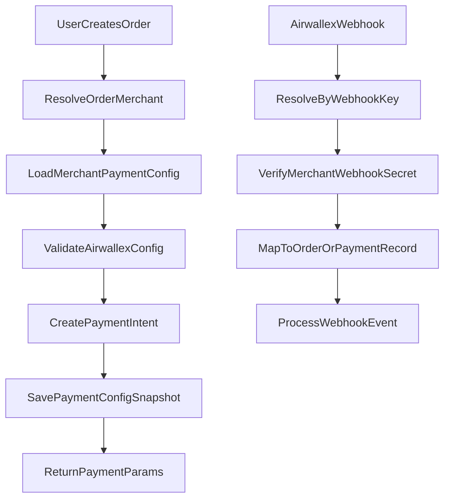
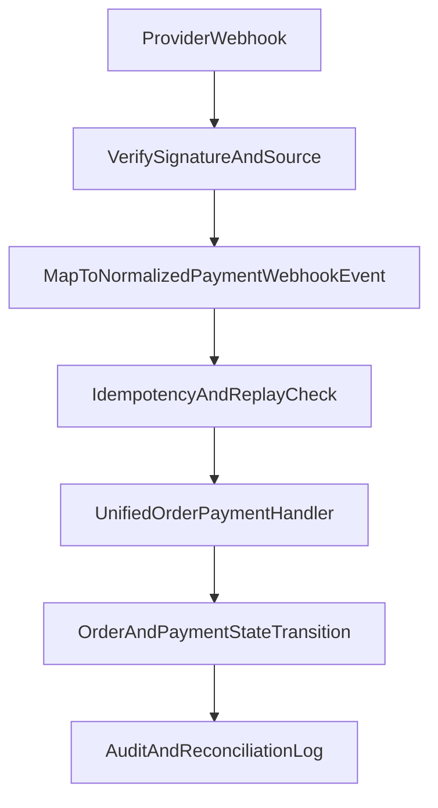

# Airwallex Merchant-Owned Payment Phased Design

## 文档目的

这份文档是当前支付改造计划的详细 handoff companion。

它不是执行清单，而是用于固定以下信息：

- 本期要做什么、不做什么
- 与 `merchant`、`MoR`、支付账户归属相关的业务语义
- 阶段一、阶段二、阶段三的清晰边界
- 未来平台代售与供货双账的明确方向
- 让新的 AI chat 在没有完整聊天上下文时，也能尽量恢复设计意图

建议配合 plan 文件一起使用：

- `c:\Users\lance\.cursor\plans\airwallex_multi-merchant_5e6aa253.plan.md`

## 术语表

为了避免后续聊天或实现时反复混淆，以下术语建议固定使用：

### `merchant`

统一业务主体。包括：

- 平台拥有的 merchant
- 普通第三方 merchant

平台本身也应该通过 merchant 体系表达，而不是长期维护一个完全平行的“平台支付主体”逻辑。

### `platform-owned merchant`

属于平台控制和运营的 merchant。  
它仍然是 merchant，只是 identity 和能力范围有特殊性。

### `third-party merchant`

普通入驻 merchant。

### `merchant-owned payment account`

商户自己持有并管理的支付账户。  
例如：

- merchant 自己的 Airwallex 单商户账户
- merchant 自己的 Stripe 账户 / connected account

### `platform-owned payment account`

平台 merchant 对应的支付账户。  
未来平台自营或平台代售时，可能走这个账户。

### `merchant_mor`

商户作为 `Merchant of Record`。  
客户更像是在向该 merchant 购买。

### `platform_mor`

平台作为 `Merchant of Record`。  
客户更像是在向平台购买。

### `product owner merchant`

商品归属 merchant。  
商品数据、商品所有权、供货归属在这个 merchant 下。

### `selling merchant`

对客户发生销售行为的 merchant。  
未来平台代售时，`selling merchant` 可能是平台 merchant，而 `product owner merchant` 是供货商 merchant。

### `payee merchant`

对应这笔订单支付收款账户归属的 merchant。  
在未来平台代售场景里，`payee merchant` 可能是平台 merchant。

### `provider`

支付服务商，例如：

- `airwallex`
- `stripe`

### `providerMode`

支付账户模式，例如：

- `single_account`
- `connected_account`

### `settlementModel`

结算模型，例如：

- `direct_sale`
- `commission`
- `supplier_wholesale`

## 核心业务原则

### 1. 平台也是 merchant

平台应该被建模成一个普通 `merchant`，而不是 merchant 体系之外的独立支付/业务对象。

含义：

- payment settings 统一挂在 merchant settings
- platform-owned merchant 和 third-party merchant 共用 merchant 管理体系
- 行为差异尽量通过 merchant identity 和配置表达，而不是到处写平台 role 分叉

### 2. 支付账户设置属于 merchant settings

无论是：

- platform-owned merchant
- third-party merchant

支付配置都应该通过同一套 merchant-scoped payment setting 管理。

系统应尽量避免为了平台逻辑再长期维护一套平行的支付配置模型。

### 3. 当前阶段只支持 merchant-owned Airwallex

当前实现目标：

- 每个 merchant 有自己的 Airwallex 单商户凭据
- 不再回退使用旧的全局 `.env` 运行时配置
- merchant 没有有效 Airwallex 配置时，Airwallex 支付创建必须失败

本阶段不实现：

- platform merchant 支付执行
- Stripe provider 统一抽象
- Airwallex platform / connected-account 模式
- 平台代售供货双账

### 4. 未来平台代售不等于商品归属转移

这是一个必须保留的未来语义：

- 供货商 merchant 仍然拥有商品归属
- 平台可以在平台支付 / `platform_mor` 模式下代售供货商商品
- 这不意味着商品会被复制到平台 merchant 名下成为平台自有商品

因此未来设计里，这几个概念可以不同：

- `product owner merchant`
- `selling merchant`
- `payee merchant`

它们不一定总是同一个 merchant。

## 阶段划分

## 阶段一：Merchant-Owned Airwallex Refactor

### 目标

把当前全局写死的 Airwallex 实现改成 merchant-scoped 配置与运行时解析。

### 必须交付

- merchant 级 Airwallex 凭据
- merchant Airwallex secret 的加密存储
- merchant 级 webhook 路由与验签
- merchant 级 token cache 隔离
- 支付/退款记录绑定创建时使用的 merchant payment config 快照

### 必须满足的行为

- 每次 Airwallex 支付/退款调用都先解析 merchant payment config
- webhook 验签使用 merchant 自己的 webhook secret
- 旧的全局 `.env` 运行时配置不再作为 fallback
- merchant 配置变化后，历史记录仍然可退款、可查单、可处理 webhook

### 推荐配置结构

merchant payment settings 至少应支持：

- `provider`
- `mode`
- `status`
- `providerMode`
- `morModel`
- `settlementModel`
- `baseUrl`
- `webhookKey`
- encrypted Airwallex credentials

在阶段一，实际值受限为：

- `provider = airwallex`
- `providerMode = single_account`
- `morModel = merchant_mor`
- `settlementModel = direct_sale`

### 本阶段明确不做

- platform-owned merchant payment execution
- Stripe provider abstraction
- supplier resale UI
- tax / reporting redesign

### 阶段一建议字段预留

即使阶段一只实现 Airwallex 单商户，也建议在模型上预留这些稳定字段：

- `provider`
- `providerMode`
- `morModel`
- `settlementModel`
- `webhookKey`
- `paymentProviderConfigId`

建议支付记录至少保留：

- `provider`
- `providerMode`
- `morModel`
- `providerConfigSnapshotId`
- `providerPaymentIntentId`

### 阶段一推荐流程



### 阶段一失败策略

- merchant 没有 Airwallex 配置：直接失败，不回退 `.env`
- webhook 找不到 merchant 配置：进入 unmatched webhook 处理逻辑
- merchant 更换配置：新单用新配置，旧单继续按旧快照处理

## 阶段二：Airwallex Merchant-Owned + Stripe Platform 并存

### 阶段目标（已确认）

在保留现有 Airwallex 单商户方案的前提下，新增 Stripe 平台支付方案，并让两个 provider 的 webhook 统一挂到同一条订单状态处理主链路。

本阶段是“并存 + 统一事件入口”，不是“全 provider 完全抽象重写”。

### 范围内

- 保留并继续使用 Airwallex `single_account`（merchant-owned）支付流程
- 新增 Stripe 平台账户支付流程（platform-owned）
- 分别实现 Airwallex webhook 与 Stripe webhook 的验签与来源识别
- 新增 provider 到统一领域事件对象的映射层
- 统一进入现有订单/支付状态处理逻辑（handler/service）
- 预留未来 Airwallex 平台支付模式兼容字段与路由能力
- 平台抽成先使用平台固定规则：`5%`
- 抽成配置存放在 `platform settings`，并按权限控制为“CMS 可读、客户端不可读”

### 范围外

- 不在本阶段实现 Airwallex platform/connected 实际支付链路
- 不在本阶段实现平台代售供货双账
- 不在本阶段重做税务和财务报表体系

### 统一 webhook 标准对象（建议）

新增标准对象，作为“provider webhook -> 订单处理主链路”的唯一输入。

建议命名：`NormalizedPaymentWebhookEvent`

建议字段：

- `eventId`
- `eventType`
- `provider`
- `providerMode`
- `merchantId`
- `paymentProviderConfigId`
- `providerPaymentIntentId`
- `providerRefundId`（可空）
- `orderId`（可空，允许先按 payment 反查）
- `occurredAt`
- `rawPayload`（保留原始内容和原始结构）
- `signatureVerified`
- `isReplay`

约束：

- 订单处理层只消费 `NormalizedPaymentWebhookEvent`，不直接解析 provider 原始 payload
- 同一 `eventId + provider` 必须幂等
- 无法映射 `merchantId` 或订单时进入 unmatched 队列，不可静默丢弃

### 阶段二处理流程



### 配置模型（阶段二落地值）

#### Airwallex merchant-owned（保留）

- `provider = airwallex`
- `providerMode = single_account`
- `morModel = merchant_mor`
- `settlementModel = direct_sale`

#### Stripe platform-owned（新增）

- `provider = stripe`
- `providerMode = single_account`（本阶段按平台单账户）
- `morModel = platform_mor`
- `settlementModel = commission`

### Stripe 抽成规则（当前阶段）

- 当前只支持平台固定抽成：`commissionRate = 0.05`
- 规则配置来源：`platform settings`
- 可见性约束：
  - CMS 可读
  - 客户端不可读
- 订单创建时必须固化快照，避免未来规则变更影响历史单：
  - `commissionRateSnapshot = 0.05`
  - `commissionRuleVersion`（建议预留，当前可固定 `v1`）

#### 兼容预留（不实现执行，只保留模型）

- `provider = airwallex`
- `providerMode = connected_account`（未来）
- `morModel = platform_mor`（未来）
- `settlementModel = commission | supplier_wholesale`（未来）

### 阶段二交付清单

- 双 provider 支付配置契约与校验规则
- Airwallex webhook 路由与 Stripe webhook 路由（分开验签）
- `NormalizedPaymentWebhookEvent` 映射层与幂等处理
- 统一订单处理主链路接入（不破坏原业务 handler 语义）
- provider 配置快照和事件审计字段补齐

### 阶段二开发任务拆解（可直接排期）

#### 模块 A：配置与模型

- 在 merchant/platform settings 补齐 Stripe 平台配置读取契约
- 增加抽成配置读取能力：`commissionRate = 0.05`
- 明确配置可见性：CMS 可读、客户端不可读
- 支付记录补齐快照字段：
  - `commissionRateSnapshot`
  - `commissionRuleVersion`

#### 模块 B：支付创建主链路

- 在下单支付创建流程中按 provider 路由：
  - Airwallex -> 现有 merchant-owned 流程
  - Stripe -> 新增平台支付流程
- 统一写入支付快照字段（包括抽成快照）
- 保证历史记录后续退款/对账仍按快照执行

#### 模块 C：Webhook Provider 适配层

- Airwallex webhook 适配器：签名校验 + payload 映射
- Stripe webhook 适配器：签名校验 + payload 映射
- 两者统一输出 `NormalizedPaymentWebhookEvent`
- `rawPayload` 保存原始内容与结构

#### 模块 D：统一订单处理层接入

- 统一入口只接收 `NormalizedPaymentWebhookEvent`
- 复用现有 payment/refund handler 业务能力
- 明确 eventType 到订单状态迁移映射表
- unmatched 事件进入待处理队列，禁止静默丢弃

#### 模块 E：幂等与审计

- 幂等键：`provider + eventId`
- 重放检测：重复事件不重复迁移状态
- 审计字段：签名结果、处理结果、失败原因、重试次数
- 增加最小对账查询能力（按 provider、merchant、时间）

#### 模块 F：CMS 与运维联调

- CMS 可查看平台抽成配置（不可下发到客户端）
- 提供 webhook 最近处理结果查看能力
- 形成联调清单：
  - Airwallex 成功/失败/重放
  - Stripe 成功/失败/重放
  - 历史订单快照复算验证（5%）

### 阶段二文件级实施清单（建议）

以下为建议优先改动点，实际以代码现状为准：

- `xituan_backend/src/domains/payment/controllers/payment.controller.ts`
  - 增加 Stripe webhook 入口（或分发入口）
  - 保持 Airwallex webhook 与 Stripe webhook 分开验签流程
- `xituan_backend/src/domains/payment/routes/payment.routes.ts`
  - 注册 Stripe webhook 路由
  - 统一 webhook 路由命名规范，避免重复注册
- `xituan_backend/src/domains/payment/services/webhook-event.service.ts`
  - 新增统一事件入站方法：接收 `NormalizedPaymentWebhookEvent`
  - 增加 unmatched webhook 入队能力
- `xituan_backend/src/domains/payment/services/payment-business.service.ts`
  - 下单支付时写入 `commissionRateSnapshot` / `commissionRuleVersion`
  - provider 分流后的快照落库逻辑统一
- `xituan_backend/src/domains/payment/services/payment.handler.service.ts`
  - 按 normalized event 映射状态迁移，减少 provider 分支散落
- `xituan_backend/src/domains/payment/services/refund.handler.service.ts`
  - 保持 refund 侧与 payment 侧快照一致性校验
- `xituan_backend/src/domains/merchant/services/merchant-setting.service.ts`
  - 读取 Stripe 平台配置与平台固定抽成配置
  - 配置访问控制（CMS 可读、客户端不可读）
- `xituan_backend/submodules/xituan_codebase/typing_entity/merchant-setting.type.ts`
  - 增加平台抽成配置字段契约（固定 5% + 版本号预留）

### 阶段二统一事件契约（建议草案）

```ts
interface iNormalizedPaymentWebhookEvent {
  eventId: string;
  eventType: string;
  provider: string;
  providerMode: string;
  merchantId: number;
  paymentProviderConfigId: number;
  providerPaymentIntentId: string;
  providerRefundId?: string;
  orderId?: number;
  occurredAt: string;
  rawPayload: Record<string, unknown>;
  signatureVerified: boolean;
  isReplay: boolean;
}
```

约束补充：

- `rawPayload` 必须保留原始结构，不做结构重组
- `occurredAt` 统一使用 ISO datetime 字符串
- 日期型字段若单独落库，按系统规则使用 `YYYY-MM-DD`

### 阶段二联调用例矩阵（最小集）

- Case A1：Airwallex 支付成功 webhook
  - 期望：订单从待支付迁移到已支付；写入审计日志
- Case A2：Airwallex webhook 重放
  - 期望：命中幂等；状态不重复迁移
- Case S1：Stripe 支付成功 webhook
  - 期望：订单状态迁移成功；抽成快照为 `0.05`
- Case S2：Stripe 退款 webhook
  - 期望：退款状态迁移成功；历史抽成复算一致
- Case X1：签名校验失败
  - 期望：拒绝处理并记录失败审计
- Case X2：无法映射 merchant/order
  - 期望：进入 unmatched 队列并可在 CMS 查询

### 阶段二验收标准

- Airwallex webhook 可成功驱动对应订单状态流转
- Stripe webhook 可成功驱动对应订单状态流转
- Airwallex 事件不会误更新 Stripe 订单，反之亦然
- 商户/平台支付配置变更后，历史订单仍可按快照追溯处理
- 同一 webhook 重放不会导致重复状态迁移
- Stripe 订单可按 `commissionRateSnapshot = 0.05` 稳定复算历史抽成

## 阶段三：Platform Resale and Supplier Ledger（拆分 A/B/C）

### 总目标

实现平台代售供货商商品时的平台销售账与供货商供货账双账模型，并与当前零售订单体系解耦。

### Stage 3A（优先）：数据模型与状态基线

范围：

- 新建供货侧独立表（不复用 `merchant.orders`）
- 定义主表 + 明细表 + 状态字段 + 幂等键 + 审计字段
- 建立与平台零售订单的关联键（一对一或一对多策略）
- 定义必要索引与唯一约束

最低字段建议：

- `merchant_id`（供货商）
- `product_id`
- `platform_order_id`（平台侧零售订单引用）
- `supply_unit_price`
- `supply_quantity`
- `supply_subtotal`
- `supply_status`
- `source_event_id`
- `created_at` / `updated_at`

验收：

- 能稳定记录“平台卖出 -> 供货侧记账”基础数据
- 能按 merchant 与时间区间高效查询
- 幂等约束可阻止重复入账

### Stage 3B：业务流程与对账补偿

范围：

- 明确“平台销售完成 -> 供货记录生成/更新”流程
- 定义取消、退款、部分退款对供货记录的影响
- 定义异常补偿（漏单重放、重复事件、顺序错乱）
- 建立最小对账流程（平台销售账 vs 供货账）

验收：

- 全链路状态机可覆盖支付成功、退款、取消等关键分支
- 异常场景可自动或半自动补偿，不需要手工改库
- 对账报告可识别差异并给出可追溯事件链路

### Stage 3C：CMS/API 与运营落地

范围：

- CMS 增加供货管理入口（建议仍放合作伙伴管理分组）
- 增加查询、明细、筛选、导出、审计日志能力
- 定义角色权限（平台运营、财务、商户运营）
- 开放必要 API（列表、详情、重放/补偿触发）

验收：

- 运营可独立完成查询、追踪、导出与异常定位
- 权限隔离符合平台与商户数据边界
- 上线后不依赖开发人工介入日常对账

### 阶段三详细实施拆解（A / B / C）

#### Stage 3A 详细拆解（数据层）

数据对象建议：

- `platform_supply_ledger`（供货主表）
- `platform_supply_ledger_item`（供货明细）
- `platform_supply_ledger_event`（状态与补偿事件审计）

主表关键字段建议：

- `id`
- `merchant_id`（供货商）
- `platform_order_id`
- `ledger_no`
- `currency`
- `subtotal_amount`
- `adjustment_amount`
- `total_amount`
- `status`（draft/confirmed/adjusted/cancelled/refunded/closed）
- `idempotency_key`
- `source_event_id`
- `created_at` / `updated_at`

明细关键字段建议：

- `id`
- `ledger_id`
- `product_id`
- `sku_id`（可空）
- `quantity`
- `supply_unit_price`
- `line_subtotal`
- `line_adjustment`
- `line_total`

索引与约束建议：

- 唯一键：`idempotency_key`
- 索引：`merchant_id + created_at`
- 索引：`platform_order_id`
- 索引：`status + created_at`

Stage 3A DoD：

- 可稳定生成供货主表与明细记录
- 幂等写入可阻止重复入账
- 可按 merchant/time/order 维度高效查询

#### Stage 3B 详细拆解（流程与对账）

核心流程：

1. 平台零售订单支付成功
2. 根据订单商品归属生成或更新供货 ledger
3. 记录供货事件审计
4. 遇到退款/部分退款时按规则反向调整供货 ledger
5. 对账任务按日或按批次比对平台销售账与供货账

异常补偿策略：

- webhook 重放：幂等键拦截
- 事件乱序：允许延迟重算与重放补偿
- 漏事件：通过 reconciliation job 反查补单
- 状态冲突：进入人工审核队列并保留事件链路

对账最小维度：

- `platform_order_id`
- `merchant_id`
- `gross_sale_amount`
- `supply_total_amount`
- `platform_commission_amount`
- `reconcile_status`

Stage 3B DoD：

- 支付、退款、部分退款的供货账影响可复算
- 对账任务可输出差异清单
- 差异记录具备可追溯事件链路

#### Stage 3C 详细拆解（CMS/API）

CMS 页面建议：

- `Platform Supply Management` 列表页
- 供货单详情页（含状态时间线与事件日志）
- 差异对账页（可筛选、导出）
- 补偿触发页（重放/重算）

API 能力建议：

- `GET /platform-supply-ledgers`
- `GET /platform-supply-ledgers/:id`
- `GET /platform-supply-ledgers/:id/events`
- `POST /platform-supply-ledgers/:id/replay`
- `POST /platform-supply-ledgers/reconcile`
- `GET /platform-supply-ledgers/reconcile/diffs`

权限建议：

- platform operator：读写补偿
- finance：读 + 导出
- merchant operator：仅可读自己数据（如后续开放）

Stage 3C DoD：

- 运营与财务可独立查询、导出、追踪差异
- 补偿操作全量审计可追踪
- 权限边界通过联调与验收测试

## 关键语义规则

### Rule 1：避免在现有 order 表上堆 ABCD case

对于未来平台代售和供货侧双账：

- 不要持续把新语义塞进当前 `orders/order_items`
- 当业务语义明显变化时，优先新建明确的新表

### Rule 2：payment snapshot 是强制要求

一旦订单/支付创建，系统必须保存足够的 payment config snapshot，以确保后续仍可执行：

- refund
- reconciliation
- webhook processing
- payment lookup

不要只依赖 merchant 当前激活配置。

### Rule 3：merchant identity 和 payment model 是不同维度

不要把它们合并成一个字段。

例如要分开：

- merchant 是 platform-owned 还是 third-party
- payment 是 `platform_mor` 还是 `merchant_mor`
- payment 走 `single_account` 还是 `connected_account`
- settlement 是 `direct_sale` 还是 `supplier_wholesale`

### Rule 4：优先 merchant-scoped 配置，而不是 platform role branching

平台特有 merchant 行为应尽量通过以下方式表达：

- merchant identity
- merchant payment settings
- merchant-specific CMS capability extensions

尽量避免在系统各处依赖 platform user role 去分叉逻辑。

## 推荐固定术语

为了减少后续实现歧义，建议持续使用以下术语：

- `merchantOwnershipType`
- `provider`
- `providerMode`
- `morModel`
- `settlementModel`
- `productOwnerMerchantId`
- `sellingMerchantId`
- `payeeMerchantId`
- `paymentProviderConfigId`

## 当前已确认的执行边界

当前边界更新为：

- 阶段一已完成并作为稳定基线
- 进入阶段二：保留 Airwallex 单商户，同时新增 Stripe 平台支付方案
- Airwallex webhook 与 Stripe webhook 分开实现验签和路由，但统一进入同一订单处理主链路
- 阶段三采用 A -> B -> C 递进推进，先数据层，再流程层，最后 CMS/API 层
- 未来 Airwallex 平台支付模式本期只做兼容预留，不做真实交易执行

## 新 AI Chat 快速恢复清单

如果新的 AI chat 需要快速恢复上下文，先读：

1. 当前 plan 文件
2. 本文档
3. 下面这些关键现状文件

- `xituan_backend/src/domains/payment/services/webhook-airwallex.service.ts`
- `xituan_backend/src/domains/payment/controllers/payment.controller.ts`
- `xituan_backend/src/app.ts`
- `xituan_backend/src/domains/payment/services/payment-business.service.ts`
- `xituan_backend/src/domains/merchant/services/merchant-setting.service.ts`

恢复时优先记住这 6 条：

- 平台也是 merchant
- 支付设置挂 merchant
- 本期只做 merchant-owned Airwallex
- 没有 merchant config 就不允许 Airwallex 支付
- 历史订单必须绑定 payment config snapshot
- 平台代售供货双账未来走独立供货表，不复用现有 orders

