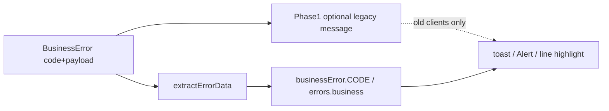

# 四端 BusinessError 统一处理

Last updated: 2026-10-10

服务端只回 **`code` + 结构化 payload**（及可选 `lineErrors`），不把某种语言的文案当作 API 契约。各端用本地 i18n 映射用户可见文案。

## 服务端契约

| 项 | 约定 |
|----|------|
| 抛出 | `BusinessError` / `eBusinessErrorCode`，禁止 `throw new Error(中文)` 作为业务契约 |
| Shape | A 单实例 / B 集合 `lineErrors` / AB 混合（见 `.cursor/rules/business-error-response.mdc`） |
| 响应 | `error` 对象含 `code`、timestamp、可选 payload；客户端 `BusinessErrorUtil.extractErrorData` |
| 双写例外 | 见 [post-deploy ledger](./post-deploy-ledger/entries/2026-10-refund-amount-exceeds-remaining-dual-write.md)：`REFUND_AMOUNT_EXCEEDS_REMAINING` Phase-1 另写 legacy 中文 `message` 兼容旧端 |

## 各端入口

| 端 | 入口 | i18n 路径 |
|----|------|-----------|
| 微信 C + 商户面板 | `businessErrorMessageUtil.resolveZhFromApiError` / `SimpleErrorHandler` | 硬编码中文 map（`lib/business-error-message.util.ts`） |
| CMS | `cmsBusinessErrorMessageUtil.fromCaught` | `messages/*.json` → `errors.business.{CODE}` |
| Merchant App | `appBusinessErrorHandleUtil.fromCaught` | `businessError.{CODE}.short\|summary` |
| Customer App | `appBusinessErrorHandleUtil.fromErrorData` / `fromCaught`；`appToastUtil.errorFromCaught` | 同上 |

**禁止**业务路径向用户展示后端中文 / 裸 `Error.message`（有 code 时）。无 code → 场景 fallback（如 `orders.loadFailed`）。OpenIM / Stripe / 本地权限等非 BusinessError 保持隔离。

## 场景清单（S1–S8）

| ID | 场景 | UI | 验收要点 |
|----|------|-----|----------|
| S1 | 列表 / 详情加载 | 页内 error / toast | sceneFallback |
| S2 | 表单 / 设置保存 | toast | 同上 |
| S3 | 订单动作（退款/支付/状态/履约） | Alert / Modal | 退款超额走 code 插值 |
| S4 | 购物车 / 结账 | 行高亮 + summary | B/AB + `businessErrorLineUtil` |
| S5 | 履约 / 发货 / 打包 | toast | CMS 履约 util 委托总入口 |
| S6 | 鉴权 / 账号 | 表单 error | 禁止 `result.message` 原文 |
| S7 | 特殊 code Handler | 可选导航 | `handlers[code]`（微信已有 CommonHandlers） |
| S8 | 非 BusinessError | SDK / 权限文案 | 不伪造 code |

## 退款超额 Phase-1（增量，不破旧端）

- Code：`REFUND_AMOUNT_EXCEEDS_REMAINING`
- Payload：`refundAmountExceedsRemaining`（requested / remaining / original / alreadyRefunded）
- **旧端不变**：panel `error.message` / CMS 顶层 `message` 仍为历史同模板中文
- **新端**：读 `code` → 本地插值（可忽略 `message`）
- **Post-deploy todo（Phase N）**：Gate 后去掉 dual-write，见 [ledger entry](./post-deploy-ledger/entries/2026-10-refund-amount-exceeds-remaining-dual-write.md)

## 相关文档

- [post-deploy：退款双写](./post-deploy-ledger/entries/2026-10-refund-amount-exceeds-remaining-dual-write.md)
- [registry](./post-deploy-ledger/registry.md)
- Skill：`.cursor/skills/business-error-line-errors/SKILL.md`
- Rule：`.cursor/rules/business-error-response.mdc`
