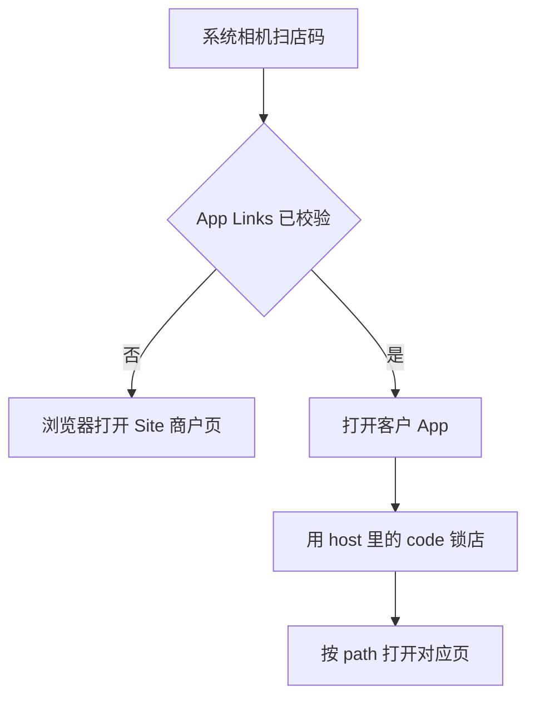

# 客户 App：网址 QR 扫码进 App

Last updated: 2026-09-28

Web 店码继续编现有 Site 地址，不另造一套链接。系统相机在关联域校验通过后打开客户 App，并按 path 进对应页。微信扫一扫打开的是内置浏览器，不会自动进 App。

## 结论

| 项 | 约定 |
|----|------|
| 二维码内容 | `{code}.m.*` 店链，`merchantStorefrontUtil.buildStorefrontOrigin` / `buildStorefrontUrl` |
| 谁能自动进 App | 系统相机、系统浏览器。微信扫一扫不行 |
| 锁店 | 只在内存。杀掉进程后点图标 = 平台首页 |
| 环境 | host 解析出的环境必须等于 App 的 `EXPO_PUBLIC_APP_ENV`（正式包默认 prod）。环境不一致时系统仍可能打开 App，但不上锁 |
| 进具体页 | 解析 Site 公开 path，映射到已有路由。认不出的 path 停在已锁店首页 |
| 调试（不依赖校验文件） | `xituancustomer://storefront?code=` 或 `merchantId=`。自定义 scheme 只锁店，不带 path |
| iOS | `apple-app-site-association` 的 `appID` 仍是 `TEAMID` 占位。补上 Apple Team ID 之前，iPhone 系统相机扫码不进 App |

Play internal testing **现包**（`135df28` 及之后、且已含 `intentFilters` 的 AAB）只能做到：校验通过后进已锁店首页。按 path 进详情、顶栏分享是客户 App 工作区里的后续改动，要进测试包必须重新上传 AAB。只验证「扫码进商户首页」不用新 AAB。

## 扫码后发生什么

启动顺序：

1. URL 带重置密码 `token=`：进重置页，不锁店
2. 能解析出本环境商户：上锁。未登录则先 pending，登录后再 `apply`
3. 没有店链时才处理 OpenIM 推送
4. 有 path 目标时，详情页压在已锁店首页上面，返回回到该店首页

## Site path → 客户 App

语言段（`zh_cn` / `zh_tw` / `en`）丢掉。店面子域的商户来自 host 的 code；主站长路径的商户来自 `/merchant/{merchantId}`。

| Site path | 客户 App |
|-----------|----------|
| `/{语言}` | 已锁店首页 |
| `/{语言}/offers/{id}` | 团购详情 |
| `/{语言}/preorder-promote/{id}` | 预定详情 |
| `/{语言}/products/{id}` | 商品详情 |
| `/{语言}/news/{id}` | 资讯详情 |
| `/{语言}/cart` | 购物车 tab |
| `/{语言}/user/orders` | 订单 tab |
| `/{语言}/user/orders/{id}` | 订单详情 |
| `/{语言}/user/messages` | 消息 tab |

主站同一页的长路径示例：`/{语言}/merchant/{merchantId}/offers/{id}`。

团购列表、预定列表在客户 App 里是店铺首页上的区块，没有单独一屏。购物车、结账、订单、消息、账号不做出站分享。

## App 内分享

会频繁被分享的页，顶栏右侧有「分享」，发出去的仍是上面的 Site 地址：店铺首页、团购详情、预定详情、商品详情、定制商品（链接是该商品页）、资讯详情。

分享需要商户 code 才能拼 `{code}.m.*`。从平台点进店时只有 UUID，客户 App 调 `GET /api/merchants/by-id/:id`（与 `by-code` 同一套公开字段）。已经用店链锁进店时用内存里的 code，不调这个接口。`by-code` 的路径和响应没有改。

## Android 校验（扫码进首页的门槛）

声明在 `xituan_app_customer/app.json` 的 `android.intentFilters`（`https` + `autoVerify`，host 含 `*.m.xituan.com.au`）。

校验文件：`xituan_site/public/.well-known/assetlinks.json`。包名 `au.com.xituan.customer`。指纹：

- `BB:93:C8:DF:2C:DB:11:42:30:95:73:A5:8D:5F:31:08:ED:45:5F:F5:C4:1A:61:DF:99:8E:6A:63:52:CE:58:C0` — USB / 上传证书（Play、官网 APK、USB 若是同一把证书，对的是这一条）
- `FA:C6:17:45:DC:09:03:78:6F:B9:ED:E6:2A:96:2B:39:9F:73:48:F0:BB:6F:89:9B:83:32:66:75:91:03:3B:9C` — 本机 debug keystore

子域 `https://{code}.m.xituan.com.au/.well-known/assetlinks.json` 返回 200 **不够**。系统要确认 `*.m.xituan.com.au` 时，请求的是：

`https://m.xituan.com.au/.well-known/assetlinks.json`

这个名字必须挂在 **Site 的 Vercel 项目**上，和已有的 `*.m.xituan.com.au` 同一套部署，证书要包含 `m.xituan.com.au` 本身（`*.m.xituan.com.au` 盖不住它）。没挂上时 Vercel 返回 `DEPLOYMENT_NOT_FOUND`，系统相机扫任何店码都会进网页。

加域名的位置：Vercel → 该 Site 项目 → **Settings → Domains** → 添加 `m.xituan.com.au`。保存后用浏览器打开上面的 URL，应看到与子域相同的 JSON。

校验结果缓存在手机上。文件或域名改好之后，已安装的包不会自己再验。任选其一：

- 卸掉，再从**现有** Play internal testing 链接装回（同一份 AAB，不用重新上传）
- `adb shell pm verify-app-links --re-verify au.com.xituan.customer`

域名还是 404 时就重装，会再次记成失败。微信扫一扫不受这次校验影响，仍然只开内置网页；店面顶栏是「打开喜团 App」。

## 相关代码

- `xituan_app_customer/app.json` — `intentFilters` / `associatedDomains`
- `xituan_app_customer/src/utils/storefront-entry-url.util.ts`
- `xituan_app_customer/src/utils/storefront-link-nav.util.ts`
- `xituan_app_customer/src/utils/storefront-share.util.ts`
- `xituan_app_customer/src/utils/storefront-lock.util.ts`
- `xituan_app_customer/App.tsx`
- `xituan_site/public/.well-known/assetlinks.json`
- `xituan_site/public/.well-known/apple-app-site-association`
- `xituan_site/src/components/layout/OpenCustomerAppBanner.tsx`
- `xituan_backend/src/domains/merchant/routes/public-merchant.routes.ts` — `GET /by-code/:code`、`GET /by-id/:id`
- `xituan_wechat_app/utils/storefront-lock.wechat.util.ts`

## 相关文档

- [site-host-storefront-surface.md](./site-host-storefront-surface.md)
