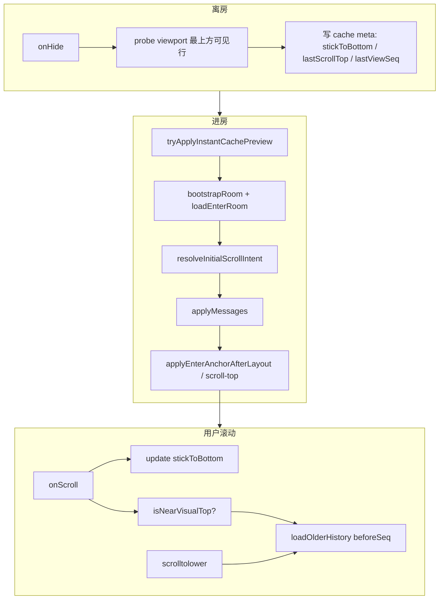

# OpenIM 聊天室：rotateX 倒置滚动与位置恢复

Last updated: 2026-06-13

## 结论（一页）

| 项 | 决策 |
|----|------|
| 布局 | `scroll-view` + 每行 `rotateX(180deg)` 视觉倒置，**不用**遮罩层、**不用** `scroll-into-view` 恢复位置 |
| 内存数据 | `messages` 保持 **seq 升序**（与后端一致） |
| 渲染顺序 | `timelineEntries` **reverse** 后渲染（DOM 最新在上） |
| 视觉底部 | `scrollTop ≈ 0`，新发消息自然贴底，**无需**程序化滚到底 |
| 加载更早 | `bindscrolltolower` + `isNearVisualTop` 兜底（**禁止** `scrolltoupper`） |
| 进房恢复 | 单次 `scroll-top` + verify；优先 `lastScrollTop`，失败再几何算 anchor |
| 离房保存 | `stickToBottom` + `lastScrollTop` + `lastViewSeq`（viewport 最上方可见行 seq） |
| 未读展开 | `loadOlderForAnchor` **仅** `hasUnreadAnchor`；与滚动恢复 **分离** |
| 已删除 | `chat-room-scroll-position.wechat.util.ts`（旧 scrollTop 补偿栈） |

---

## 1. 背景与动机

### 1.1 旧方案问题

早期聊天室依赖：

- `scroll-into-view` / 反复 `setData({ scrollTop })` 补偿
- 进房后先闪到底部再跳到上次位置
- 离房保存锚点时误取 DOM 第一条（倒置后实为最新消息）
- 恢复大 `scrollTop` 时误触 `scrolltoupper`，连锁拉取全量历史

### 1.2 目标

1. 新发消息在底部时列表稳定，无跳动
2. 再次进房恢复到上次阅读位置（含中部）
3. 滚到视觉顶部正确触发 `beforeSeq` 分页
4. 本地缓存 + 服务端 `afterSeq` 增量，减少重复拉取
5. 设计可移植到 CMS / Site / Platform（React 滚动容器）

---

## 2. 总体架构



### 2.1 三层职责

| 层 | 职责 | 位置 |
|----|------|------|
| **倒置滚动 util** | 坐标语义、`isAtBottom` / `isNearVisualTop`、anchor 几何、`reverseTimelineEntries` | `chat-room-inverted-scroll.util.ts` |
| **页面 room** | 生命周期、guard、instant cache、applyMessages、读同步 | `room.ts` |
| **codebase 共享** | 滚动意图、历史同步、缓存 meta、增量 merge | `xituan_codebase` |

---

## 3. rotateX 倒置：设计原子

### 3.1 DOM / CSS

```
scroll-view.message-area-inverted     ← rotateX(180deg)
  └─ .message-area-inverted-inner
       ├─ .message-list-bottom-spacer   ←  composer 占位
       └─ .message-row-inverted × N       ← 每行再 rotateX(180deg) 视觉正立
```

- `scroll-view` 使用 `enhanced` + `enable-flex`
- 恢复前进房：`messageAreaScrollReady: false` → `.message-area-pre-scroll { opacity: 0 }`，避免首帧贴底闪动
- **禁止**在倒置容器上使用 `scroll-into-view` 做恢复（变换下不可靠）

### 3.2 scrollTop 坐标语义（核心）

在 **未改变** 微信 `scroll-view` 原生坐标系的前提下：

| scrollTop | 视觉含义 |
|-----------|----------|
| `≈ 0`（≤ 80px 阈值） | **视觉底部**（最新消息） |
| 增大 | 向上滚，露出**更早**消息 |
| `≈ scrollHeight - viewportHeight` | **视觉顶部**（最早已加载消息） |

因此：

| 用户动作 | 应绑定的事件 |
|----------|--------------|
| 滚到视觉顶部加载更早 | **`scrolltolower`**（不是 scrolltoupper） |
| 程序化恢复中部位置 | 设置较大 `scroll-top` → 会逼近「lower」边界 |

### 3.3 数据与渲染顺序

| 结构 | 顺序 | 说明 |
|------|------|------|
| `messages`（内存） | seq **升序** | 与 merge、beforeSeq、afterSeq 一致 |
| `timelineEntries`（渲染） | **降序**（reverse） | 最新消息在 DOM 靠前位置 |
| `messages[0]` | 最旧已加载 | `loadOlder` 的 `beforeSeq` 来源 |

`buildTimelineForDisplay`：enrich → `buildTimelineEntries` → `reverseTimelineEntries`。

---

## 4. 滚动快照（离房 / 进房）

### 4.1 缓存 meta 字段（`xituan_codebase`）

| 字段 | 含义 |
|------|------|
| `stickToBottom` | 离开时是否在视觉底部 |
| `lastScrollTop` | 非贴底时的 `scrollTop`（rotateX 下可靠）；贴底写 `0` |
| `lastViewSeq` | 离开时 viewport **最上方可见行**的 seq（非 DOM 第一条） |
| `cachedMinSeq` / `cachedMaxSeq` | 本地已缓存 seq 窗口 |

写入：`onHide` → `persistChatScrollSnapshotOnLeave` → `pickViewportAnchorFromMessageRows`（按 `top` 排序取最小）。

### 4.2 进房滚动意图（`resolveInitialScrollIntent`）

优先级：

1. `lastViewSeq >= msgMax` 且 `stickToBottom !== false` → **bottom**（无需滚动）
2. `openimChatScrollIntentUtil.resolveScrollIntent`：
   - 先 `lastViewSeq` 精确匹配消息 → **anchor**
   - 再 `unreadAnchorSeq`（未读）→ **anchor**
3. 否则 **bottom**

**分离关注点：**

| 场景 | 行为 |
|------|------|
| 滚动恢复（上次阅读位置） | `lastViewSeq` + `lastScrollTop`，**不**触发 `loadOlderForAnchor` |
| 未读锚点（消息不在当前窗口） | `hasAnchor && anchorSeq` 时才 `loadOlderForAnchor` 扩展窗口 |

### 4.3 恢复执行链

1. **Instant cache**（有本地快照）：同批 `setData` 写入 `enterAnchorScrollTop` + `messageAreaScrollReady: false`
2. **历史完成后**：`readCachedLastScrollTop` → `applyRotateXScrollTop` → `verifyRotateXScrollTop`（最多 6 次）
3. 失败回退：`scrollToEnterAnchorOnce`（selector 几何 + `computeRotateXAnchorScrollTop`）
4. **禁止**恢复后将 `enterAnchorScrollTop` 置空（`''` 会回到 scrollTop 0 = 视觉底部）

---

## 5. 进房与历史同步

### 5.1 流程概要

```
tryApplyInstantCachePreview
  → resetReadTrackingState(preserveInstantScroll?)
  → loadEnterRoom (codebase openimHistorySyncUtil)
  → optional SDK supplement
  → [仅 hasUnreadAnchor] loadOlderForAnchor
  → resolveInitialScrollIntent
  → useIncrementalSync? (instant cache + canIncrementalSyncFromCache)
  → applyMessages → applyEnterAnchorAfterLayout
```

### 5.2 服务端分页（backend 契约）

| Query | 方向 | 生产老客户端 |
|-------|------|--------------|
| 无参 / `limit` | 最新一页 | ✅ 使用 |
| `beforeSeq` | 更早 | ✅ 上拉历史 |
| `afterSeq` | 比 cachedMaxSeq 更新 | 新客户端增量；老客户端不传，**向后兼容** |

`loadEnterRoom`：`cachedMaxSeq < serverMaxSeq` 时走 `fetchIncrementalAfterSeq`。

### 5.3 增量 UI 同步

条件：`hadInstantCache && !hasUnreadAnchor && canIncrementalSyncFromCache`  
→ `syncUiMessagesIncremental`，避免整表 replace 导致闪动。

### 5.4 进房路由与 merchantId（商户侧 instant cache）

`tryApplyInstantCachePreview` 在 `bootstrapRoom` **最开始**执行，需先用路由参数解析 IM 身份并读取本地消息缓存。不同 channel 对 `merchantId` 的依赖不同：

| channel | 身份 key | instant cache 是否需要路由 `merchantId` |
|---------|----------|----------------------------------------|
| `CUSTOMER_MERCHANT`（消息 tab、店铺「客服」顾客端） | 仅需当前登录 `userId` | **否**（有 `conversationId` + 本地缓存即可） |
| `MERCHANT_STAFF`（我的网店 / 客户列表、活动订单点头像） | `merchantId` + `userId` | **是** — 缺 `merchantId` 时 identity 解析失败，缓存永远不命中 |
| `MERCHANT_PUSH` | 顾客身份 | **否** |

**现象（修复前）：** 商户侧每次进客户聊天都出现全屏「正在同步会话...」；顾客消息 tab 二次进同会话几乎秒开。

**根因：** 商户侧跳转仅传 `conversationId` + `channel=merchant_staff`，`onLoad` 时 `merchantId` 为空 → `resolveRequiredIdentityKey` 返回空 → instant cache 跳过 → `loading: true` 直到 `getConversation` 与历史拉取完成（即使该会话已有本地缓存）。

**约定（商户侧 MERCHANT_STAFF）：**

1. 跳转聊天室 URL **必须**带 `merchantId`（与 `conversationId`、`title`、`channel` 同级 query）。
2. `merchantId` 来源：`getCachedMerchantId()`，否则 `merchantPanelAccessUtil.readCache()?.merchantId`。
3. **禁止**在各页面手写 room URL；统一用 `merchantPanelStaffChatNavWechatUtil.buildStaffChatRoomUrl(conversationId, encodedTitle)`。

**已接入 call site：**

| 入口 | 文件 |
|------|------|
| 网店首页客户列表 | `packageMerchant/components/merchant-panel-home-section` → `onOpenClientChat` |
| 活动订单客户头像 | `packageMerchant/components/merchant-panel-activity-orders-section` → `onOrderAvatarTap` |

**Util：** `xituan_wechat_app/packageMerchant/utils/merchant-panel-staff-chat-nav.wechat.util.ts`

**新增 MERCHANT_STAFF 进房入口时：** 必须走上述 util；若 `merchantId` 仍为空，instant cache 会降级为全屏 loading（行为与修复前相同，但不影响正确性）。

---

## 6. 加载更早历史与 Guard

### 6.1 触发路径

1. `bindscrolltolower` → `onScrollToOlder`
2. `onMessageScroll` 内 `isNearVisualTop` → debounce 120ms → `onScrollToOlder`（enhanced 事件兜底）

### 6.2 必须忽略的时段（防误拉全量历史）

以下状态为 true 时 **禁止** `loadOlderHistory`：

| Flag | 原因 |
|------|------|
| `initialHistoryLoading` | 进房历史尚未完成 |
| `enterScrollRestoreInFlight` | 正在恢复 scrollTop |
| `programmaticScrollInFlight` | `applyRotateXScrollTop` 进行中 |

恢复完成：`completeEnterScrollRestore` 清除 flag 并 `messageAreaScrollReady: true`。

### 6.3 典型踩坑（已修复）

| 现象 | 根因 | 修复 |
|------|------|------|
| 进房拉 `beforeSeq=101,51,2…` | 恢复大 scrollTop 触发 **scrolltoupper** | 改 **scrolltolower** + guard |
| 滚到顶不加载 | 仍用 scrolltoupper | scrolltolower + `isNearVisualTop` |
| 离房 seq 总是最大 | probe 取 DOM 第一条 | `pickViewportAnchorFromMessageRows` 取屏幕最上 |
| 先闪到底再恢复 | 首帧 scrollTop=0 可见 | instant cache 同批 scroll-top + opacity 0 |
| 中部离开却扩全历史 | `loadOlderForAnchor` 与 scroll 恢复混用 | 仅 `hasUnreadAnchor` |

---

## 7. 诊断

日志前缀：`[ChatRoom:scroll-restore]`

| phase | 含义 |
|-------|------|
| `leave.*` / `persist.*` | 离房与写入 |
| `enter.instant-cache*` | 缓存首帧 |
| `enter.resolve` | 滚动意图 |
| `enter.scroll-top*` | 恢复与 verify |
| `older.skip` / `older.load` | 上拉历史 |
| `scroll.probe-anchor` | 滚动中锚点探测 |

真机验证：过滤上述前缀；网络应仅有 `read-state`、`participants`、`messages?limit=50`（及必要的单次 `beforeSeq`），无进房连锁 `beforeSeq`。

---

## 8. 跨端移植（CMS / Site / Platform）

### 8.1 可复用设计原子

1. **倒置或 flex-col-reverse**：任选一种，使「新发在底部」= 默认 scroll 位置，减少 programmatic scroll
2. **双序模型**：内存升序 + 渲染降序（或 reverse 容器）
3. **快照三元组**：`stickToBottom` + `lastScrollTop`（或 scroll offset）+ `lastViewSeq`
4. **意图二分**：`bottom` | `anchor`；未读扩展与阅读恢复分路
5. **单次定位 + verify**：不用 into-view；React 可用 `scrollTop` / `scrollTo` + `requestAnimationFrame` 校验
6. **程序化滚动 guard**：恢复期间禁用「触顶加载」
7. **触顶/触底语义表**：倒置后「加载更早」对应 **max scrollTop** 侧（微信 = lower）

### 8.2 平台差异注意

| 平台 | 注意 |
|------|------|
| 微信小程序 | `scroll-view` + `scroll-top` 绑定；enhanced 模式 |
| React（CMS/Site） | 优先 `overflow-y: auto` 容器 + `flex-direction: column-reverse` 或 CSS invert 方案；Intervention Observer 取 viewport 顶行 |
| 共用 codebase | 滚动意图、历史同步、缓存 meta 放 `xituan_codebase`；端上仅 adapter + UI util |

### 8.3 禁止回退的模式

- 多层 `scrollTop` 补偿 + `scroll-into-view` 混用
- 用未读 `anchorSeq` 驱动「回到上次阅读位置」的历史扩展
- 倒置布局下使用 `scrolltoupper` 加载更早消息
- 离房时取列表第一项作为 viewSeq

---

## 9. 变更记录（摘要）

| 阶段 | 内容 |
|------|------|
| 大清理 | 删除 `chat-room-scroll-position.wechat.util.ts`；WXML/WXSS rotateX |
| 位置恢复 | `lastScrollTop` + scroll-top verify；instant cache 首帧 |
| 进房误拉 | guard + scrolltolower |
| 顶栏加载 | scrolltolower + `isNearVisualTop` |
| Backend | `afterSeq` 增量（可选，老客户端兼容） |
| 商户进房 | MERCHANT_STAFF 跳转带 `merchantId`；`merchant-panel-staff-chat-nav.wechat.util` |

---

## 相关文档

- [openim/README.md](./README.md)
- [../backend-protection-layers-and-scale-notes.md](../backend-protection-layers-and-scale-notes.md)
- Skill：`.cursor/skills/openim-client-scroll-interaction/SKILL.md`
