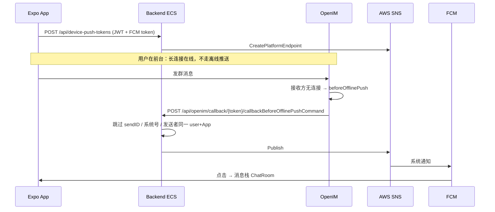

# Android 离线推送工作流（OpenIM → SNS → FCM）

Last updated: 2026-09-28

**范围**：Expo **喜团**（customer）与 **喜团运营**（merchant）Android 系统通知。微信小程序 / Site / CMS 在线聊天不走这条 FCM 链路。iOS APNs 代码里有 ARN 槽位，生产 `deploy.yml` **尚未注入**。

**权威**：本文。OpenIM EC2 / Compose 细节见 [OPENIM-DEPLOYMENT.md](../../aws-setup/OPENIM-DEPLOYMENT.md)；本地 Docker 见 `xituan_backend/deploy/openim/README.md`。

## 结论

| 问题 | 结论 |
|------|------|
| 谁发系统通知 | OpenIM 判定接收方**离线**后回调 backend，backend 用 AWS SNS 发 FCM。不用 OpenIM 内置个推。 |
| 谁算离线 | 该 OpenIM user 没有活跃长连接。App 进后台须 `setAppBackgroundStatus(true)`，否则 websocket 仍算在线、不会回调。 |
| ECS 读哪份环境变量 | **只读 GitHub Environment `production` Secrets**（`deploy.yml` 注入）。本机 `xituan_backend/.env.production` **不会**进容器。 |
| 生产 06 CloudFormation | 默认跳过。SNS IAM 策略在模板 `06_ecs-services.yaml` 的 `device-push-sns-fcm`；若 06 未再部署，须确认 **线上 Task Role 已有同名 inline policy**。 |

---

## 一、需要手动设置（复盘清单）

下列都不会随 `git push` 自动齐全。漏任何一项，表现都是「App 在聊、系统通知没有」。

### 1. Firebase / 应用签名

| 项 | 说明 |
|----|------|
| Firebase Android 应用 | customer：`au.com.xituan.customer`；merchant：`au.com.xituan.merchant`。各有 `google-services.json` 打进 Expo 包。 |
| SHA 指纹 | Firebase 控制台加入 **上传用 jks** 与 Play **App signing** 证书 SHA-1/SHA-256。缺 Play 签名时 Internal 测试包收不到 FCM。 |
| 通知权限 | 真机系统通知权限打开。模拟器经常没有 FCM。 |

### 2. AWS SNS Platform Application

| 项 | 说明 |
|----|------|
| 创建 | 区域 `ap-southeast-2`。GCM/FCM：**`xituan-customer-fcm`**、**`xituan-merchant-fcm`**。ARN 形如 `arn:aws:sns:ap-southeast-2:ACCOUNT:app/GCM/xituan-customer-fcm`。 |
| 密钥 | Platform Application 绑定对应 Firebase 服务账号 / API key（控制台一次性配置）。 |
| iOS | `SNS_PLATFORM_ARN_APNS_*` 代码已读，生产 workflow **未注入**，先不依赖。 |

### 3. 环境变量与 Secret（三处值必须对齐）

| 变量 | 本地 | 生产 |
|------|------|------|
| `SNS_PLATFORM_ARN_FCM_CUSTOMER` | `.env.development` | GitHub Environment **`production`** Secret |
| `SNS_PLATFORM_ARN_FCM_MERCHANT` | 同上 | 同上 |
| `OPENIM_CALLBACK_PATH_TOKEN` | 本地固定 `xituan-openim-callback-dev`，与 `deploy/openim/config/webhooks.yml` 的 URL 路径一致 | **独立生产 token**（勿复用本地字符串）。须同时写入 GitHub Secret **和** OpenIM EC2 `webhooks.yml` |

生产部署：改 Secret 后要跑 **含当前 `deploy.yml` 的** production 工作流。只 Re-run **旧 commit** 不会带上后来才写进 YAML 的注入项。

`06_ecs-services.yaml` **不要**写这三项（生产 06 跳过，密钥也不该进 CFN 参数）。

### 4. OpenIM `beforeOfflinePush` webhook

OpenIM **不读** backend 环境变量。回调 URL 只在 OpenIM 自己的 `webhooks.yml`。

| 环境 | 怎么挂 |
|------|--------|
| 本机 | `npm run im:up` 挂载 `deploy/openim/config/webhooks.yml`。URL：`http://host.docker.internal:3050/api/openim/callback/xituan-openim-callback-dev`。`beforeOfflinePush.enable: true`。 |
| 生产 EC2 | 默认是库存 `callbackExample`（本机 127.0.0.1），**不会**打到 ECS。用 `aws-setup/scripts/openim-ec2-enable-offline-push-webhook.sh`（token 与 GitHub Secret 相同，origin `https://backend.xituan.com.au`）。 |

生产 URL 形态：`https://backend.xituan.com.au/api/openim/callback/<OPENIM_CALLBACK_PATH_TOKEN>`。

### 5. ECS Task Role SNS IAM

Task Role 须能对上述两个 Platform Application 执行 `CreatePlatformEndpoint` / `Publish`（以及 endpoint 的 Get/Set/Delete）。

| 项 | 说明 |
|----|------|
| 模板 | `xituan_agent/aws-setup/06_ecs-services.yaml` → PolicyName **`device-push-sns-fcm`** |
| 生产现状 | 06 栈通常跳过，策略可能是后来 **`iam put-role-policy`** 挂上的。以后若更新 06 且未带上该 Policy，会冲掉线上权限。 |
| 失败日志 | `AuthorizationErrorException` + `SNS:CreatePlatformEndpoint` |

本机 backend 用开发者 IAM 密钥，**不经过** ECS Task Role，所以本地能推、生产 403 很常见。

### 6. 客户端发版

| 项 | 说明 |
|----|------|
| Token 上报 | 登录后 Home 调 `POST /api/device-push-tokens`。未登录、无权限、无 token → 永远没有 endpoint。 |
| 后台在线 | 含 `setAppBackgroundStatus` 的 App 版本进后台才会被 OpenIM 标离线。旧包划到后台仍占着 websocket。 |
| 点通知进房 | 推送 data 带 `type=openim` + `conversationId`。旧包只会切到消息 **列表**。 |
| Metro | 改原生插件无效；`setAppBackgroundStatus` / 导航是 JS，热更新通常够。backend 行为必须 **部署 ECS**。 |

### 7. 验证时注意

| 项 | 说明 |
|----|------|
| 同一人两套 App | merchant 发消息应推 **customer** App，不应推回发送者的 merchant App。 |
| 微信仍开着 | 同一 customer 的 OpenIM 账号若在小程序在线，Expo 不会进 `beforeOfflinePush`。 |
| 测系统通知 | 接收方进后台（或强杀且不要再打开），另一端发一条。看 ECS 日志，不要翻错日期的 log stream。 |

---

## 二、端到端流程

Webhook 响应 `nextCode: 1` 且 `userIDList: []`：我们已用 SNS 投递，禁止 OpenIM 再走个推。

### 1. 注册设备

登录后 customer `HomeScreen` / merchant `MerchantHomeScreen`（及 merchant `HomeScreen`）上报 token。

| 字段 | 含义 |
|------|------|
| `appKind` | `customer` / `merchant` → 选哪把 SNS Platform App |
| `provider` | Android：`fcm` |
| 存储 | 按 `userId + appKind`；发布时用最新一条，避免旧 token 把 endpoint 永久 Disabled |

Android 通知渠道 id 必须与 backend 一致：`xituan_im`。

### 2. OpenIM 何时回调

群聊发出后，OpenIM 把 **当前离线** 的群成员放进 `userIDList`（含 inbox、其它员工、系统号）。不保证「业务上的对方」，只保证「它认为没连接的成员」。

Backend 处理：

- 跳过 `sendID`、`xituan_im_system`
- 无 `im.user_bindings` 则跳过
- 只推 `customer` → customer App；`merchant_staff` / `merchant_user` → merchant App
- 与发送者同一 `userId` + 同一 App 则跳过（避免自己推自己）
- 同一回调里同一 `userId+appKind` 只发一次
- 用 `groupID` 查会话，写入 FCM data：`type=openim`、`groupId`、`clientMsgId`、`conversationId`

锁屏文案固定「新消息 / 您有一条新消息」，不放正文。

### 3. 客户端点击

`openimPushNavigationUtil` 认 `data.type === openim`，拉会话后进 **Messages → ChatRoom**（不是只切 Tab 停在列表）。

---

## 三、源码锚点

| 环节 | 路径 |
|------|------|
| Webhook 路由 | `xituan_backend/src/domains/openim/routes/openim-offline-push-callback.routes.ts` |
| 投递与过滤 | `xituan_backend/src/domains/openim/services/openim-offline-push.service.ts` |
| SNS | `xituan_backend/src/domains/notification/utils/device-push-sns.util.ts` |
| Token 注册 | `xituan_backend/src/domains/notification/services/device-push-token.service.ts` |
| ECS 注入 | `xituan_backend/.github/workflows/deploy.yml` |
| Task Role 策略 | `xituan_agent/aws-setup/06_ecs-services.yaml`（`device-push-sns-fcm`） |
| 本地 webhook | `xituan_backend/deploy/openim/config/webhooks.yml` |
| 生产 webhook 脚本 | `xituan_agent/aws-setup/scripts/openim-ec2-enable-offline-push-webhook.sh` |
| App 上报 / 渠道 | `xituan_app_*/src/utils/device-push-*.util.ts` |
| 后台离线 | `xituan_app_*/src/openim/openim-session.util.ts`（`bindAppBackgroundStatus`） |
| 点通知进房 | `xituan_app_*/src/utils/openim-push-open-chat.util.ts` |

---

## 四、排障（按日志）

CloudWatch 组：`/ecs/xituan-backend-production`。每次发版会换 task stream，不要用几天前的 stream。

| 日志 | 含义 |
|------|------|
| 无 `[openim-offline-push] callback` | OpenIM 没打到 ECS：webhook URL/token、接收方仍被算在线、或看错 stream |
| callback `userCount: 0` | 探测包或 OpenIM 认为没有离线成员 |
| `no binding` | `userIDList` 里的 OpenIM id 在 `im.user_bindings` 没有行（系统号除外） |
| `sent: 0` + `AuthorizationErrorException` | Task Role 缺 SNS 权限 |
| `sent: 0` 但无 403 | 该 user+appKind 没有可用 token / endpoint Disabled |
| `[device-push-sns] published` | SNS 已发出；手机仍无通知 → Firebase SHA、权限、渠道、杀进程策略 |
| 401 webhook | `OPENIM_CALLBACK_PATH_TOKEN` 与 URL 路径不一致 |

本地对照：本机 `.env.development` 的 IAM 能调 SNS，不能用来推断生产 Task Role。

---

## 相关文档

- [openim/README.md](./README.md) — 本目录索引
- [OPENIM-DEPLOYMENT.md](../../aws-setup/OPENIM-DEPLOYMENT.md) — EC2 / ALB / `im:up`
- `xituan_backend/deploy/openim/README.md` — 本机 webhook 与 curl 探测
- [Email-Notification-Preferences.md](../Email-Notification-Preferences.md) — 邮件 SES，与 FCM 无关
