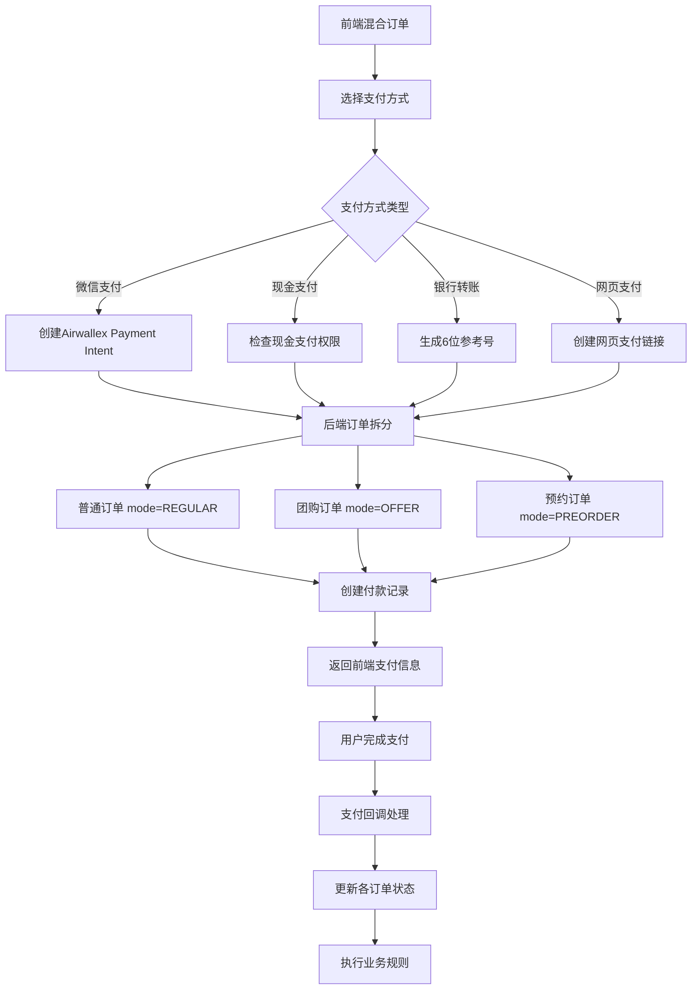
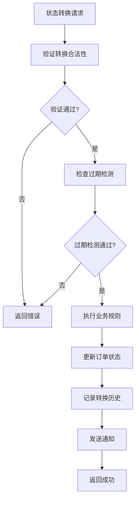
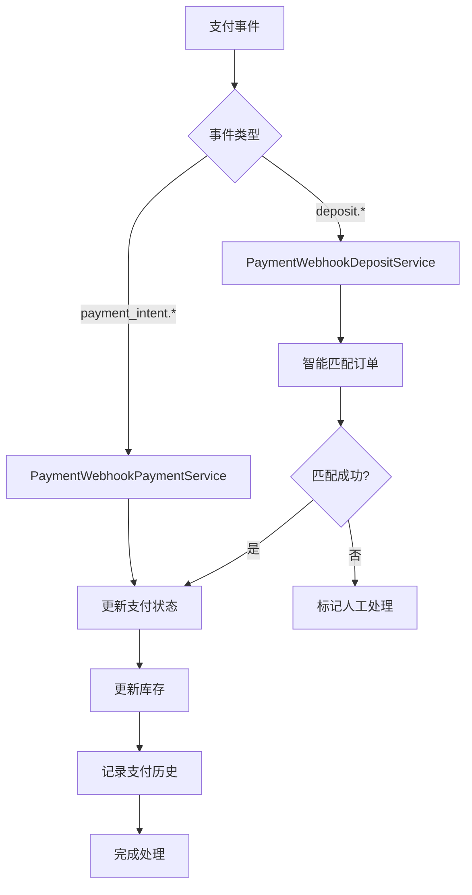
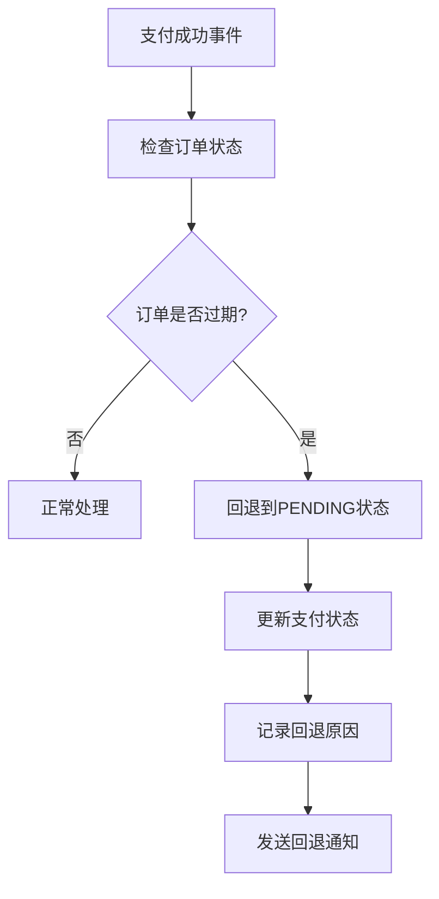

# 订单状态管理系统实施方案 (v3.0)

## 📋 项目概述

本方案实现了一个基于**订单拆分架构**的专业订单状态管理系统，支持多种订单模式（普通、团购、预约等）的独立处理，通过付款父子结构实现合并支付，并集成了多支付方式支持，确保系统架构简洁、业务逻辑清晰、维护成本低。

### 核心设计理念
- 🎯 **订单独立性**: 拆分后的订单完全独立，无业务逻辑关联
- 🔗 **付款关联**: 通过付款父子结构实现唯一关联
- 🏗️ **架构简洁**: 避免复杂的订单关联和状态聚合
- ⚡ **性能优化**: 查询效率高，无跨表复杂关联
- 🔧 **易于维护**: 代码简单，职责明确
- 💳 **支付灵活**: 支持多种支付方式和状态分离

### 核心特性
- ✅ 多订单模式支持（普通、团购、预约）
- ✅ 订单拆分和独立处理
- ✅ 付款父子结构管理
- ✅ 状态转换规则引擎
- ✅ 防重复操作机制
- ✅ 完整的状态转换历史记录
- ✅ 业务规则验证（支付、库存、Offer处理）
- ✅ 审计日志和合规支持
- ✅ 前端编辑界面集成
- ✅ 多支付方式支持（微信、现金、银行转账、网页支付）
- ✅ 支付状态与订单状态分离
- ✅ 过期订单自动回退机制
- ✅ 承诺支付机制（现金、银行转账）

---

## 🏗️ 系统架构

### 订单拆分架构设计

```
前端混合订单 → 后端拆分处理 → 独立订单管理
├── 普通商品 → 普通订单 (mode: REGULAR)
├── 团购商品 → 团购订单 (mode: OFFER, mode_instance_id: offer_id)
└── 预约商品 → 预约订单 (mode: PREORDER, mode_instance_id: preorder_id)
```

### 数据库层设计

#### 核心订单表
```sql
orders (订单表)
├── id (主键)
├── order_number (订单号)
├── mode (订单模式: REGULAR/OFFER/PREORDER)
├── mode_instance_id (模式实例ID: offer_id/preorder_id等)
├── status (当前状态)
├── payment_method (用户选择的支付方式)
├── payment_status (支付状态：pending/processing/success/failed/cancelled/refunded/committed)
├── payment_reference (6位数字参考号，银行转账用)
├── committed_at (承诺支付时间，承诺支付时设置)
├── user_id, total_amount, delivery_fee, final_amount
├── delivery_address_snapshot, note
├── cancel_reason, refund_reason
└── 时间戳字段 (created_at, updated_at, paid_at等)

order_items (订单商品表)
├── id (主键)
├── order_id (外键)
├── product_id, quantity, price
├── mode_product_id (模式商品ID，如offer_product_id)
└── 其他商品信息
-- 注意：通过父级order.mode和order.mode_instance_id获取关联信息

order_status_transitions (状态转换记录表)
├── id (主键)
├── order_id (外键)
├── from_status, to_status (状态转换)
├── transition_type (AUTO/MANUAL/SYSTEM)
├── operator_id (操作人)
├── reason (变更原因)
├── amount (涉及金额)
├── payment_transaction_id (支付交易ID)
└── created_at, metadata
```

#### 付款管理表
```sql
order_payment_records (付款记录表)
├── id (主键)
├── parent_payment_id (父级付款ID - Airwallex Payment Intent，为null表示父级记录)
├── order_id (外键 - 关联的订单ID)
├── payment_type (PAYMENT/REFUND/PARTIAL_REFUND)
├── amount, currency, payment_method
├── transaction_id, status
├── refunded_amount (已退款金额)
├── needs_manual_review (需要人工处理)
├── manual_review_reason (人工处理原因)
├── webhook_event_data (webhook事件数据)
├── reason, created_at, processed_at
└── metadata (额外信息)

-- 说明：此表同时保存父级和子级付款信息
-- 父级记录：parent_payment_id = null，对应Airwallex Payment Intent
-- 子级记录：parent_payment_id = 父级ID，对应具体订单的付款分配

-- 索引优化
CREATE INDEX idx_payment_records_order_id ON order_payment_records(order_id);
CREATE INDEX idx_payment_records_parent_payment_id ON order_payment_records(parent_payment_id);
CREATE INDEX idx_payment_records_manual_review ON order_payment_records(needs_manual_review);
```

#### 库存管理表（支持多类型产品）
```sql
-- 基础产品库存表
products (产品表)
├── id (主键)
├── stock (基础库存)
├── reserved_stock (预留库存)
└── 其他产品字段...

-- 团购产品库存表
offer_products (团购产品表)
├── id (主键)
├── offer_id (团购ID)
├── product_id (产品ID)
├── stock (团购库存：从products表借用)
├── reserved_stock (已预订数量)
├── total_stock (总库存)
└── 其他团购产品字段...

-- 预约产品库存表
products_preorderable (预约产品表)
├── id (主键)
├── product_id (产品ID)
├── promote_id (推广ID，可为空)
├── stock (预约库存：从products表借用)
├── reserved_stock (已预订数量)
├── total_stock (总库存)
└── 其他预约产品字段...

-- 库存锁定表（支持多类型产品）
inventory_locks (库存锁定表)
├── id (主键)
├── product_id (基础产品ID)
├── order_id (订单ID)
├── quantity (锁定数量)
├── lock_type (锁定类型：ORDER_RESERVED, PAYMENT_PENDING, REFUND_PENDING)
├── mode (订单模式：REGULAR, OFFER, PREORDER)
├── mode_instance_id (模式实例ID：offer.id 或 preorder.id)
├── mode_product_id (模式产品ID：offer_product.id 或 products_preorderable.id)
├── expires_at (过期时间)
├── reason (锁定原因)
├── metadata (元数据)
└── created_at

-- 库存交易记录表（支持多类型产品）
inventory_transactions (库存交易记录表)
├── id (主键)
├── product_id (基础产品ID)
├── order_id (订单ID)
├── transaction_type (LOCK/UNLOCK/DEDUCT/RESTORE)
├── status (PENDING/COMPLETED/FAILED)
├── mode (订单模式：REGULAR, OFFER, PREORDER)
├── mode_instance_id (模式实例ID：offer.id 或 preorder.id)
├── mode_product_id (模式产品ID：offer_product.id 或 products_preorderable.id)
├── quantity (变更数量)
├── before_stock (变更前库存)
├── after_stock (变更后库存)
├── reference_id (关联ID)
├── reason (变更原因)
├── operator_id (操作人ID)
├── metadata (元数据)
└── created_at
```

---

## 🏪 多类型产品库存管理机制

### 库存管理架构
系统采用**分层库存管理**架构，支持三种产品类型的独立库存管理：

```
基础产品库存 (products)
├── 普通产品库存 (直接使用)
├── 团购产品库存 (通过 offer_products 借用)
└── 预约产品库存 (通过 products_preorderable 借用)
```

### 库存借用机制

#### 1. 普通产品 (REGULAR)
```typescript
// 直接使用 products 表的库存
const product = await productRepo.findById(productId);
if (product.stock < quantity) {
  throw new Error('库存不足');
}
```

#### 2. 团购产品 (OFFER)
```typescript
// 使用 offer_products 表的库存（从 products 表借用）
const offerProduct = await offerProductRepo.findByOfferAndProduct(offerId, productId);
if (!offerProduct.isQuantityAvailable(quantity)) {
  throw new Error('团购库存不足');
}

// 库存借用流程：
// 1. Offer创建时：从 products.stock 借用到 offer_products.stock
// 2. 订单创建时：从 offer_products.stock 预留到 offer_products.reserved_stock
// 3. Offer截单时：将剩余库存返还给 products.stock
```

#### 3. 预约产品 (PREORDER)
```typescript
// 使用 products_preorderable 表的库存（从 products 表借用）
const preorderProduct = await preorderProductRepo.findByProductAndPromote(productId, promoteId);
if (!preorderProduct.isQuantityAvailable(quantity)) {
  throw new Error('预约库存不足');
}

// 库存借用流程：
// 1. 预约活动创建时：从 products.stock 借用到 products_preorderable.stock
// 2. 订单创建时：从 products_preorderable.stock 预留到 products_preorderable.reserved_stock
// 3. 预约截止时：将剩余库存返还给 products.stock
```

### 库存锁定机制

#### 锁定类型
- **ORDER_RESERVED**: 订单预留锁定
- **PAYMENT_PENDING**: 支付待确认锁定
- **REFUND_PENDING**: 退款待处理锁定

#### 锁定流程
```typescript
// 创建库存锁定
const lock = await inventoryLockRepo.create({
  productId: baseProductId,
  orderId: orderId,
  quantity: quantity,
  lockType: 'ORDER_RESERVED',
  mode: orderMode, // REGULAR, OFFER, PREORDER
  modeInstanceId: offerId || preorderId,
  modeProductId: offerProductId || preorderProductId,
  expiresAt: new Date(Date.now() + 30 * 60 * 1000) // 30分钟过期
});
```

### 库存交易记录

#### 交易类型
- **LOCK**: 锁定库存
- **UNLOCK**: 解锁库存
- **DEDUCT**: 扣减库存
- **RESTORE**: 恢复库存

#### 交易流程
```typescript
// 记录库存交易
const transaction = await inventoryTransactionRepo.create({
  productId: baseProductId,
  orderId: orderId,
  transactionType: 'LOCK',
  status: 'COMPLETED',
  mode: orderMode,
  modeInstanceId: offerId || preorderId,
  modeProductId: offerProductId || preorderProductId,
  quantity: quantity,
  beforeStock: beforeStock,
  afterStock: afterStock,
  reason: '订单创建预留库存'
});
```

### 库存一致性保证

#### 1. 事务性操作
```typescript
// 使用数据库事务确保库存操作的一致性
await dataSource.transaction(async manager => {
  // 1. 检查库存
  const product = await manager.findOne(Product, { where: { id: productId } });
  
  // 2. 更新库存
  await manager.update(Product, { id: productId }, { 
    stock: product.stock - quantity 
  });
  
  // 3. 创建锁定记录
  await manager.save(InventoryLock, lockData);
  
  // 4. 记录交易
  await manager.save(InventoryTransaction, transactionData);
});
```

#### 2. 库存验证
```typescript
// 多层级库存验证
async function validateInventory(orderItems: OrderItem[]): Promise<boolean> {
  for (const item of orderItems) {
    switch (item.mode) {
      case 'REGULAR':
        const product = await productRepo.findById(item.productId);
        if (product.stock < item.quantity) return false;
        break;
        
      case 'OFFER':
        const offerProduct = await offerProductRepo.findByOfferAndProduct(
          item.modeInstanceId, item.productId
        );
        if (!offerProduct.isQuantityAvailable(item.quantity)) return false;
        break;
        
      case 'PREORDER':
        const preorderProduct = await preorderProductRepo.findByProductAndPromote(
          item.productId, item.modeInstanceId
        );
        if (!preorderProduct.isQuantityAvailable(item.quantity)) return false;
        break;
    }
  }
  return true;
}
```

### 库存恢复机制

#### 1. 订单取消时
```typescript
// 释放预留库存
async function releaseInventoryOnCancel(orderId: string): Promise<void> {
  const locks = await inventoryLockRepo.findByOrderId(orderId);
  
  for (const lock of locks) {
    // 根据订单模式恢复对应库存
    switch (lock.mode) {
      case 'REGULAR':
        await productRepo.incrementStock(lock.productId, lock.quantity);
        break;
      case 'OFFER':
        await offerProductRepo.incrementStock(lock.modeProductId, lock.quantity);
        break;
      case 'PREORDER':
        await preorderProductRepo.incrementStock(lock.modeProductId, lock.quantity);
        break;
    }
    
    // 删除锁定记录
    await inventoryLockRepo.delete(lock.id);
  }
}
```

#### 2. 订单过期时
```typescript
// 自动释放过期锁定
async function releaseExpiredLocks(): Promise<void> {
  const expiredLocks = await inventoryLockRepo.findExpired();
  
  for (const lock of expiredLocks) {
    await releaseInventoryOnCancel(lock.orderId);
    
    // 记录过期释放交易
    await inventoryTransactionRepo.create({
      productId: lock.productId,
      transactionType: 'UNLOCK',
      status: 'COMPLETED',
      mode: lock.mode,
      modeInstanceId: lock.modeInstanceId,
      modeProductId: lock.modeProductId,
      quantity: lock.quantity,
      reason: '订单过期自动释放'
    });
  }
}
```

---

## 📊 状态转换规则

### 简化的订单状态枚举
```typescript
enum epOrderStatus {
  PENDING = 'pending',                    // 待处理（替代原来的 pending_payment）
  PROCESSING = 'processing',              // 处理中
  READY_FOR_DELIVERY = 'ready_for_delivery', // 待发货
  IN_DELIVERY = 'in_delivery',            // 配送中
  DELIVERED = 'delivered',                // 已送达
  CANCELLED = 'cancelled',                // 已取消
  EXPIRED = 'expired',                    // 已过期
  REFUNDED = 'refunded',                  // 已退款
  DELETED = 'deleted'                     // 已删除
}

enum epOrderMode {
  REGULAR = 'REGULAR',      // 普通订单
  OFFER = 'OFFER',          // 团购订单
  PREORDER = 'PREORDER'     // 预约订单
}
```

### 合法转换路径（支持跳过中间环节）
```typescript
const transitions = {
  'pending': ['processing', 'ready_for_delivery', 'in_delivery', 'delivered', 'cancelled', 'expired', 'deleted'],
  'processing': ['ready_for_delivery', 'in_delivery', 'delivered', 'refunded'],
  'ready_for_delivery': ['in_delivery', 'delivered', 'refunded'],
  'in_delivery': ['delivered', 'refunded'],
  'delivered': ['refunded'],
  'cancelled': ['deleted'],
  'expired': ['pending', 'refunded', 'deleted'], // 允许回退到pending
  'refunded': [],
  'deleted': []
};
```

### 过期检测规则（基于支付方式）
```typescript
// 过期检测函数
async function checkOrderExpiry(order: Order): Promise<iOrderExpiryCheck> {
  // 1. 获取平台设置
  const orderSettings = platformSettingService.getOrderSettings();
  
  // 2. 根据订单模式获取基础过期时间
  let baseExpiryMinutes: number;
  switch (order.mode) {
    case epOrderMode.REGULAR:
      baseExpiryMinutes = orderSettings.pendingPayExpMinutes_regular;
      break;
    case epOrderMode.OFFER:
      baseExpiryMinutes = orderSettings.pendingPayExpMinutes_offer;
      break;
    case epOrderMode.PREORDER:
      baseExpiryMinutes = orderSettings.pendingPayExpMinutes_preorder;
      break;
  }
  
  // 3. 根据支付方式调整过期时间
  let actualExpiryMinutes = baseExpiryMinutes;
  
  switch (order.payment_method) {
    case epUserPaymentMethod.CASH:
      // 现金支付：30天过期时间
      actualExpiryMinutes = 30 * 24 * 60; // 30天
      break;
      
    case epUserPaymentMethod.BANK_TRANSFER:
      // 银行转账固定48小时
      actualExpiryMinutes = 48 * 60; // 48小时
      break;
      
    case epUserPaymentMethod.WECHAT:
      // 实时支付使用平台设置
      break;
  }
  
  // 4. 计算过期时间
  const expiryTime = new Date(order.createdAt.getTime() + actualExpiryMinutes * 60 * 1000);
  const isExpired = new Date() > expiryTime;
  
  return {
    isExpired,
    expiryReason: isExpired ? '订单已过期' : '订单未过期',
    canTransition: !isExpired,
    expiryTime
  };
}
```

### 支付方式变更与库存锁定更新
当用户修改订单支付方式时，系统会自动更新相关库存锁定的过期时间：

```typescript
// 支付方式变更流程
async function updateOrderPaymentMethod(userId: string, orderId: string, paymentMethod: string): Promise<Order> {
  // 1. 验证订单状态和权限
  // 2. 更新订单支付方式
  const updatedOrder = await this.orderRepository.updateOrder(orderId, {
    paymentMethod: paymentMethod,
    updatedAt: new Date()
  });

  // 3. 更新库存锁定的过期时间
  const inventoryManagementService = new InventoryManagementService();
  await inventoryManagementService.updateOrderInventoryLockExpiry(updatedOrder);
  
  return updatedOrder;
}

// 库存锁定过期时间更新
async function updateOrderInventoryLockExpiry(order: Order): Promise<void> {
  // 1. 根据新支付方式计算过期时间
  const expiryMinutes = this.calculateInventoryLockExpiryMinutes(order);
  const newExpiresAt = new Date(Date.now() + expiryMinutes * 60 * 1000);

  // 2. 更新该订单的所有库存锁定记录
  const locks = await this.inventoryLockRepository.find({
    where: { orderId: order.id, lockType: 'ORDER_RESERVED' }
  });

  for (const lock of locks) {
    lock.expiresAt = newExpiresAt;
    await this.inventoryLockRepository.save(lock);
  }
}
```

**过期时间规则**：
- **现金支付**：30天（1个月）
- **银行转账**：48小时
- **微信支付**：根据订单模式确定（常规12小时，特价30分钟，预售48小时）

### 业务规则定义
```typescript
enum epBusinessRule {
  VALIDATE_PAYMENT = 'validate_payment',           // 验证支付
  UPDATE_INVENTORY = 'update_inventory',           // 更新库存
  PROCESS_OFFERS = 'process_offers',               // 处理团购
  PROCESS_REFUND = 'process_refund',               // 处理退款
  RESTORE_INVENTORY = 'restore_inventory',         // 恢复库存
  UPDATE_OFFERS = 'update_offers',                 // 更新团购
  SEND_NOTIFICATION = 'send_notification',         // 发送通知
  CHECK_CASH_PERMISSION = 'check_cash_permission', // 检查现金支付权限
  MATCH_BANK_TRANSFER = 'match_bank_transfer'      // 匹配银行转账
}

const specialTransitions = {
  'pending': {
    'processing': ['validate_payment', 'update_inventory', 'process_offers', 'send_notification']
  },
  'expired': {
    'pending': ['validate_payment', 'send_notification'] // 过期订单回退
  }
  // ... 其他转换规则
};
```

---

## 🔄 订单拆分逻辑详解

### 基础拆分规则
```typescript
// 当前实现：按类型拆分
const splitByType = (items: CartItem[]) => {
  const regular = items.filter(item => !item.offer_id && !item.preorder_id);
  const offers = items.filter(item => item.offer_id);
  const preorders = items.filter(item => item.preorder_id);
  
  return { regular, offers, preorders };
};
```

### 精细化拆分规则
```typescript
// 未来实现：按类型 + 实例ID分组
const splitByTypeAndInstance = (items: CartItem[]) => {
  const regular = items.filter(item => !item.offer_id && !item.preorder_id);
  
  // 按offer_id分组（不同团购活动需要拆分）
  const offerGroups = groupBy(items.filter(item => item.offer_id), 'offer_id');
  
  // 按preorder_id和交货日期分组（不同预约批次需要拆分）
  const preorderGroups = groupBy(
    items.filter(item => item.preorder_id), 
    ['preorder_id', 'delivery_date']
  );
  
  return { 
    regular: [regular], 
    offers: Object.values(offerGroups), 
    preorders: Object.values(preorderGroups) 
  };
};
```

### 拆分后的订单结构
```typescript
// 普通订单
const regularOrder = {
  mode: 'REGULAR',
  mode_instance_id: null,
  payment_method: 'WECHAT', // 用户选择的支付方式
  payment_reference: null,   // 银行转账时生成6位数字
  items: [/* 普通商品 */]
};

// 团购订单（按offer_id拆分）
const offerOrders = [
  {
    mode: 'OFFER',
    mode_instance_id: 'offer_123',
    payment_method: 'BANK_TRANSFER',
    payment_reference: '123456', // 银行转账参考号
    items: [/* offer_123的商品 */]
  }
];

// 预约订单（按preorder_id + 交货日期拆分）
const preorderOrders = [
  {
    mode: 'PREORDER',
    mode_instance_id: 'preorder_789',
    delivery_date: '2024-01-15',
    payment_method: 'CASH',
    payment_reference: null,
    items: [/* 2024-01-15交货的商品 */]
  }
];
```

---

## 🔄 核心业务流程

### 1. 订单创建流程（支持多支付方式）



### 2. 状态转换流程（支持跳过中间环节）



### 3. 支付状态更新流程（与订单状态分离）



### 4. 过期订单回退流程



---

## ⏰ 过期检测机制

### 过期检测函数
```typescript
interface iOrderExpiryCheck {
  isExpired: boolean;
  expiryReason: string;
  canTransition: boolean;
  expiryTime?: Date;
}
```

### 过期规则
- **现金支付**: 承诺支付2周过期，其他不过期
- **银行转账**: 承诺支付48小时过期，其他固定48小时过期
- **实时支付**: 使用平台设置（常规12小时、特价30分钟、预约48小时）

### 过期处理
1. 定时任务检测过期订单（正常过期 + 承诺支付过期）
2. 根据支付方式应用不同过期规则
3. 自动设置订单状态为EXPIRED
4. 释放预留库存
5. 承诺支付过期时禁用用户对应支付方式权限

---

## 💳 承诺支付机制

### 概述
承诺支付机制允许用户选择现金支付或银行转账时，通过承诺方式获得更长的支付时间，同时简化库存锁定逻辑。

### 核心特性
- **承诺支付状态**: `payment_status = 'committed'`
- **承诺时间**: 现金支付2周，银行转账48小时
- **权限控制**: 承诺支付过期时禁用用户对应支付方式权限
- **过渡状态**: 承诺支付最终被实际支付覆盖

### 与现有系统的集成
- **订单表**: 添加 `committed_at` 字段记录承诺时间
- **定时任务**: 新增承诺支付过期处理逻辑
- **权限管理**: 基于 `allowCash` 和 `allowBankTransfer` 字段
- **监控系统**: 通过 `alert_orders_payments` 表记录异常

### 详细设计
详细的承诺支付机制设计、实现细节、数据库迁移、前端实现等，请参考：
**[承诺支付机制设计方案](./commitment-payment-design.md)**

---

## 🔄 过期订单回退机制

### 回退场景
1. **Webhook支付完成**: 支付成功后自动回退
2. **人工确认支付**: 管理员确认后回退

### 回退逻辑
```typescript
async function handleExpiredOrderPayment(
  orderId: string, 
  paymentData: any, 
  context: 'webhook' | 'manual'
): Promise<void> {
  const order = await getOrderById(orderId);
  
  if (order.status === epOrderStatus.EXPIRED) {
    const isPaymentSuccess = 
      paymentData.status === 'SUCCEEDED' || 
      paymentData.status === 'SETTLED' ||
      paymentData.status === 'SUCCESS';
    
    if (isPaymentSuccess) {
      // 更新支付状态
      await updateOrderPaymentStatus(orderId, epPaymentRecordStatus.SETTLED);
      
      // 回退订单状态到待处理
      await transitionOrderStatus(orderId, epOrderStatus.PENDING, {
        reason: `过期订单支付成功，${context === 'webhook' ? '自动' : '人工'}回退`,
        operatorId: context === 'webhook' ? 'system' : 'admin'
      });
    }
  }
}
```

---

## 🚀 实施阶段

## 阶段一：基础架构搭建 ✅ 已完成

### 1.1 数据库设计
- [x] 创建 `order_status_transitions` 表
- [x] 创建 `order_payment_records` 表  
- [x] 创建 `offer_orders` 表
- [x] 创建 `product_inventory` 表
- [x] 创建 `inventory_locks` 表
- [x] 创建 `inventory_transactions` 表
- [x] 修改 `orders` 表结构（添加 mode, mode_instance_id 字段）

### 1.2 类型定义
- [x] 创建 `OrderStatusTransition` 类型定义
- [x] 创建 `OrderPaymentRecord` 类型定义
- [x] 创建 `OfferOrder` 类型定义
- [x] 创建 `ProductInventory` 类型定义
- [x] 创建状态转换规则常量
- [x] 创建业务规则枚举

### 1.3 实体注册
- [x] 在 `database.config.ts` 中注册所有新实体
- [x] 确保 TypeORM 能正确识别所有实体
- [x] 创建数据库迁移文件

### 1.4 核心服务
- [x] 实现 `OrderStatusService` 基础结构
- [x] 实现状态转换规则引擎
- [x] 实现防重复操作机制
- [x] 实现 `PaymentProcessingService` (集成Airwallex)
- [x] 实现 `InventoryService` (数据库驱动)
- [x] 实现 `OfferOrderService` (完整功能)
- [x] 实现 `NotificationService` (基础功能)

### 1.5 API控制器
- [x] 创建 `OrderStatusController`
- [x] 实现所有状态管理API端点
- [x] 修改 `AdminOrderController` 集成状态管理
- [x] 创建订单拆分API端点

### 1.6 前端集成
- [x] 更新订单列表页面添加编辑按钮
- [x] 创建订单编辑模态框
- [x] 实现状态选择和原因输入
- [x] 集成API调用

---

## 阶段二：多支付方式集成 🔄 部分完成

### 2.1 数据库扩展 🔄 部分完成
- [x] 更新 `orders` 表添加支付相关字段（`payment_method`, `payment_status`, `payment_reference`）
- [x] 更新 `payment_records` 表添加人工处理字段（`needs_manual_review`, `manual_review_reason`, `webhook_event_data`）
- [ ] 创建 `user_cash_payment_permissions` 表
- [x] 统一支付方式枚举定义

### 2.2 状态转换优化 ✅ 已完成
- [x] 简化订单状态枚举（移除 `PENDING_PAYMENT`, `PAID` 状态）
- [x] 支持跳过中间环节的状态转换
- [x] 实现基于支付方式的过期检测
- [x] 添加过期订单回退机制
- [x] 实现支付状态与订单状态分离

### 2.3 订单拆分逻辑 ✅ 已完成
- [x] 实现前端混合订单提交
- [x] 实现后端订单拆分服务（`OrderSplitService`）
- [x] 添加订单模式识别逻辑
- [x] 实现模式实例ID管理

---

## 阶段三：订单拆分架构 ✅ 已完成

### 3.1 订单拆分逻辑 ✅ 已完成
- [x] 实现基础拆分规则（按类型拆分）
- [x] 实现精细化拆分规则（按offer_id和交货日期分组）
- [x] 创建 `OrderSplitService` 服务
- [x] 支持 `splitByType` 和 `splitByTypeAndInstance` 两种拆分策略
- [x] 实现 `createSplitOrders` 方法创建拆分后的订单

### 3.2 付款父子结构 🔄 部分完成
- [x] 实现付款记录父子关系（通过 `parent_payment_id` 字段）
- [x] 添加关联订单查询功能
- [ ] 实现合并支付处理
- [ ] 添加付款状态同步

### 3.3 独立订单处理 ✅ 已完成
- [x] 实现各订单类型独立状态管理
- [x] 添加订单类型特定业务规则
- [x] 实现独立库存管理（支持多类型产品）
- [x] 添加独立通知处理
- [x] 更新API为通用查询参数模式

### 3.4 退款协调机制 🔄 部分完成
- [x] 实现基于付款记录的退款
- [ ] 添加部分退款支持
- [ ] 实现退款金额分配
- [ ] 添加退款历史查询

---

## 阶段四：高级功能 🔄 部分完成

### 4.1 权限管理 ✅ 已完成
- [x] 实现基于角色的状态转换权限（通过 `AuthMiddleware` 和 `epPermission` 枚举）
- [x] 添加操作审批流程（管理员权限检查）
- [x] 实现多级权限控制（ADMIN、SUPER_ADMIN 角色）
- [x] 添加订单类型特定权限（通过 `requirePermissions` 中间件）

### 4.2 审计和合规 🔄 部分完成
- [x] 完善审计日志记录（订单状态转换历史、支付记录、库存交易记录）
- [x] 实现数据加密（敏感信息通过 JSONB 存储）
- [x] 添加合规报告生成（PDF 生成服务、合作伙伴发票系统）
- [ ] 实现数据备份和恢复

### 4.3 性能优化 🔄 部分完成
- [x] 实现基础缓存机制（PrintTemp 模板缓存）
- [x] 添加数据库索引优化（产品表、订单表等关键字段索引）
- [x] 实现异步处理队列（支付处理、库存更新）
- [ ] 添加监控和告警

### 4.4 高级功能 🔄 部分完成
- [x] 实现批量状态更新（产品批量库存更新、订单批量操作）
- [ ] 添加状态转换模板
- [ ] 实现自动化工作流
- [ ] 添加数据分析面板

---

## 🔧 开发指南

### 添加新的订单模式

1. **更新订单模式枚举**
```typescript
// 在 order.type.ts 中添加新模式
export enum epOrderMode {
  // ... 现有模式
  NEW_MODE = 'NEW_MODE'
}
```

2. **添加模式特定业务规则**
```typescript
// 在 order-status-rules.enum.ts 中添加规则
export const ORDER_MODE_RULES = {
  [epOrderMode.NEW_MODE]: {
    transitions: { /* 特定转换规则 */ },
    businessRules: { /* 特定业务规则 */ }
  }
};
```

3. **实现模式特定服务**
```typescript
// 创建新模式的服务
class NewModeOrderService {
  async processNewModeOrder(order: Order) {
    // 实现新模式特定逻辑
  }
}
```

### 添加新的状态转换规则

1. **更新状态枚举**
```typescript
export enum epOrderStatus {
  // ... 现有状态
  NEW_STATUS = 'new_status'
}
```

2. **更新转换规则**
```typescript
export const ORDER_STATUS_RULES = {
  transitions: {
    // ... 现有规则
    [epOrderStatus.EXISTING_STATUS]: [epOrderStatus.NEW_STATUS]
  }
};
```

3. **添加业务逻辑**
```typescript
private async executeBusinessRule(rule: epBusinessRule, order: Order, newStatus: epOrderStatus) {
  switch (rule) {
    case epBusinessRule.NEW_BUSINESS_RULE:
      // 实现新的业务逻辑
      break;
  }
}
```

---

## 🧪 测试指南

### 单元测试
```bash
# 运行所有测试
npm test

# 运行特定测试
npm test -- --grep "OrderStatusService"
npm test -- --grep "PaymentProcessingService"
```

### API测试
```bash
# 测试状态更新
curl -X PUT http://localhost:3050/api/admin/orders/{orderId}/status \
  -H "Content-Type: application/json" \
  -H "Authorization: Bearer {token}" \
  -d '{"toStatus":"processing","reason":"测试"}'

# 测试关联订单查询
curl -X GET http://localhost:3050/api/admin/orders/{orderId}/related-orders \
  -H "Authorization: Bearer {token}"
```

### 前端测试
1. 启动CMS: `cd xituan_cms && npm run dev`
2. 访问订单管理页面
3. 测试订单编辑功能
4. 测试状态更新功能

---

## 📝 常见问题

### Q: 订单拆分后如何查询关联订单？
A: 使用以下API：
```bash
GET /api/admin/orders/{orderId}/related-orders
```
系统会通过付款记录自动查找所有关联订单。

### Q: 如何查询特定类型的订单？
A: 使用通用API + 查询参数：
```bash
# 查询所有团购订单
GET /api/admin/orders?mode=OFFER

# 查询特定团购活动的订单
GET /api/admin/orders?mode=OFFER&mode_instance_id=123

# 查询预约订单
GET /api/admin/orders?mode=PREORDER
```

### Q: 如何处理混合订单的退款？
A: 每个订单独立处理退款：
1. 系统通过付款记录找到父级付款信息
2. 调用Airwallex API进行部分退款
3. 更新对应订单的状态和付款记录
4. 其他订单不受影响

### Q: 不同订单类型的库存如何管理？
A: 系统采用分层库存管理架构：
- **普通订单 (REGULAR)**: 直接使用 `products` 表的库存
- **团购订单 (OFFER)**: 使用 `offer_products` 表的库存（从 `products` 表借用）
- **预约订单 (PREORDER)**: 使用 `products_preorderable` 表的库存（从 `products` 表借用）

库存借用机制：
1. **团购/预约活动创建时**: 从基础产品库存中借用指定数量
2. **订单创建时**: 在对应的库存表中预留数量
3. **活动结束/订单取消时**: 将剩余库存返还给基础产品库存

### Q: 库存锁定机制如何工作？
A: 系统通过 `inventory_locks` 表管理库存锁定：
- **锁定类型**: ORDER_RESERVED（订单预留）、PAYMENT_PENDING（支付待确认）、REFUND_PENDING（退款待处理）
- **支持多类型**: 通过 `mode`、`mode_instance_id`、`mode_product_id` 字段支持不同产品类型
- **自动过期**: 锁定记录有过期时间，过期后自动释放
- **事务保证**: 使用数据库事务确保库存操作的一致性

### Q: 库存交易记录的作用是什么？
A: `inventory_transactions` 表记录所有库存变更：
- **交易类型**: LOCK（锁定）、UNLOCK（解锁）、DEDUCT（扣减）、RESTORE（恢复）
- **完整追踪**: 记录变更前后的库存数量、操作原因、操作人等
- **审计支持**: 提供完整的库存变更历史，支持审计和问题排查
- **多类型支持**: 通过 `mode` 相关字段支持不同产品类型的库存交易记录

### Q: 过期订单如何回退？
A: 支付成功后自动回退：
1. 检查订单状态是否为EXPIRED
2. 验证支付是否成功
3. 更新支付状态为SUCCESS
4. 回退订单状态到PENDING
5. 记录回退原因和操作者

### Q: 为什么不需要offer_orders表？
A: 拆分后的order本身就是完整的团购订单记录：
- 通过order.mode = 'OFFER'和order.mode_instance_id可以查询
- 不需要额外的关联表
- 简化了数据结构和查询逻辑

### Q: 如何添加新的订单模式？
A: 按照以下步骤：
1. 在 `epOrderMode` 枚举中添加新模式
2. 在 `ORDER_MODE_RULES` 中定义特定规则
3. 创建对应的服务类
4. 实现模式特定的业务逻辑

### Q: 状态转换失败怎么办？
A: 检查以下几点：
1. 状态转换路径是否合法
2. 过期检测是否通过
3. 业务规则验证是否通过
4. 数据库连接是否正常
5. 订单模式是否支持该转换
6. 支付方式是否支持该转换

---

## 📚 相关文件

### 后端核心文件
- `src/domains/order/services/order-status.service.ts` - 核心状态管理服务
- `src/domains/order/services/order-split.service.ts` - 订单拆分服务
- `src/domains/order/controllers/order-status.controller.ts` - API控制器
- `src/domains/order/controllers/admin-order.controller.ts` - 管理端控制器
- `src/domains/payment/services/payment.service.ts` - 主支付服务 (API集成、签名验证)
- `src/domains/payment/services/payment.webhook.payment.service.ts` - 移动支付Webhook处理
- `src/domains/payment/services/payment.webhook.deposit.service.ts` - 银行转账Webhook处理
- `src/domains/payment/services/payment-business.service.ts` - 支付业务逻辑服务
- `src/domains/inventory/services/inventory.service.ts` - 库存管理服务
- `src/domains/order/services/order-mode.service.ts` - 订单模式处理服务

### 数据库实体
- `src/domains/order/domain/order-status-transition.entity.ts` - 状态转换实体
- `src/domains/order/domain/order-payment-record.entity.ts` - 付款记录实体
- `src/domains/inventory/domain/product-inventory.entity.ts` - 库存实体
- `src/domains/inventory/domain/inventory-lock.entity.ts` - 库存锁定实体
- `src/domains/inventory/domain/inventory-transaction.entity.ts` - 库存交易实体

### 前端文件
- `src/pages/orders.tsx` - 订单列表页面
- `src/components/orders/OrderEditModal.tsx` - 订单编辑模态框
- `src/lib/api/order.api.ts` - API客户端

### 配置文件
- `migrations/` - 数据库迁移文件
- `submodules/xituan_codebase/typing_entity/` - 类型定义
- `submodules/xituan_codebase/constants/` - 常量定义

---

## 🎯 下一步行动

### 立即可以做的
1. 测试现有的状态转换功能
2. 验证前端编辑界面
3. 检查数据库记录完整性
4. 测试订单拆分逻辑

### 短期计划 (1-2周)
1. 实现多支付方式支持
2. 完善过期订单回退机制
3. 实现基于支付方式的过期检测
4. 支持跳过中间环节的状态转换

### 中期计划 (1个月)
1. 完善订单拆分架构
2. 实现付款父子结构
3. 添加关联订单查询
4. 完善退款协调机制

### 长期计划 (3个月)
1. 完善权限管理
2. 添加审计功能
3. 性能优化
4. 添加监控告警

---

## 🔍 架构优势总结

### 1. 简洁性 ⭐⭐⭐⭐⭐
- 订单完全独立，无复杂关联
- 通过付款记录实现唯一关联
- 避免状态聚合的复杂性
- 代码维护成本低

### 2. 清晰性 ⭐⭐⭐⭐⭐
- 业务逻辑清晰，职责明确
- 每种订单类型独立处理
- 退款按订单独立处理
- 系统边界清晰

### 3. 可扩展性 ⭐⭐⭐⭐⭐
- 新增订单类型容易
- 新增业务规则简单
- 支持多种支付方式
- 支持多种通知渠道

### 4. 性能 ⭐⭐⭐⭐⭐
- 查询效率高
- 无跨表复杂关联
- 支持缓存优化
- 支持异步处理

### 5. 可维护性 ⭐⭐⭐⭐⭐
- 代码结构清晰
- 测试覆盖完整
- 文档详细准确
- 错误处理完善

### 6. 支付灵活性 ⭐⭐⭐⭐⭐
- 支持多种支付方式
- 支付状态与订单状态分离
- 过期订单自动回退
- 完整的支付记录追踪

---

*最后更新: 2025-01-12*
*版本: 3.1.0*
*状态: 阶段一完成，阶段二完成，阶段三完成，阶段四部分完成*
*架构: 订单拆分 + 付款父子结构 + 多支付方式支持 + 分层Webhook处理 + 权限管理 + 审计合规*
*更新: 订单拆分架构已实现，多支付方式已完成，Webhook处理架构重构完成，权限管理已完成，审计合规部分完成*