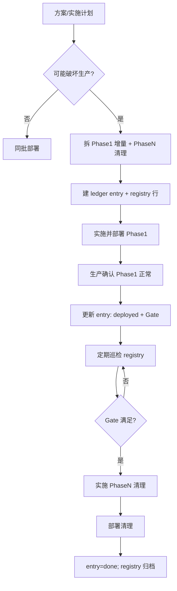

# Post-Deploy Ledger（部署尾项登记册）

Last updated: 2026-07-25

> **日常巡检口令：「检查 post-deploy」**（或问「还有没有部署后要补的？」）  
> → 打开 [`registry.md`](./registry.md)，看 **活跃** 表中 `active` / `blocked` 行数是否为 **0**。  
> → 非 0：点进对应 [`entries/`](./entries/) 查看 Gate 与 post-deploy debt 勾选项；Gate 已满足则排期 Phase N 清理部署。

---

## 用途

跨子项目、跨发布窗口的功能改动（例如：先上 backend、WeChat 审核后才能发客户端）往往包含 **临时兼容层**（双写字段、保留旧 API、deprecated 响应字段）。这些 **不能在 Phase 1 当天删**，也 **不应** 只写在 Cursor plan 或聊天里——会随时间丢失。

**Post-Deploy Ledger** 是运行态台账：记录「已上生产的中间阶段」与「待 Gate 后执行的清理阶段」，供人工与 AI **持续追踪**，在有空闲或专项清理时完成收尾部署。

---

## 何时必须登记

凡改动 **可能破坏当前生产环境**（已发布客户端、第三方集成、报表、批 job），且无法与所有 consumer **同批全量** 上线时，**必须** 做 post-deploy 分阶段规划并登记 ledger。

典型触发（非穷举）：

| 类型 | 示例 |
|------|------|
| API 删字段 / 删路由 | 移除 `set-default`，响应不再含 `isDefault` |
| DB 删列 / 改 NOT NULL | `DROP is_default` |
| 行为变更 | 结账预填逻辑从默认地址改为 last-used |
| 多仓不同步 | backend 先于 wechat 审核上线 |
| 双写 / 兼容 shim | 新列 + 旧列同时维护 |

**不必登记**：单 repo、单 PR、与生产 consumer 同步发布的纯增量（无临时兼容层）。

---

## 目录结构

| 路径 | 职责 |
|------|------|
| [`registry.md`](./registry.md) | **唯一巡检入口**——活跃项 + 已归档 |
| [`entries/YYYY-MM-<slug>.md`](./entries/) | 每条跨阶段功能一份：Phase 对照、Gate、post-deploy debt 清单 |
| [`.cursor/skills/post-deploy-ledger/SKILL.md`](../../../.cursor/skills/post-deploy-ledger/SKILL.md) | AI/人工：如何设计 pre-deploy / post-deploy 改动范畴 |
| [`agent-global-dev-rules-checklist.md`](../agent-global-dev-rules-checklist.md) §11 | 全仓强制规则摘要 |

与其它文档分工见 [`devGuide/todo/README.md`](../todo/README.md)。

---

## 标准流程（开 → 运 → 关）

### 1. 方案设计与实施计划（编码前）

- [ ] 判定是否需要分阶段（见 skill **Pre-deploy 设计**）
- [ ] 在 plan / devGuide 中写清 **Phase 1（可安全先上）** 与 **Phase N（清理 / 破坏性）**
- [ ] 新建 `entries/YYYY-MM-<slug>.md`，在 `registry.md` 增加一行（状态可先 `planned`）
- [ ] plan / devGuide 文首加链：`**部署尾项:** [ledger entry](./entries/....md)`

### 2. Phase 1 部署与生产确认

- [ ] 部署 Phase 1（仅增量 + 兼容，**不**含破坏性变更）
- [ ] **生产确认**：核心路径、监控、旧客户端仍可用
- [ ] 更新 entry：`当前已部署`、deployed 日期、**Gate**（可验证条件）
- [ ] `registry` 状态 → `active` 或 `blocked`（等 Gate 时）

### 3. 持续追踪

| 时机 | 动作 |
|------|------|
| 每周 / 站会前 | 打开 `registry.md`，处理 `active` / `blocked` |
| 每次生产发布前 | 确认不会误跑 **pending** 的清理 migration / 删 API |
| 客户端全量 / Gate 满足 | 排期 Phase N 清理 PR |
| 清理部署后 1 周内 | entry → `done`，registry 归档 |

### 4. 清理部署（Phase N）

- [ ] Gate 逐条验证（写进 entry 的 checklist）
- [ ] 执行清理：删列、删 API、停双写、类型收尾
- [ ] post-deploy debt 全部勾选；状态 → `done`
- [ ] 从各 repo `todo/` 移除重复项

---

## Entry 模板

见 [`entries/2026-06-user-address-last-used-delivery.md`](./entries/2026-06-user-address-last-used-delivery.md)（示例）。

**状态**：`planned` | `active` | `blocked` | `done` | `cancelled`

---

## 相关文档

- [Agent 全局规则 §11 分阶段部署](../agent-global-dev-rules-checklist.md)
- [`.cursor/rules/ai-coding-principles.mdc`](../../../.cursor/rules/ai-coding-principles.mdc) — Post-deploy phased deployment
- [`.cursor/skills/post-deploy-ledger/SKILL.md`](../../../.cursor/skills/post-deploy-ledger/SKILL.md)
- [Cross-repo todo 约定](../todo/README.md)
