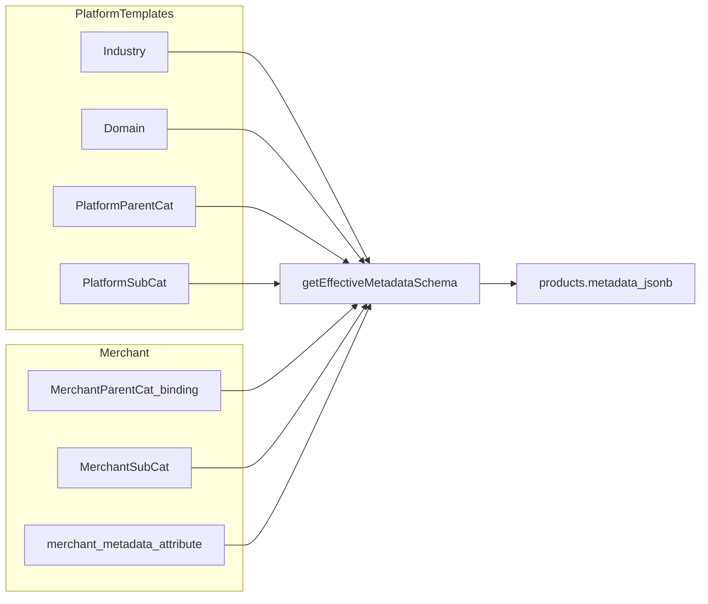

# Product Metadata 分阶段开发计划

## 阶段总览（五阶段）

| 阶段 | 目标 | 主要交付 |
|------|------|----------|
| **一** | 最小平台骨架 + 类型与 schema 入口收口 + 数据与键名一次到位 | 行业/领域 + **全局**平台父类树种子（**从默认商户** `categories` **一次性导入**）；**四字段**（`ingredient`/`storageType`/`storageDay`/`cuisine_style`）**全部**写入行业 `platform_metadata_attribute` 为 **schema 唯一真源**；`getEffectiveMetadataSchema` + LRU + bust；`region`→`cuisine_style` **一次性** SQL + 同一发布列车（migration 先行）；打印模板中 `metadata.region` **一次性**修复；全仓库引用扫描；**未知 metadata 键保存即拒绝**；`entityFields` 可选 `categoryId` |
| **二** | 平台侧可运营维护 | 完整 DDL（含枚举、审计）；Platform CRUD API；`xituan_platform` 模板中心 UI；`storage_key` 发布后不可改 |
| **三** | 商户绑定与 CMS/打印动态化 | **折中存储**：父类表快照 `platform_domain_id` + **`platform_category_id`**（平台父或子单引用）+ `binding_status` / `mapping_version`，向导/任务独立表；`merchant_metadata_attribute`、迁移任务；`GET product-metadata-schema`（**ETag / 完整缓存策略延至 Phase 3 完成之后**，本阶段可先 correctness-first）；CMS 动态表单与迁移向导；**`entityFields` 严格动态合并**（冲突显式失败，不静默回退静态字段） |
| **四** | Site 对齐契约 | 展示/筛选走 schema 与 `lang`；搜索经 façade；可选前端 `schemaVersion` 缓存 |
| **五** | 微信小程序对齐契约 | 与 Site 同 API/类型；详情列表 schema 驱动 |

**已定执行策略（跨阶段约束）**

- 存量 `products.metadata`：`region` → `cuisine_style` 采用 **一次性迁移**（migration SQL 为主），上线窗口内与代码切换对齐。
- 产品保存：**当前有效 schema 外未知键 / 类型不符**等仍 **拒绝保存**（不自动剥离、不服务端自动重试）。**`BOUND_NO_MAP`（映射未完成）**：**仍允许保存商品**；**全局搜索**侧对依赖「默认枚举集合」的 facet **降级不提供**（商户自定义枚举通道与全局默认枚举隔离，不受影响）。详见框架文档「绑定状态机」修订。
- **发布节奏**：同一发布列车内 **先执行 migration，再滚动发布应用**（极短窗口内完成切换）。
- **平台父类模型**：**全局一套** 平台父类模板树（运营在 Platform 维护）；商户 `categories` 在后续阶段通过绑定指向平台节点，第一阶段不做「每商户复制一份父类」。
- **父类种子来源**：从 **默认商户** 的 `categories` 树 **一次性导入** 为全局平台父类节点（默认商户 id 在实施中固定为配置或约定常量，保证可复现）。
- **行业属性本阶段写全**：`ingredient`、`storageType`、`storageDay`、`cuisine_style` 四条均在行业 scope 的 `platform_metadata_attribute` 落表；`getEffectiveMetadataSchema` **只读 DB**，不再与硬编码双轨。
- **打印**：存量打印模板/配置中 `metadata.region` **一次性**迁移为 `metadata.cuisine_style`（同一发布列车内完成）。

## 权威依据与约束

- **总体框架（修订版）**：同目录 [`商品_metadata_通用化_70835335.plan.md`](./商品_metadata_通用化_70835335.plan.md)（双轴、`domain_id` vs `platform_category_id`、绑定树约束、全局检索 vs 店内类目、合并/ENUM/RBAC/不可变规则等）。
- **Agent 执行摘要与代码触点**：[`.cursor/skills/product-metadata-schema/SKILL.md`](../../.cursor/skills/product-metadata-schema/SKILL.md)（须与上列框架及本计划同步更新）。
- 新 SQL 仅写入 [`xituan_backend/migrations/`](../../xituan_backend/migrations/) 下一序号文件；**不**编辑 [`xituan_backend/migrations_stable/`](../../xituan_backend/migrations_stable/)。
- 共享类型以子模块 [`xituan_codebase`](../../xituan_backend/submodules/xituan_codebase) 为单一真源，改类型后按多仓流程同步 CMS / Site / Platform / Wechat / Backend。
- 新 Platform 路由分组遵循 [`.cursor/skills/api-route-groups/SKILL.md`](../../.cursor/skills/api-route-groups/SKILL.md)。

## 当前实现快照（起点）

| 区域 | 现状 |
|------|------|
| 存储 | [`product.entity.ts`](../../xituan_backend/src/domains/product/domain/product.entity.ts) `metadata` jsonb，类型多为 `any` |
| 类型 | [`product.type.ts`（codebase）](../../xituan_backend/submodules/xituan_codebase/typing_entity/product.type.ts) 窄接口 `iProductMetadata`；后端 [`domains/product/types/product.type.ts`](../../xituan_backend/src/domains/product/types/product.type.ts) 另有宽接口 + `any` |
| CMS | [`ProductEditModal.tsx`](../../xituan_cms/src/components/products/ProductEditModal.tsx) 写死 `ingredient` / `storageType` / `storageDay` / `region` |
| 打印字段 | [`entityFields.default.ts`](../../xituan_backend/submodules/xituan_codebase/typing_entity/entityFields.default.ts) 静态 `metadata.*`；[`entityFields.routes.ts`](../../xituan_backend/src/domains/printTemps/routes/entityFields.routes.ts) 仅 `entityType`，无 `categoryId` |
| 分类 | [`category.entity.ts`](../../xituan_backend/src/domains/product/domain/category.entity.ts) 仅 `parentId` 树，无平台绑定字段 |

## 目标数据流（完成后）

---

## 第一阶段：结构收口（无新业务功能）

**目标**：先建立最小可运行的新架构骨架，减少“一次性迁移”混乱：先落平台基础模板与初始映射，保持业务行为稳定，再推进后续管理与迁移。

1. **平台基础模板先行落地（最小集）**：预置行业=`食品生产`、领域=`烘焙`；**全局**平台父类树种子由 **默认商户** 的 [`categories`](../../xituan_backend/src/domains/product/domain/category.entity.ts) **一次性导入**（每节点一条平台父类记录，非按全商户复制）；平台子类本阶段先不建；商户 `categories` **结构不迁**，与平台树的绑定留待第三阶段。
2. **行业级 metadata 定义本阶段写全**：在 `platform_metadata_attribute`（行业=`食品生产`）落齐 **`ingredient`、`storageType`、`storageDay`、`cuisine_style`**；`getEffectiveMetadataSchema` **以该表为唯一真源**生成字段列表（与 SKILL 中「定义在表、值在 jsonb」一致），避免代码硬编码与 DB 双轨。
3. **命名统一（第一阶段落地）**：将原 `region` 统一为中文 **`料理风格`**、英文 storage_key **`cuisine_style`**，用于表达“日式/韩式/法式”等。
4. **第一阶段统一更新范围**：同步更新 schema 定义、产品编辑表单文案（`料理风格`）、[`entityFields.default.ts`](../../xituan_backend/submodules/xituan_codebase/typing_entity/entityFields.default.ts) 路径 `metadata.cuisine_style`、共享类型；**migration SQL** 将 `products.metadata` 中 `region` **一次性** 改为 `cuisine_style`（无长期双读）。
5. **类型统一与去 any**：在 `xituan_codebase` 统一 `iProductMetadata`，清理后端实体/DTO 上业务 `any`，后端重复定义改为引用共享类型。
6. **`getEffectiveMetadataSchema(merchantId, categoryId)`**：新建统一入口，首版从 **DB 行业属性行** 合并生成 schema（本阶段可尚未合并领域/父类，或按 SKILL 预留空层）；内置进程 LRU 与 bust 钩子。
7. **产品写入校验 + `entityFields` 契约**：产品保存经统一入口校验；**仅允许 schema 内键**，否则拒绝；`GET /api/entityFields/:entityType` 支持可选 `categoryId`，**与 Phase 3 对齐：带 `categoryId` 时以动态合并为准，schema/合并冲突时显式失败，不静默回退仅静态字段**（首阶段若尚未接动态合并可暂保留回退，上线 Phase 3 前须收紧）。
8. **类目结构延后调整**：你提出的“哪些父类再挪为其他父类子类”放到整体方案完成后单独治理，不在第一阶段做结构重排。
9. **SKILL 同步**：本阶段完成后回写 `SKILL.md` 的已决策项，防止后续实现偏移。

**验收**：平台最小模板与初始映射可用；现网产品编辑/保存/列表不回归；无业务 `any`；存在唯一 schema 解析入口；类目结构未重排。

### 第一阶段已拍板清单（原开放项）

1. **发布顺序**：同一发布列车 — **migration 先行**，再滚动应用。
2. **平台父类与商户 categories**：**全局平台父类树**；商户绑定 **第三阶段**。
3. **行业级属性**：本阶段 **`ingredient` / `storageType` / `storageDay` / `cuisine_style` 全部写入** `platform_metadata_attribute`（行业 scope），作为 **schema 唯一真源**。
4. **全局父类种子**：从 **默认商户** 的 `categories` **一次性导入**。
5. **打印**：存量模板/配置中 `metadata.region` → `metadata.cuisine_style`，**一次性**迁移（与产品 jsonb 同列车）。
6. **全仓库引用**：全局检索并修正 `region` / `metadata.region` 及 metadata 过滤逻辑（partner 等），**按此执行**。
7. **migration 权限与校验**：预发验证 + 生产授权 + 迁移前后 **SQL 计数校验**，**按此执行**。
8. **子模块发布顺序**：`xituan_codebase` 变更后各端同步与发版顺序一致，**按此执行**。

**实施时需落配置**：**默认商户 ID**（用于导入平台父类种子）在代码或配置中显式声明，避免环境间种子不一致。

---

## 第二阶段：平台四级 + Backend API + Platform 管理端

**目标**：行业 / 领域 / 平台父类 / 平台子类 及 `platform_metadata_attribute`（+ 枚举表、审计表）可维护。

**与第一阶段衔接**：若第一阶段 migration 已创建行业/领域/全局父类/`platform_metadata_attribute` 等最小表并完成种子，本阶段 **补全** 枚举、审计、子类等第一阶段未建的表与约束，并接 **CRUD + UI**；避免两阶段重复建同名表。

1. **DDL**：`platform_metadata_industry`、`platform_metadata_domain`、`platform_*_category`（树）、`platform_metadata_attribute`（`scope_type` + `scope_id` + `storage_key` 唯一）、`platform_metadata_enum_*`、`platform_metadata_audit_log`（命名可与计划微调但语义对齐 SKILL）。
2. **Backend**：Platform 管理 CRUD、发布规则（`storage_key` 发布后不可改）、合并读取供后续阶段使用；属性变更时调用 schema **bust**（可按 scope 粗粒度失效）。
3. **Platform 前端**：模板中心（树 + 节点信息 + 属性 Tab + 属性编辑弹窗）；同 scope 下 `storage_key` 冲突阻断保存。
4. **路由与权限**：按 api-route-groups 挂载 CMS/admin 或 platform 角色校验。

**验收**：不依赖商户数据即可完整维护四类节点与属性；审计有记录。

---

## 第三阶段：商户绑定 + CMS 动态 metadata + 打印（2026 共识修订）

**目标**：绑定状态机、商户定义表、迁移向导、动态表单与 **`entityFields` 严格动态合并**；与框架文档中 **双轴类目 / `platform_category_id` / 折中存储 / RBAC** 一致。

1. **DDL（折中）**  
   - **商户父类（或绑定载体）表快照**：`platform_domain_id`、**`platform_category_id`（nullable；指向平台树任意节点——父或子）**、`binding_status`、`mapping_version` 等。  
   - **独立表**：迁移向导任务、`metadata_migration_task`（+ item）、审计外键等（避免类目主表臃肿）。  
   - 子类 **`domain_id` 由顶层父类绑定派生并级联同步**（子类不单独改域）。  
   - *说明：若历史方案仅写 `platform_parent_category_id`，Phase 3 以 **`platform_category_id` 单字段** 表达平台锚点，合并时解析 **平台根 → 该节点** 链。*

2. **合并算法**  
   - 全序合并、`platform_attribute_id` ref 展开、`EXISTS` 商户行 vs 仅投影平台模板。  
   - **同 `storage_key` / `jsonKey` 允许跨层重复**（子覆盖父），但 **全链 `value_type` 必须一致**；否则 **`PRODUCT_METADATA_SCHEMA_TYPE_CONFLICT` 类硬错误**。  
   - **平台侧写入**：祖先层 attribute 保存前 **向下闭包扫描**，禁止晚增「同 key 不同类型」压过子级。  
   - **已发布定义**：**`storage_key` + `value_type` 不可原地修改**；变更须 **新行 + 迁移/向导**。

3. **API**  
   - `GET …/product-metadata-schema?categoryId=`；产品保存与 `entityFields` 校验走 **同一 `getEffectiveMetadataSchema` 入口**。  
   - **`schemaVersion` / `ETag` / Redis 条件 GET / 客户端缓存策略**：**Phase 3 功能闭环后再做**（本阶段以正确性为先，可与框架文档 §11 对齐）。

4. **绑定状态与向导（修订）**  
   - **禁止「绑定并跳过映射」**。  
   - **`BOUND_NO_MAP`**：**允许保存商品**；CMS 提示映射与搜索 facet 降级策略；**ENUM 差异**：第一期以 **提示 + auto map** 为主，不作为主硬阻断；**必填冲突**：第一期须 **检测 + 明确合并规则**（取最严或子覆盖，全仓统一）。  
   - **类型冲突**：硬阻断合并及严格 API（含 `entityFields`）。

5. **商户选用平台节点时的树约束（与框架一致）**  
   - **`platform_category_id` 指向平台子类**：父链以平台为准，**禁止商户改 `parentId` 自造冲突父链**。  
   - **指向平台父类**：**该绑定节点领域按默认**（与创建父类时约定 `domain` 一致），不得擅自偏离。

6. **权限**  
   - **绑定 / 向导 / 商户 metadata**：仅 **CMS merchant admin/manager**（merchant RBAC）。  
   - **平台模板 CRUD**：仅 **platform admin** 路由；**禁止 CMS 客户端直接调 platform admin API**。

7. **打印**  
   - [`entityFields.controller.ts`](../../xituan_backend/src/domains/printTemps/controllers/entityFields.controller.ts)：`categoryId` 存在时动态合并 **`metadata.<jsonKey>`**；**冲突显式失败，不静默回退静态定义**。

**验收**：绑定与映射状态可跑通；产品 metadata 不再写死四字段；打印字段列表与校验跟 schema 一致；**全局类目 facet 仅在有可靠 `platform_category_id` / 映射策略时提供；`BOUND_NO_MAP` 下默认枚举 facet 按产品策略降级**。

## 类目重整后置策略（在五阶段后执行）

- 你已明确：先完成全链路（backend/platform/cms/site/wechat）再决定哪些“当前父类”下沉为其他父类的子类。
- 该动作作为独立“类目治理批次”执行：只改类目树与绑定关系，不与 metadata 主功能开发混在同一批，降低回归风险。

---

## 第四阶段：Site

**目标**：展示/筛选不依赖散落魔法字符串；为后续搜索留 façade。

1. 商品列表/详情：按 schema 的 `jsonKey` + `lang` 渲染 metadata。
2. 筛选：优先经 **`ProductSearchService`（或等价）** 抽象，内部仍 PG；facet 键与 `visibility` 白名单（SKILL Review 项）定稿后再加列。
3. 前端可缓存 `schemaVersion`（如 sessionStorage），配合条件 GET。

---

## 第五阶段：Wechat App

**目标**：与 Site **同一 API 与类型契约**；商品详情/列表若展示规格则 schema 驱动；注意包体与请求次数（条件 GET + 本地 version）。

---

## Phase 3 已确认决策（实施口径，2026）

1. **`required` 合并**：全链 **取最严**（strict merge）。
2. **定义不可变**：**保存即锁定** `storage_key` + `value_type`（发布后不可原地改）。
3. **`BOUND_NO_MAP` 与「强制统一」**：主要影响 **查询 / facet**；平台预期默认值 **多数情况不强制** → **警告**即可；若业务定义为 **必须统一** 的动作 → **禁止**（在该动作上硬拦）。
4. **`domain` 与平台节点**：正常路径下 **商户父类创建时已绑领域**、挂平台父类时 **领域按默认**、**父类创建后不可改领域**，**不应**出现双 `domain` 语义；若仍检测到不一致，视为 **异常/历史脏数据/平台数据修复** —— **绑定时校验拒绝** 或 **强制走修复向导**，不在运行时静默吞掉。
5. **存储**：**父类表绑定快照** + **独立任务/向导表**（唯一职责划分见实现设计）。
6. **向导**：对需处理项 **必须逐项选择** 动作（不可留空跳过）。
7. **类目切换 / 删除 / 合并**：**父级一致** 才允许切换；若有 **进行中任务** → **等待完成** 或 **选择回滚** 后再操作。
8. **商品换 `categoryId`**：若 **父级 lineage 一致** 且 **metadata 与目标 schema 一致**，或 **可通过向导迁到目标 category** → **允许**；若 **不兼容** → **需重建**（或等价：不允许直接切换，必须新建商品/复制后按新类重填）。
9. **并发**：**乐观锁版本号**（非「多人共用同一版本防冲突」，而是 **每次成功提交递增版本**；他人持旧版本 `UPDATE … WHERE version=N` → **0 行**则失败并 **刷新重试**）。
10. **全局 Agent 规则**：跨子项目约定见 **[`agent-global-dev-rules-checklist.md`](./agent-global-dev-rules-checklist.md)**；metadata 实现同时遵守 **[`.cursor/skills/product-metadata-schema/SKILL.md`](../../.cursor/skills/product-metadata-schema/SKILL.md)** 与本计划、框架 plan。
11. **审计与通知**：**`metadata_audit_log` 全量写入**、**CMS「最近变更」** 等 —— **Phase 3 核心闭环之后交付**（后置）。
12. **迁移 / 换绑 / 分级切换与 ENUM**：若目标属性 **`require_exact_enum_match = true`**（见下条）且无法通过 **`metadata_enum_value_map`（auto map）** 等使现有值全部落入目标允许集合 → **禁止**完成该迁移或切换；若无此硬约束 → **仅 warning**，仍可按既定策略推进（与查询 facet 降级等并存）。映射表须支持 **幂等** 重放。
13. **ENUM 严格模式（定义层）**：在 **`platform_metadata_attribute` / `merchant_metadata_attribute`**（或审批过的扩展 JSON）上增加 **`require_exact_enum_match`（bool）**（命名以最终实现为准）：`true` 时绑定/迁移路径 **必须** 枚举闭合，否则 **拦**；与第 12 条为 **同一设定** 的 **数据面** 与 **流程面**。
14. **`visibility`**：**CMS / Site / 打印 / 搜索索引** 使用 **同一套** 可见性语义与 **同一字段源**（单套配置，一处维护）。
15. **`value_type` ↔ JSON 形态**：见 **§25**（`devStandard` 文档 + `xituan_codebase` 代码双轨）。
16. **复制商品**：见 **§22**（CMS 预校验 + 后端再校验；失败则错误返回）。
17. **换类迷你向导**：**纳入 Phase 3**——与换 `categoryId`、乐观锁冲突、**统一业务错误码 + CMS 文案** 一并交付。
18. **`product_metadata_search_index`（若有）**：**用途** = 将 `products.metadata` 与类目、**visibility** 等打成 **列表筛选 / facet 友好的扁平列**（或供 OpenSearch 消费），避免列表对 jsonb 深解析。**写入顺序**：**迁移任务成功完成** 且 **商品 `metadata` 已落库为稳定态** 之后，再更新索引；**默认推荐 outbox 异步 + 幂等**（细节 **§24**）。避免索引先于迁移出现 **旧 key / 非法 enum**。
19. **订单历史展示与空间**：见 **§23、§26**（`metadata` 快照 + **`schema_context_category_id`** + **`effective_schema_revision`**）；**属性定义不物理删除**，**`DEPRECATED` + 版本** 回放。**不**默认每单嵌入整份 effective schema 文档。
20. **商户自排版（远期）**：**布局配置** 与 **校验 schema** 生命周期 **解耦** 预留；定义下架时历史 UI 展示 **「字段已停用 + 历史值」**。详细 PRD **可后置**，不阻塞 Phase 3 绑定主线。
21. **`require_exact_enum_match` 存量**：**无历史行**需推断；新列默认 **`false`**，除非后续产品发 **显式数据补丁** 将特定行业/属性标为 `true`。
22. **复制商品（CMS + API）**：**CMS 在提交前**用与后端一致的 schema 源（如先拉 `product-metadata-schema`）**预校验**；**后端仍全量校验**。**不完整或不合法 → 返回错误、不生成残缺商品**（整单复制失败语义）。
23. **订单行 metadata 回放上下文**：每个 **`order_item`**（或团队等价粒度）除 **`metadata` 值快照** 外，存 **`effective_schema_revision`（或 `schema_version`）**；并存 **`schema_context_category_id`（下单当时用于合并 effective schema 的叶子类目 id）**——因 **`products.category_id` 事后可变**，仅 revision **不足以**唯一还原「当时按哪条类目链解析」；与订单域展示口径一致（见下条）。**「复用」含义**：**不是**把 schema 塞进现有 `selected_options` / `product_name`；是复用与 **`product_name` 相同的「下单快照」模式**，**新增专用列**（语义与列名见 [`../devStandard/metadata-order-line-snapshot.md`](../devStandard/metadata-order-line-snapshot.md)）。
24. **搜索索引写入形态**：**索引更新与主写入链分离（outbox / 异步 worker）** 为 **默认推荐**（更灵活、易重试、幂等）；**须仍满足** §18：**迁移完成 + 商品 metadata 稳定后再发索引事件**。**需要重试**：与全仓 **pending 事件 / webhook** 同类运维方式 **统一**（`retry_count` 上限 + 死信/告警），见 [`../devStandard/metadata-search-index-pipeline.md`](../devStandard/metadata-search-index-pipeline.md)。若某读路径 **强依赖** 索引与主库一致，再评估 **局部同步尾部写入**。
25. **`value_type` ↔ JSON 对照表**：**文档** → **`xituan_agent/devStandard/product-metadata-value-type-json-contract.md`**（**后端主笔** 首版，Phase 3 填满）；**运行时共用常量/类型** → **`xituan_codebase`**，各项目引用。
26. **订单域对齐**：订单展示以 **item 上 `metadata` 快照 + `schema_context_category_id` + `effective_schema_revision`** 为准（与 §23 同一决策）。
27. **迁移任务回滚**：**谁编辑谁可回滚**（任务/向导的操作者）；**不**单独引入复杂 RBAC 规则（本期）。
28. **定义生命周期**：延续 **不物理删**、**`DEPRECATED` 为主**；若枚举/状态机仍含 **`DELETED`**，仅用于 **从未被订单或快照引用** 的行，或 **逐步废弃** 该值（与用户「认同」一致）。
29. **`require_exact_enum_match` 继承**：商户属性行 **`platform_attribute_id` 非空** 时 **默认继承** 平台侧该属性的 `require_exact_enum_match`（解析时以平台 ref 为准，避免双真源）。
30. **错误码登记与实现**：见 [`../devStandard/metadata-product-business-error-registry.md`](../devStandard/metadata-product-business-error-registry.md)。已在 **`xituan_codebase`** 增加 **`PRODUCT_METADATA_COPY_INVALID`**、**`PRODUCT_CATEGORY_METADATA_MIGRATION_REQUIRED`**（各仓子模块需 **同一 commit**）；CMS i18n 建议 **`errors.business.<CODE>`**。
31. **工程缺省（DDL / revision / outbox / i18n）**：已由实现侧选定并写入 [`../devStandard/metadata-phase3-engineering-defaults.md`](../devStandard/metadata-phase3-engineering-defaults.md)（**`effective_schema_revision` = varchar(64) SHA-256**、**`merchant.product_metadata_search_index_outbox`** 等）；订单域仅 **审 DDL +执行迁移**。

---

## PRD 闸门（跨阶段，开工前逐项关闭或标「本期不做」）

以下已在 **「Phase 3 已确认决策」及补充条** 中收口或延期，实施时以该节为准；其余仍待产品点名：

| 项 | 状态 |
|----|------|
| `visibility` 单套 | **已定**（§14） |
| 换分类 / 迷你向导 | **已定做**（§8、§17） |
| 分类删除合并与 `BOUND_NO_MAP` / 任务等待回滚 | **已定**（§7） |
| 迁移与 CMS 并发 | **已定乐观锁**（§9） |
| ENUM 未映射 / 严格匹配 | **已定**（§12–§13 + auto map 表） |
| RBAC | **已定**（见上文 Phase 3 §6） |
| 复制商品 metadata | **已定**（§16 / §22：CMS 预校验 + 后端校验） |
| `product_metadata_search_index` 顺序 / 形态 | **已定**（§18 / §24：迁移稳定后；默认异步） |
| 订单侧展示 | **已定**（§19 / §23 / §26：`metadata` + `schema_context_category_id` + revision） |
| 商户自排版 | **远期**（§20） |
| 订单外域对齐 | **已定**（§26；与订单模型字段名以订单域实现为准） |
| `require_exact_enum_match` 存量 | **已定**（§21：无历史，默认 `false`） |
| 迁移回滚权限 | **已定**（§27：谁编辑谁回滚） |
| 定义 `DELETED` | **已定**（§28：弱化/废弃物理删语义） |
| 订单行「复用」 | **已定**（§23 + `devStandard/metadata-order-line-snapshot.md`） |
| 索引重试统一 | **已定**（§24 + `metadata-search-index-pipeline.md`） |
| 错误码登记 | **已定**（§30 + registry；`xituan_codebase` 已加两码） |
| ENUM 继承 | **已定**（§29） |
| 对照表主笔 | **已定**（§25：后端） |
