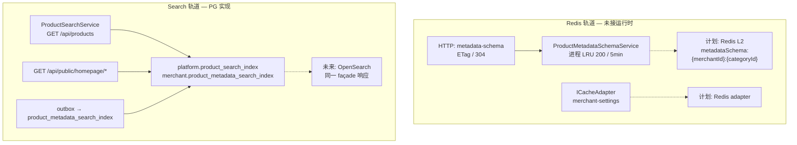

# Redis & Search — 基础设施铺垫总览

Last updated: 2026-05-24

本目录记录 **xituan_backend** 为日后接入 **Redis（多实例共享缓存）** 与 **OpenSearch / Elasticsearch（商品与 metadata 搜索）** 已做的铺垫与当前实现现状。  
目标读者：后端 / 全栈开发、运维（ElastiCache、OpenSearch Service）。

---

## 文档结构

| 路径 | 内容 |
|------|------|
| [redis/current-state.md](./redis/current-state.md) | 缓存抽象、ETag、LRU、相关 HTTP API、失效与运维入口（**as-is**） |
| [redis/valkey-development.md](./redis/valkey-development.md) | ElastiCache Valkey/Redis 长期路线、应用架构、限速、迁移与实现规范（**to-be**） |
| [search/current-state.md](./search/current-state.md) | 搜索门面、PG 投影表、outbox、cron、公开/店内 API、前端消费 |

---

## 架构关系（当前）

---

## 当前结论（一句话）

| 能力 | 运行时 | 对外契约 |
|------|--------|----------|
| **Redis** | 无；仅进程内 Map / `ICacheAdapter` 内存实现 | ETag + 条件 GET 已就绪；商户设置可走统一 cache 接口 |
| **Search** | PostgreSQL 物化表 + `tsvector` GIN；metadata 投影 + outbox | `ProductSearchService` + `iProductSearchFacadeListData` 已冻结；OpenSearch 未接入 |

---

## 后端入口索引（按轨道）

### Redis 相关

- 共享层：`xituan_backend/src/shared/cache/`
- ETag：`xituan_backend/src/shared/utils/http-etag.util.ts`
- Schema LRU：`xituan_backend/src/domains/metadata/services/product-metadata-schema.service.ts`
- 商户设置缓存：`xituan_backend/src/domains/merchant/services/merchant-setting.service.ts`
- CMS Dashboard 缓存：`xituan_backend/src/domains/dashboard/services/dashboard-sections.service.ts`（`dashboard:v1:{merchantId}`，90s TTL）
- 平台设置内存缓存：`xituan_backend/src/domains/platform-setting/services/platform-setting.service.ts`
- 待办：`xituan_backend/todo/metadata-schema-etag-redis-l2.md`

### Search 相关

- 门面：`xituan_backend/src/domains/product/services/product-search.service.ts`
- 契约类型：`xituan_backend/src/domains/product/types/product-search.type.ts`
- 首页/全局搜索：`xituan_backend/src/domains/homepage-cache/`
- Outbox：`xituan_backend/src/domains/metadata/services/metadata-search-index-outbox.service.ts`
- Cron：`homepage-cache-cron.service.ts`（15 分钟）、`metadata-search-index-cron.service.ts`（每分钟）
- 启动注册：`xituan_backend/src/app.ts`（`start()` 内）

---

## 相关 devGuide / SKILL（勿重复造轮子）

| 文档 / SKILL | 说明 |
|--------------|------|
| [redis/valkey-development.md](./redis/valkey-development.md) | Valkey/Redis 开发、ElastiCache、限速、多 ECS 共享状态 |
| `.cursor/skills/redis-valkey-backend/SKILL.md` | Agent 实现 Redis/Valkey 时的规范 |
| [metadata_visibility_facet_facade_整体方案_2026-04-25.md](../metadata_visibility_facet_facade_整体方案_2026-04-25.md) | Facet / visibility / façade 定稿 |
| [商品_metadata_通用化_70835335.plan.md](../商品_metadata_通用化_70835335.plan.md) | Schema 缓存、Redis L2、OpenSearch 章节 |
| [product_metadata_开发计划_b162e071.plan.md](../product_metadata_开发计划_b162e071.plan.md) | Phase 与 projection 顺序 |
| `.cursor/skills/product-metadata-schema/SKILL.md` | Agent 实现 metadata / 搜索时的规范 |

---

## 建议落地顺序（与 backend todo 对齐）

1. **Redis L2**：`getEffectiveMetadataSchema` 单点 + `REDIS_URL` 可选；ETag/304 不变；与现有 `bustCache()` / 平台·商户 DDL 失效对齐。  
2. **Redis adapter**：`getDefaultCache()` 换实现，多 ECS 任务共享商户设置热数据。  
3. **Search**：保持 PG + façade；数据量与运维就绪后再加 OpenSearch 读实现，**禁止**改 `iProductSearchFacadeListData` 外形。  
4. **延后**：交互式 `metadataFilters` facet 筛列表、CMS 列表走 `ProductSearchService`（可选）。

---

## 子文档维护约定

- **现状梳理**（as-is）：写在各子目录 `current-state.md`，代码变更后更新 Last updated。  
- **设计方案**（to-be）：后续可在 `redis/`、`search/` 下新增 `implementation.md` 或 `runbook.md`，本 README 只增链接、不展开细节。  
- **新建或迁移 devGuide 文档**：遵循 `.cursor/skills/devguide-documentation/SKILL.md`（先查子目录、扫重复、更新交叉引用）。
