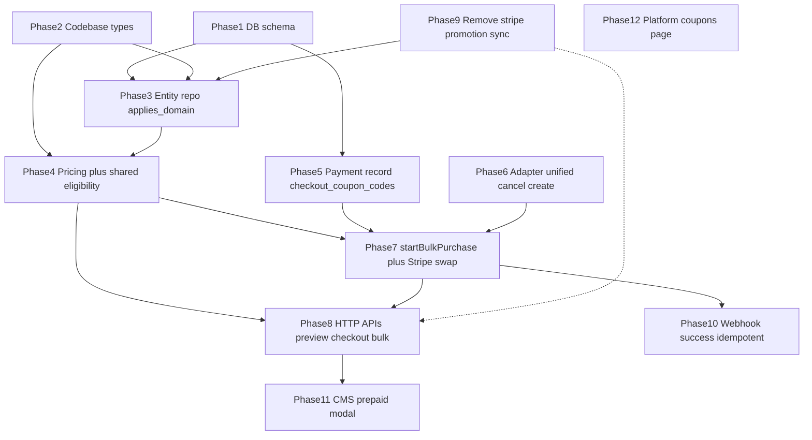

# Subscription prepaid + coupon — implementation phases (dependency order)

Source plan: `.cursor/plans/预付折扣与优惠结算_9aaf0872.plan.md` (and ongoing edits).  
Rule: new SQL only under `xituan_backend/migrations/` with the **next numeric index** after the current highest file; do not edit `migrations_stable/` via automation.

---

## Dependency overview

---

## Phase 1 — Database (blocks persistence and honest deploy)

**Primary**

- New migration (next index in `xituan_backend/migrations/`):  
  - `subscription_promotions`: add `applies_domain`, backfill **all rows** to `subscription_bulk`, drop `applies_to` (and dependent constraints if any).  
  - `platform.subscription_payment_records`: add `checkout_coupon_codes text[] NOT NULL DEFAULT '{}'`.

**Depends on:** nothing.

**Unlocks:** TypeORM entities, any query using new columns, Phase 3–5.

**Same-release note:** deploy migration together with backend that reads/writes new shape (per plan).

---

## Phase 2 — Shared typing (`xituan_codebase`)

**Primary**

- Enum / types: `applies_domain` values; retire `epSubscriptionPromotionAppliesTo` from subscription promotion surface where the plan requires.  
- Bump submodule consumers per [xituan-codebase-change-scope](.cursor/skills/xituan-codebase-change-scope/SKILL.md) only where imports change.

**Depends on:** Phase 1 column names stable (can parallelize naming with Phase 1 before merge).

**Unlocks:** CMS/platform TypeScript, backend DTOs.

---

## Phase 3 — Backend domain: promotion entity + catalog/repository

**Primary**

- Entity + repository: `applies_domain` instead of `applies_to`; list/find promotions for bulk by `subscription_bulk`.  
- Platform subscription controller / admin paths: stop writing `appliesTo`; align create/update with `applies_domain`.

**Depends on:** Phase 1 + Phase 2.

**Unlocks:** Phase 4 eligibility reads, Phase 9 sync removal.

---

## Phase 4 — Core pricing + shared eligibility (critical path)

**Primary**

- Remove **bulk** automatic `FIRST_MONTH_50_OFF` from `calculateBulkPrice` (and any shared entry used only for bulk preview).  
- Implement **one** shared module used by both list and purchase, e.g.  
  - resolve promotion row by `code` + merchant + `applies_domain === subscription_bulk`  
  - one-time + success consumption rules aligned with `firstMonthPromotionUsed` / `checkout_coupon_codes` + success (per plan)  
  - optional code: duration stack + coupon line items → `iSubscriptionPriceBreakdown`  
- `pricing-preview`: accept optional promotion `code` query/body as decided; reuse shared calculator.

**Depends on:** Phase 3 (promotion reads). Conceptually independent of Phase 5 until `startBulkPurchase` needs amounts.

**Unlocks:** Phase 7–8, Phase 11 preview UI.

---

## Phase 5 — Payment record write path

**Primary**

- `subscription_payment_record` entity: `checkout_coupon_codes`.  
- `createPending` / repository: persist `checkout_coupon_codes` (empty array when no coupon).

**Depends on:** Phase 1 migration applied (or migration file committed before entity deploy).

**Unlocks:** Phase 7 (attach codes to row), Phase 10 (audit trail).

---

## Phase 6 — Payment provider adapters (unified boundary)

**Primary**

- Define unified result / `BusinessError` mapping for create + cancel.  
- **Stripe:** real `cancelOutbound` for PaymentIntent.  
- **OmiPay:** `cancelOutbound` **not implemented** (placeholder / throws not-supported internally mapped to unified type — no fake success).

**Depends on:** little DB; can start in parallel with Phase 4 after interfaces are known.

**Unlocks:** Phase 7 Stripe swap branch.

---

## Phase 7 — `startBulkPurchase` (orchestration)

**Primary**

- Request body: optional single promotion `code` (field name fixed in Phase 8 contract).  
- Flow: shared eligibility + pricing → `createPending` with `checkout_coupon_codes` → provider session.  
- **Stripe + coupon + pending overlap:** call `cancelOutbound`; **on failure → BusinessError, no new row, no new PI** (no retry). **On success:** terminal old row, insert new pending, create PI.  
- **OmiPay + coupon:** no remote cancel; **do not** reject on pending-only overlap; still reject when **one-time + already consumed by success** (shared rule).  
- **No coupon:** skip coupon branches (per plan).

**Depends on:** Phase 4, Phase 5, Phase 6.

**Unlocks:** Phase 8 admin routes, Phase 10 webhook consistency.

---

## Phase 8 — HTTP API surface (admin / merchant context)

**Primary**

- `GET …/bulk-checkout-options` (or name in plan): returns eligible codes using **same** shared eligibility as Phase 4.  
- `POST …/bulk-purchase` (existing): extend body with optional `code`; wire Phase 7.  
- Rename subscription promotion routes to **`coupons`** only (no legacy alias); grep `xituan_cms` / `xituan_platform` / scripts.

**Depends on:** Phase 7.

**Unlocks:** Phase 11–12 frontends.

---

## Phase 9 — Remove `stripe-promotion-sync`

**Primary**

- Delete service + all call sites; platform flows must not depend on Stripe Coupon for subscription bulk amount.

**Depends on:** Phase 3+ no longer requiring Stripe coupon id for bulk (amount is server-computed). Can overlap late Phase 4 / Phase 7 but safest **after** bulk path no longer calls sync.

**Unlocks:** cleaner deploy; avoid double source of truth.

---

## Phase 10 — Webhooks + success path

**Primary**

- Idempotent completion; set `firstMonthPromotionUsed` / promotion consumption consistent with **user-selected code** (not removed auto-first-month for bulk).  
- Re-read rules before marking consumed (plan: race acceptance without DB lock).

**Depends on:** Phase 7 row shape (`checkout_coupon_codes`), Phase 4 rules.

**Unlocks:** production-safe payments.

---

## Phase 11 — `xituan_cms` (merchant)

**Primary**

- Prepaid modal: load checkout-options, optional code selection, call extended `bulk-purchase`.  
- Comparison table + RulesNote (plan todos `cms-display`, `cms-payment-modal`).

**Depends on:** Phase 8 stable API contract.

---

## Phase 12 — `xituan_platform` (operator)

**Primary**

- Dedicated coupons page; remove coupon block from `subscription-plans`; reuse existing platform nav/permission patterns.

**Depends on:** Phase 8 `coupons` routes + Phase 3 CRUD if UI edits promotions.

---

## Suggested parallelization (same sprint)

| Track A (backend data path) | Track B (can overlap) |
|------------------------------|------------------------|
| Phase 1 → 3 → 4 → 5 → 7    | Phase 2 after enum names fixed |
| Phase 6 alongside Phase 4–5 | Phase 9 after bulk no longer needs sync |
| Phase 10 after Phase 7 merge | Phase 11–12 after Phase 8 |

---

## Explicit non-goals (this rollout)

- DB row locks / advisory locks for coupon (deferred per plan).  
- OmiPay remote cancel until official API exists.  
- Standalone “cancel pending payment” CMS API (deferred per plan).
