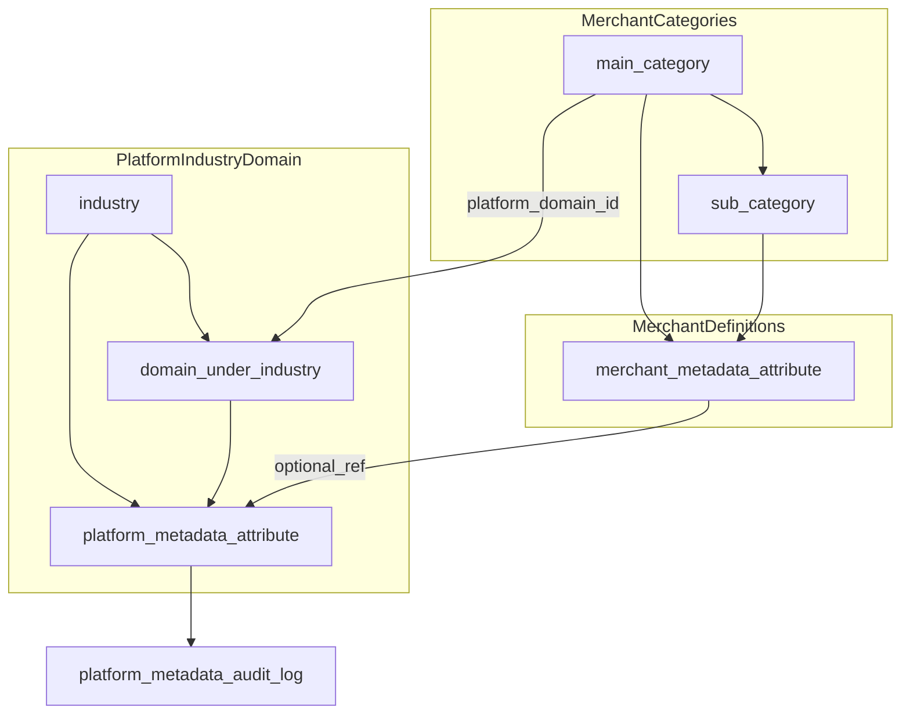

# 商品 Metadata 通用化总体框架（修订版）

**与分阶段计划互链**：[Product Metadata 分阶段开发计划](./product_metadata_开发计划_b162e071.plan.md)（Phase 3 交付切片以该文档「第三阶段」修订为准）。

**权威模型（以本节为准）**

- **平台模板轴**（可并行存在两类模板）：  
  - **行业模板**：行业类型（Industry）→ 子领域（Domain），领域继承行业 metadata 并追加领域属性。  
  - **平台分类模板**：平台父类 → 平台子类，各层可定义 metadata。  
  两者都属于「平台默认模板池」，供商户按分类自由绑定。
- **商户类目轴（店内展示/导航/店内筛选）**：**商户父类** → **商户子类**（[`Category.parentId`](../../xituan_backend/src/domains/product/domain/category.entity.ts) **仅**表示商户陈列树）。  
  关键点：**商户不被限定在单一领域**，每个商户父类可独立绑定不同平台模板组合。
- **全局检索语义（跨商户）**：依赖 **`domain_id`（领域，顶层父类至少选定，子类继承）** + 可选 **`platform_category_id`（指向平台类目树任意节点）**；**商户自建父/子名默认不作为**全局类目 facet；平台类目 facet 仅在映射/策略允许时使用。
- **商品值**：仍落在 [`Product.metadata`](../../xituan_backend/src/domains/product/domain/product.entity.ts)（jsonb）；**定义**由多层合并得到，驱动 CMS、校验、打印绑定列表。

**继承/覆盖链（定义层，按分类绑定解析）**

```text
平台行业 metadata（可选）
  → 平台领域 metadata（可选）
  → 平台父类 metadata（可选）
  → 平台子类 metadata（可选）
  → 商户父类 metadata（扩展/覆盖）
  → 商户子类 metadata（扩展/覆盖）
```

同一 `storage_key` / `jsonKey` **允许**在更下层 **覆盖**上层（子覆盖父）；**全合并链上该 key 的 `value_type` 必须一致**，否则 **硬错误**（如 `PRODUCT_METADATA_SCHEMA_TYPE_CONFLICT`），禁止静默强制转换。  
**平台侧**：在祖先层创建/更新 attribute 时做 **向下闭包扫描**，防止「父级晚设同 key 不同类型」进入库。  
**已发布定义**：**`storage_key` 与 `value_type` 不可原地修改**；需改则 **新属性行 + 迁移/向导**，旧行 `DEPRECATED`。

---

## 现状摘要（与需求的差距）

- 商品值：`jsonb`；类型 [`iProductMetadata`](../../xituan_backend/submodules/xituan_codebase/typing_entity/product.type.ts) 仍为固定食品字段。
- CMS：[`ProductEditModal.tsx`](../../xituan_cms/src/components/products/ProductEditModal.tsx) 固定 metadata 表单项。
- 商户 [`Category`](../../xituan_backend/src/domains/product/domain/category.entity.ts) 已有 `parentId`：**仅表示商户分类树**，本设计中 **不**承担「行业类型」角色。
- 打印：[`entityFieldsConfig`](../../xituan_backend/submodules/xituan_codebase/typing_entity/entityFields.default.ts) 硬编码；[`entityFields` 路由](../../xituan_backend/src/domains/printTemps/routes/entityFields.routes.ts) 尚未按商户/分类动态合并。

---

## 设计原则

1. **值与定义分离**：`products.metadata` 只存值；各层 **属性定义** 存表，经 **解析服务** 合并为「有效 schema」。
2. **稳定 `storageKey`**：JSON 键用稳定 slug；平台属性有稳定 **id（ref 目标）**；商户侧定义行可有独立 UUID，迁移时 **属性行 id 可保持不变**，通过 **`platform_attribute_id`（ref）** 绑定平台三级中的某一属性实体。
3. **ref 与 fork 并存**（按你最新表述以 ref 为主）  
   - **迁移到平台属性（默认不重写产品 jsonb 键）**：商户属性行挂 **`platform_attribute_id` ref** 即可对齐平台语义（类型、ENUM、平台侧文案源）；**`products.metadata` 内已有键名与值可保持不动**，避免大规模 jsonb 改写风险。有效 schema 对前端/校验同时给出 **`jsonKey`（实际读写 `metadata[jsonKey]`）** 与 **`platformAttributeId`（语义来源）**；平台属性表上的 canonical `storage_key` 与商户 JSON 物理键 **允许字符串不一致**。仅当业务强制要求（例如打印/第三方硬编码路径必须与平台 key 完全一致）时，才 **可选** 触发「批量改键」迁移任务，不作为默认路径。  
   - **未绑定平台的纯自定义**：无 ref，仅商户层定义。  
   - **未在商户表落定义时的回退**：若某商户分类未配置任何行，可 **仅投影** 其绑定的「子领域 + 行业」合并结果（只读）；一旦商户保存过该层配置，则以商户表为准（`EXISTS` 判定，与旧版思路一致）。
   - **读路径与负载**：有效 schema **按 `(merchantId, categoryId)` 缓存**（带 `schemaVersion`）；单次商品读写 **不在行级反复 join 平台表**，仅用缓存字典校验/序列化；绑定或属性变更时 bust 缓存即可。
4. **按商户父类绑定平台模板（修订）**：商户父类（绑定载体）上 **`platform_domain_id`** + 可选 **`platform_category_id`**（**单字段**指向平台树 **父或子** 节点；合并时取 **平台根→该节点** 路径上的模板属性）。**不再以单独 `platform_parent_category_id` 为唯一表达**（若历史存在可迁移为 `platform_category_id`）。**折中存储**：绑定快照列在父类表；**向导任务 / 映射流水 / 审计关联** 用独立表。同一商户下不同父类可绑定不同模板组合。
5. **自定义上提迁移**：商户自定义属性可迁移到平台某个默认属性集（通过 `platform_attribute_id` ref 绑定），前提是 `value_type` 一致；迁移后保持商户属性行 id 不变。
6. **`storage_key` + `value_type` 不可变（定义层硬规则，发布后）**：**平台属性行、商户属性行各自表内**的 **`storage_key` 一经发布即不可修改**；**`value_type`（及 ENUM 若纳入类型一致性）同样不可原地修改**（与第 3 条 ref 对齐：有 `platform_attribute_id` 时商户不得改 type）。**多语言展示名、说明、排序、必填、枚举项标签** 等可改。语义/类型变化 → **新属性行 + 数据迁移/向导**。若采用第 3 条默认策略，**对齐平台可不改商品 JSON 键**，仅改 ref 与 schema 投影。
7. **单位（已定口径）**：**一律用「最小/基准小单位」存 `number`**（如克、毫米），**不在 jsonb 并存多套单位语义 key**；客户端（或仅展示层 BFF）按用户偏好做 **换算与格式化**，服务端校验仍按基准单位。避免 `weight_kg` / `weight_g` 混用。
8. **跨语言排序**：与 **现有产品列表排序** 一致；凡需按多语言 metadata 或展示名排序的 **query API**，显式提供 **`lang` 参数**（或与列表接口相同的语言解析顺序），用于 coalesce/排序键选择。
9. **引用型（一期可不实现；若做则取数→渲染流程）**：metadata 存 **外键 id** 指向「认证/证照、媒体、品牌主数据」等表。**推荐服务端组装读模型**，避免客户端 N+1：  
   - **列表/轻量接口**：不展开引用，只返回 id + schema 中标明 `value_type=REFERENCE`，前端显示占位或省略。  
   - **详情接口**：`expandMetadataRefs=true`（或独立 `GET …/metadata-resolved`）由服务端按 id 批量查询关联表，将 **已解析片段**（如 `{ id, label, thumbUrl }`）嵌入 `metadataResolved` 或与 `metadata` 并行的只读字段；**CMS 表单**仍编辑 id，**展示组件**读 resolved。  
   - **缓存**：resolved 块可短期缓存，失效随主数据变更事件 bust。  
   与「无校验的字符串 id」区分；一期仅标量/ENUM/多语言时可不写此路径。
10. **`schemaVersion` 与「schema」指什么**：这里的 **schema** = **某商户分类上下文下的「有效 metadata 字段定义」文档**（字段列表：类型、必填、`jsonKey`、ENUM 选项、展示名、校验规则、`platformAttributeId` 等），由平台模板 + 商户定义合并生成，**不是**数据库表结构 DDL，也不是整张 `products` 表结构。  
    **`schemaVersion`** = 该文档内容变更时的 **版本戳**（单调整数或 short hash），在 **每次合并生成 schema 文档时一并算出**，写入响应体（并可作为 **`ETag` / `If-None-Match`** 做条件 GET）。它描述的是「**这份字段定义文档**」是否变了，**不是** Redis 自带的机制，但 **正是缓存命中/失效判断的核心依据**。  
    **排期（修订）**：**完整 `schemaVersion` + ETag + Redis + 客户端条件 GET 策略在 Phase 3 功能闭环之后**再细化落地；此前以 **合并正确性 + 可选进程 LRU** 为主。

11. **Schema 缓存怎么实现（与 `schemaVersion` 的关系）**  
    - **算什么**：对某 `(merchantId, categoryId)` 首次请求（或缓存未命中）时，服务 **合并各层属性定义** 得到 schema 文档，同时计算 `schemaVersion`（例如 `binding.mapping_version` + 参与合并的各属性 `updated_at` 的 max 再 hash，或 DB 中维护单调 `effective_schema_revision` 列并在相关写入时 `+1`）。  
    - **存哪**：`cacheKey = metadataSchema:{merchantId}:{categoryId}`，`value = { schemaVersion, fields: [...] }`（或序列化 JSON）。**已定：一期默认仅进程内 LRU**；待 **ECS 多任务需跨实例一致** 或 LRU 内存/一致性不够时，再上 **Amazon ElastiCache for Redis**。实现上 **`REDIS_URL` 有则走 Redis、无则 LRU**，同一 `getEffectiveMetadataSchema` 抽象。可选 **短 TTL**（仅 Redis 或模拟层）兜底。  
    - **商品详情怎么用**：处理 `GET product/:id` 时 **不 join 平台**；用该商品 `categoryId` 取（或先取）对应缓存条目，在内存中按 `jsonKey` 对 `product.metadata` 做校验/剥离未知键；复杂度 **O(字段数)**。  
    - **何时 bust**：任何会改变合并结果的操作完成后 **删除该 `cacheKey`** 或 **递增 revision** 使旧 `schemaVersion` 自然失效，包括：商户属性 CRUD、父类绑定变更、`BOUND_NO_MAP→BOUND_MAPPED`、平台被引用属性/枚举变更（若缓存包含平台投影）。  
    - **与客户端**：响应带 `schemaVersion`；客户端本地存「分类 id → version」；若版本未变可 **跳过重新拉 schema**；若变则重新请求。服务端亦可用 **`ETag: "{schemaVersion}"`**，客户端 `If-None-Match` 匹配则 **304** 无 body。  
    - **结论**：`schemaVersion` **来自合并逻辑对「当前定义快照」的摘要**，用于 **HTTP 条件请求 + 服务端内存/Redis 缓存 + 前端本地缓存** 三层；不是另一种独立「缓存类型」。

12. **Schema 缓存运转细则（存哪、怎么取、谁读缓存、版本不一致流程、懒加载）**  

    **服务端存哪**  
    - **推荐键**：`metadataSchema:{merchantId}:{categoryId}`（`categoryId` 用商品挂载的 **叶子分类**，与合并解析输入一致）。  
    - **值**：`{ schemaVersion, fields: [...] , computedAt }` 序列化（JSON/MessagePack 均可）。  
    - **部署形态（已定）**：**生产先 LRU**；需要时 **ElastiCache for Redis**（如 Sydney `ap-southeast-2`）。可选未来 **L1 进程 + L2 Redis** 二级缓存。  
    - **本地开发**：`docker compose` 增加 **`redis:7-alpine`**，映射 **`6379`**；`.env` / `local` 配置 **`REDIS_URL=redis://127.0.0.1:6379`**，与生产共用同一套 Redis 代码路径，便于联调 **bust / TTL / 多实例行为**；不设 `REDIS_URL` 时 **回退 LRU**（新人零依赖启动）。WSL2 注意端口占用与防火墙。  
    - **TTL**：建议 **5～30 分钟** 作兜底；正确性仍以 **写路径 bust** 为主。  

    **服务端怎么取（内部统一入口）**  
    - 封装 `getEffectiveMetadataSchema(merchantId, categoryId)`：**先查缓存** → miss 则 **DB 合并** → 写入缓存 → 返回 `{ schemaVersion, fields }`。  
    - **所有需要 schema 的路径**只调此入口，避免重复逻辑：`GET product-metadata-schema`、`PATCH/POST product` 校验、`GET entityFields?categoryId=` 合并动态字段、（可选）`GET product/:id` 内联校验。  

    **哪些 API call 会命中「服务端」这份缓存**  
    - **显式**：`GET …/product-metadata-schema?categoryId=`（CMS 打开分类/产品编辑器、打印选字段前）。  
    - **隐式**：`POST/PATCH …/products` 保存前服务端校验 metadata；`GET …/entityFields/PRODUCT?categoryId=` 动态列；若商品详情接口选择在服务端校验 metadata，则 `GET …/products/:id` 内部也会调同一入口（**不一定要把整份 schema 下发给浏览器**）。  

    **前端「临时 version」放哪、怎么用**  
    - **存哪**：**内存 Map**（同一会话编辑多个产品时）或 **`sessionStorage`**（刷新页面仍保留），键建议 `metadataSchemaVer:{merchantId}:{categoryId}`，值仅为 **`schemaVersion` 字符串**（不必存整份 fields，减小体积）。  
    - **何时写**：每次成功拉到 `GET product-metadata-schema` 的 body 后，更新该 version；若用 **304**，version 不变、无需更新 body。  
    - **何时比**：打开产品编辑、或切换 `categoryId`、或点保存前：若本地无 version 或 **与响应头/body 中 `schemaVersion` 不一致** → 重新请求 schema（见下条流程）。  
    - **可选**：同一页内再存 **完整 schema 文档** 于内存（`Map<categoryId, fields>`），仅 CMS 长会话需要；离开页可丢。  

    **版本不一致时的完整流程（前端 + 服务端）**  
    1. 前端准备提交或渲染表单：已知 `categoryId`、本地 `cachedVersion`。  
    2. 请求 `GET product-metadata-schema?categoryId=`，带 **`If-None-Match: "{cachedVersion}"`**（或 query `clientKnownVersion=` 由服务端比对）。  
    3. **服务端**：`getEffectiveMetadataSchema` 先命中 Redis/LRU 得到当前 `schemaVersion`；若请求头 If-None-Match **等于**当前版本 → **304**，无 body，前端沿用内存里的 fields。  
    4. 若 **不等于** 或缓存 miss：合并 DB → 新 `schemaVersion` → **200** 返回完整 JSON + `ETag`；并 **写入** Redis/LRU。  
    5. 前端收到 200：更新 `sessionStorage` 中的 version，替换内存中的 fields，再渲染/再校验。  
    6. **未带条件请求**：每次 200 亦可，流量大；条件 GET 省带宽。  

    **懒加载 vs 开机全量加载**  
    - **采用懒加载（用到才缓存）**：**不在**进程启动时预载全商户全分类 schema（组合爆炸、冷数据浪费内存）。  
    - **首次**某 `(merchantId, categoryId)` 被任意 API 触发时 **算一次、写入缓存**；之后同 key 命中直至 bust/TTL。  
    - **可选预热**：仅对「热点商户 Top N 分类」在发布新版本后由后台任务 **主动 bust 后预跑一次** `getEffective`，非默认必做。  

    **容量与「太大」怎么办（Redis / 内存）**  
    - **单 key 上界**：schema 文档体量 ≈「该分类下字段数 × 单字段元数据大小」；PRD 层可对 **单分类最大字段数** 设硬上限，从源头限制单 key 体积。  
    - **总 key 数上界**：Redis 使用 **`maxmemory` + `maxmemory-policy=allkeys-lru`**（或 `volatile-lru` 若全 key 带 TTL）：内存满时 **自动淘汰最久未访问的 key**，schema 缓存可安全被踢，下次 miss 再算（略增 DB 压力，正确性不变）。  
    - **TTL**：全 key 设 TTL，使冷分类 **自然过期**，减少长期堆积。  
    - **进程内 LRU**：库实现带 **max 条目数**（如最多缓存最近 5k 个 `merchantId+categoryId`），超出则淘汰最旧。  
    - **瘦身**：缓存体只存 **校验与渲染必需字段**（`jsonKey`、`type`、ENUM codes、展示用短文案）；超长说明、大段 help 可走 **按需第二请求** 或不进缓存。  
    - **压缩**：单 key 序列化后仍大（例如枚举项极多）可对 value **gzip** 再存 Redis（CPU 换内存）。  
    - **监控**：Redis `used_memory`、key 数量、schema 接口 miss 率；异常膨胀时告警并查是否字段失控或 bug 重复写 key。  

---

## 数据模型（库表草案，命名可再工程化）

### Platform schema

- **`platform_metadata_industry`**：食品、服装、3C…；多语言名称、`code`、排序、状态。
- **`platform_metadata_domain`**：`industry_id`、子领域 `code`、名称；**继承关系**用 `industry_id` 表达即可（领域挂行业下）。
- **`platform_metadata_attribute`**（可被 ref 的「三级」实体之一）：  
  - `id`（UUID，**迁移 ref 目标**）  
  - 归属：`scope` = `INDUSTRY` | `DOMAIN` + `scope_entity_id`（行业 id 或领域 id）  
  - `storage_key`、`value_type`、多语言 `display_name`、校验 JSON、枚举引用、`sort_order`、`version`  
- **`platform_metadata_enum_*`**：可选。  
- **`platform_metadata_audit_log`**：行业 / 领域 / 属性 变更审计，供通知与追溯。

### Merchant schema

- **`merchant_categories`**：沿用现有 `categories` 表；在**商户父类（绑定载体）**层增加绑定字段（**折中：快照列放此表**）：  
  - `platform_domain_id`（可空；子类 **继承同步**，不在子类随意改域）  
  - **`platform_category_id`（可空）**：指向平台类目树 **父或子** 任一节点，供 **全局类目 facet** 与平台链模板合并；未绑则全局侧不提供平台类目维度 facet（仍可有 `domain_id` 等）。  
  - `binding_status`、`mapping_version` 等  
  - *向导任务、映射 item、审计边* → **独立表**（见下文迁移任务表；不在此重复堆砌）
- **`merchant_metadata_attribute`**（建议按 **绑定层级** 分表或单表加 `scope`）：  
  - `merchant_id`  
  - `scope` = `MAIN_CATEGORY` | `SUB_CATEGORY`  
  - `category_id`（主或子分类 id）  
  - `id`（UUID，迁移保持不变）  
  - `storage_key`  
  - `value_type`、多语言 label、排序、必填、选项  
  - **`platform_attribute_id`（可空 ref）**：非空即表示 **托管对齐** 到平台该属性；同步策略见下  
  - **`label_locked_to_platform`**（可选）：为 true 时展示名强制跟平台文案更新  

**不在 JSON 里塞定义**。

---

## Schema 解析算法（服务端）

输入：`merchantId`，商品 `categoryId`（通常子分类叶子）。

1. 取该子分类及其主分类（沿 `parent_id` 或显式 `main_category_id` 字段，二选一实现）。  
2. **平台基座**：读取该商品所属商户父类绑定：  
   - 若绑定 `platform_domain_id`，加载 `industry ∪ domain` 属性；  
   - 若绑定 **`platform_category_id`**，加载 **平台树「根 → 该节点」** 路径上各层模板属性（该 id 可为平台父或子）；  
   - 若两类都绑定，按预设优先级合并（**先 industry/domain，再平台类目链**；**同 key 不同类型硬错误**；同 key 同类型允许覆盖）。
3. **商户层**：合并 `MAIN_CATEGORY` 与 `SUB_CATEGORY` 的 `merchant_metadata_attribute`（子层增量；`storageKey` 冲突规则同上）。  
4. **ref 展开**：对有 `platform_attribute_id` 的行，用平台当前版本的 type/enum 作为 **权威类型**（商户改 type 应禁止）；display 按 `label_locked_to_platform` 与本地 override 决定。  
5. 输出 **有效字段列表**（供 CMS 与 `entityFields`）、以及 **校验器** 使用的类型信息。

---

## CMS / Platform 流程要点

- **Platform**：维护行业、子领域、各 scope 下属性；所有变更写审计表；**仅 platform admin / super admin** 可调用的路由。  
- **商户（CMS）**：分类树管 **店内**陈列与检索；在 **商户父类** 上配置 **`platform_domain_id` / `platform_category_id` / 绑定状态** 与父类级 metadata；在 **商户子分类** 上配置增量 metadata。**绑定、向导、商户 metadata 定义仅 merchant admin/manager（merchant RBAC）**；**禁止 CMS 直连 platform admin API**，须经 merchant-scoped backend。  
  - **树约束**：`platform_category_id` 指向 **平台子类** 时，**父链以平台为准**，**禁止商户 `parentId` 自造冲突父链**；指向 **平台父类** 时，**该绑定节点领域按默认**（与创建父类时约定一致）。  
- **产品编辑**：`categoryId` 变更 → 拉取合并后的 schema → 动态表单；校验写入 `metadata`。  
- **迁移页（上提）**：自选商户属性 → 选择平台默认属性（行业/领域/平台父子任一来源）→ 校验 **value_type 一致** → 写 **`platform_attribute_id`**；**默认不改写** `products.metadata` 内键名，有效 schema 通过 **`jsonKey`=现有物理键** 读写；仅在有明确业务需求时勾选 **可选「批量改键」** 任务；**属性行 id 不变**。

### 商户绑定平台分类后的 metadata 绑定与值迁移（关键机制）

为避免“绑定后产品值错位/丢失”，定义 3 个状态与 2 类映射：

**硬规则（必须执行，2026 修订）**
- 商户分类从 `UNBOUND` 进入任何平台绑定态时，**必须进入迁移向导流程**，不允许“一键绑定并跳过映射”。
- 若存在 **未关闭的阻塞项**（至少包含：**类型冲突**、以及你们定义为阻塞的 **必填策略**），分类状态停留在 `BOUND_NO_MAP`，直到满足 **严格路径**（如 `entityFields`、合并）要求。
- **`BOUND_NO_MAP` 期间**：**仍允许保存商品**（不因映射未完成一律阻断落库）；**全局搜索**对依赖 **「默认枚举集合」** 的 facet **降级不提供**（或空）；**商户自定义枚举通道**与全局默认枚举 **隔离设计**，不受该降级误伤。**ENUM 差异**：第一期以 **提示 + auto map** 为主。**必填冲突**：第一期须 **检测 + 全仓统一合并规则**（取最严或子覆盖，须写死一种）。
- **CMS**：对映射风险给 **显著提示**；是否阻断「发布」类动作由产品再细化，但 **默认不采用**「未映射则禁止一切保存」。

1. **分类绑定状态**（商户父类或子类）
   - `UNBOUND`：未绑定平台模板，仅商户自定义定义生效
   - `BOUND_NO_MAP`：已绑定平台模板，但未执行历史值映射；新建产品按新 schema
   - `BOUND_MAPPED`：已完成映射并回填；新旧产品均按绑定后的 schema 工作

2. **属性映射关系**
   - **定义映射**：`merchant_metadata_attribute.platform_attribute_id`（表示该商户属性已对齐到某平台属性）
   - **值迁移映射任务**：`metadata_migration_task` + `metadata_migration_task_item`
     - 记录 `source_storage_key -> target_storage_key`、`type`、转换策略、影响产品数、成功/失败明细

3. **绑定流程（推荐强制向导）**
   - 步骤A：选择“绑定到平台父类/子类模板”
   - 步骤B：系统生成差异清单：`新增平台字段`、`可自动匹配字段`、`需人工映射字段`、`冲突字段`
   - 步骤C：用户确认映射规则（仅允许同类型；可设置默认值/空值策略）
   - 步骤D：创建迁移任务（后台批处理，幂等，可重试）
   - 步骤E：任务完成后将分类状态置为 `BOUND_MAPPED`

4. **产品值迁移规则（保证正确性）**
   - **同 key 同类型**：直接复用值，不改写
   - **异 key 同类型**：按映射批量改写 `metadata` 键（保留旧键可选，默认保留一段过渡期）
   - **类型不一致**：禁止自动迁移，要求人工处理或保持未映射
   - **平台新增必填字段**：绑定时要求补默认值策略（固定值/空并拦截发布）
   - **平台删除字段**：商户历史值允许保留（字段标记 `deprecated`），不强删

5. **运行时读取策略**
   - schema 解析始终来自“绑定后有效定义”
   - 产品读取时优先读 `target_storage_key`；若开启过渡兼容，再回退读 `source_storage_key`
   - 过渡期结束后可执行“清理旧键”任务

---

## 打印模板与预览

- 扩展 `GET /api/entityFields/:entityType?categoryId=`：在商户上下文中返回基础字段 + **`metadata.<storageKey>`**（来自上节解析）。  
- **严格模式（修订）**：带 `categoryId` 且走动态合并时，**schema/合并冲突须显式失败**，**禁止静默回退**到仅静态 `entityFields` 列表。  
- 预览：选择 **子分类**（或带绑定 domain 的样本分类）生成 `sampleData.metadata`。

---

## 与现有 `Category.parentId` 的关系

- **仅映射**「商户主分类 / 子分类」层级，**不**表示行业类型。  
- **行业 / 子领域** 与 **平台父/子分类模板** 都是独立平台实体；商户父类通过绑定字段关联到其一或其组合。

---

## 实施阶段



1. **MVP**：平台 industry/domain/attribute + 平台父/子模板 + 商户父类多模板绑定 + 商户两层 attribute 表 + 解析 API + CMS 动态表单 + 校验 + entityFields 动态合并。  
2. **二期**：迁移向导（JSON 键批量改名）、枚举集、平台变更推送商户、子领域与行业 `storageKey` 冲突检测工具。

---

## 关键文件（实现阶段）

- [`xituan_backend/src/domains/product/`](../../xituan_backend/src/domains/product/)、新建 platform 元数据域（或 `xituan_backend/src/domains/metadata/`）  
- [`product.type.ts`](../../xituan_backend/submodules/xituan_codebase/typing_entity/product.type.ts)、[`entityFields.default.ts`](../../xituan_backend/submodules/xituan_codebase/typing_entity/entityFields.default.ts)、[`entityFields.routes.ts`](../../xituan_backend/src/domains/printTemps/routes/entityFields.routes.ts)  
- [`ProductEditModal.tsx`](../../xituan_cms/src/components/products/ProductEditModal.tsx)、[`printTemps`](../../xituan_cms/src/pages/printTemps/)

---

## 修订小结（相对初版计划）

| 主题 | 修订结论 |
|------|----------|
| 「父类」 | 分为两类：平台父类模板 与 商户父类（店内类目）；商户父类可绑定平台模板，二者语义解耦。 |
| 继承结构 | **行业→领域→平台类目链（`platform_category_id`）→商户父类→商户子类**（按绑定情况参与）；商品 metadata 值仍单层对象，定义多层合并。 |
| 迁移到平台 | 以 **`platform_attribute_id` ref** 为主；类型一致；可选展示跟随或本地覆盖。 |
| 读默认 vs 商户 | 仍可 **`EXISTS` 商户定义行** 判定；无行时可仅投影绑定 domain 的平台合并结果。 |
| 平台锚点 | 使用 **`platform_category_id`（nullable）** 表达平台 **父或子** 单引用；**`domain_id`** 管 schema 与领域级全局检索；**全局类目 facet** 依赖平台锚点。 |
| 同 key | **允许跨层重复**（子覆盖父）；**类型必须一致**；平台 **向下扫描** + **发布后 key/type 不可变**。 |
| 绑定存储 | **折中**：父类表 **快照** + **向导/任务独立表**。 |
| `BOUND_NO_MAP` | **允许保存商品**；**全局默认枚举 facet 降级**；ENUM **提示 + auto map**；**`required` 全链取最严**；非强制场景 **警告**，若业务要求强制统一则 **禁止** 对应动作。 |
| API/RBAC | **CMS merchant-only** 绑定与向导；**platform admin** 维护平台模板；**路由分离**。 |
| 定义锁定 | **`storage_key` + `value_type`：保存即锁定**（见 Phase 3 决策节）。 |
| 向导 | 待处理项 **必须逐项选择** 动作，不可跳过。 |
| 类目/任务 | **父级 lineage 一致** 才允许切换类目；任务进行中 → **等待完成** 或 **回滚**。 |
| 换商品分类 | 父级一致且 metadata 兼容，或 **向导可迁到目标** → 允许；否则 **需重建**（不硬切）。 |
| 并发 | **乐观锁**：行级 `version`（或 `updated_at`+校验）；更新 `WHERE id=? AND version=?`，成功则 `version+1`；冲突则失败并提示刷新（**非**多人故意共用同一旧版本号并发写）。 |
| 全局规则 | 跨能力清单：**[`agent-global-dev-rules-checklist.md`](./agent-global-dev-rules-checklist.md)**；metadata Skill 引用该 ref。 |
| 审计 / 最近变更 | **后置**：Phase 3 核心完成后再接 **`metadata_audit_log` 全量** 与 CMS 通知类能力。 |
| 缓存 | **ETag/Redis/客户端完整策略** → **Phase 3 闭环后**；先 correctness + 可选 LRU。 |
| 未知 key | 指 **effective schema 外** 仍出现在 `products.metadata` 的 key（历史/导入/绑定切换等），非仅「商户自建无平台对应」。 |
| ENUM 迁移 / 换绑 | 属性 **`require_exact_enum_match`**：`true` 且无法 **auto map 闭合** → **禁止**切换/迁移完成；否则 **warning**。**`metadata_enum_value_map`**（或等价表）记录映射，**幂等**。 |
| `visibility` | **CMS / Site / 打印 / 搜索索引** **同一套** 字段源与语义。 |
| JSON 契约 | **`xituan_agent/devStandard/product-metadata-value-type-json-contract.md`** + 运行时共用 **`xituan_codebase`**；见分阶段 plan **§25**。 |
| 复制商品 | **CMS 提交前预校验** + **后端再校验**；**原样深拷贝** `metadata`；不合法 **整单失败**（§22）。 |
| 换类 UX | **迷你向导** + 与乐观锁、**统一错误码/文案** 一并交付。 |
| `product_metadata_search_index` | **列表 facet / 筛选扁平投影**；**迁移稳定后**再更新；**默认 outbox 异步 + 幂等**（§24）。 |
| 订单历史 | **`order_item`：`metadata` 快照 + `schema_context_category_id`（当时叶子类目）+ `effective_schema_revision`**；定义 **不物理删**（§23–§26）。 |
| ENUM 严格存量 | **无历史行**；新字段默认 **`false`**（§21）。 |
| ENUM 继承 | **`platform_attribute_id` 非空 → 默认继承** 平台 `require_exact_enum_match`（§29）。 |
| 迁移回滚 | **谁编辑谁回滚**（§27）。 |
| 错误码 / i18n | [`metadata-product-business-error-registry.md`](../devStandard/metadata-product-business-error-registry.md)（§30；含新 `PRODUCT_METADATA_*` 码）。 |
| 订单行复用 | [`metadata-order-line-snapshot.md`](../devStandard/metadata-order-line-snapshot.md) — **快照模式** 与 `product_name` 一致，**新列** 存 metadata/schema。 |
| 索引进度 | [`metadata-search-index-pipeline.md`](../devStandard/metadata-search-index-pipeline.md) — **异步 + 重试与 webhook 类统一**（§24）。 |
| 商户自排版 | **远期**：布局与 **校验 schema** 解耦；定义缺失时历史 UI **停用提示 + 历史值**。 |

**与分阶段计划对齐**：细则与编号 **§12–§20** 见 [`product_metadata_开发计划_b162e071.plan.md`](./product_metadata_开发计划_b162e071.plan.md)「Phase 3 已确认决策」及补充条。

---

## 关键数据表样例（让绑定/迁移可落地）

1. **平台属性定义表 `platform_metadata_attribute`**
- `id` (uuid, pk)
- `scope_type` (`INDUSTRY` | `DOMAIN` | `PLATFORM_PARENT_CATEGORY` | `PLATFORM_SUB_CATEGORY`)
- `scope_id` (uuid)
- `storage_key` (varchar)
- `value_type` (enum)
- `display_name` (jsonb multilingual)
- `required` (bool)
- **`require_exact_enum_match` (bool，默认 `false`)**：仅当 `value_type = ENUM` 有意义；`true` 时迁移/换绑须 **枚举集合闭合**（见修订小结「ENUM 迁移」）；实现名可微调但语义保留
- `status`（**优先** `ACTIVE` \| `DEPRECATED`；**避免物理删行** 以支撑订单/历史回放）
- 唯一键：`(scope_type, scope_id, storage_key)`

2. **商户属性定义表 `merchant_metadata_attribute`**
- `id` (uuid, pk；迁移后保持不变)
- `merchant_id` (uuid)
- `scope_type` (`MERCHANT_PARENT_CATEGORY` | `MERCHANT_SUB_CATEGORY`)
- `scope_id` (uuid)
- `storage_key` (varchar)
- `value_type` (enum)
- `display_name` (jsonb multilingual)
- **`require_exact_enum_match` (bool，默认 `false`)**（可与平台 ref 继承或本地覆盖，规则见实现）
- `platform_attribute_id` (nullable，表示对齐到平台某属性)
- `lifecycle_status` (`ACTIVE` | `DEPRECATED`)
- `deprecated_strategy` (`KEEP_READONLY` | `HIDE_FROM_FORM`, nullable)
- 唯一键：`(merchant_id, scope_type, scope_id, storage_key)`

3. **商户父类绑定（折中：推荐主数据在 `merchant_categories` 父类行 + 独立任务表）**
- **快照列（父类 `categories`）**：`merchant_id`（若表上无则推导）、`platform_domain_id`、`platform_category_id`、`binding_status`、`mapping_version` 等  
- **独立表**（可选命名 `merchant_category_template_binding` 或仅任务表）：承载 **进行中向导、审计引用** 等高频写扩展；若保留独立绑定表，则与父类行 **二选一为主真源**（避免双写漂移），**推荐父类行快照 + 任务/审计独立表**。
- `binding_status`：`UNBOUND` | `BOUND_NO_MAP` | `BOUND_MAPPED`
- 唯一性：每商户每父类绑定 **一行快照**（或等价约束）

4. **迁移任务表**
- `metadata_migration_task`：任务头（状态、dry-run 报告、执行时间）
- `metadata_migration_task_item`：逐字段动作  
  `action_type`:
  - `LINK_TO_PLATFORM`（仅挂 ref，不改 key）
  - `RENAME_KEY_AND_LINK`（改 key + 挂 ref）
  - `DEPRECATE_ONLY`（弃用旧属性，不迁移）
  - `KEEP_CUSTOM_UNMAPPED`（保留自定义，不对齐平台）

---

## 迁移向导交互（商户实际怎么操作）

1. **入口与时机**
- 商户在父分类执行“绑定平台模板”时，系统强制进入迁移向导（硬规则）。
- 先做 `dry-run`，显示影响商品数与风险，不立即写产品数据。

2. **映射工作台（核心 UI）**
- 左列：当前商户属性（key、类型、使用率、最近使用时间）
- 右列：平台候选属性（按当前绑定模板过滤）
- 每行必须选择一个动作：`链接` / `重命名迁移并链接` / `弃用` / `保留自定义`
- 类型不一致时禁用“链接/迁移”动作，只允许“弃用/保留”

3. **弃用的用户操作**
- 选择弃用后必须选策略：
  - `只读保留`：历史值继续展示，不再出现在编辑表单
  - `表单隐藏`：前台与后台编辑都不再可写，仅审计可见
- 可选设置“延迟清理日期”，到期后允许后台清理旧 key

4. **提交与执行**
- 提交后生成迁移任务，后台分批执行（幂等、可暂停/重试）
- 任务完成前分类状态保持 `BOUND_NO_MAP`
- 全部完成后自动切 `BOUND_MAPPED`

5. **读写兼容期**
- 读取优先 `target_storage_key`，兼容回退 `source_storage_key`（可配 30/60 天）
- 兼容期结束后执行“旧 key 清理任务”

---

## 页面线框级步骤（可直接转 PRD）

以下用“页面 -> 区块 -> 用户动作 -> 系统反馈”的方式描述。

### A. Platform：行业/领域/平台分类模板管理

1. **页面：平台 metadata 模板中心**
- 区块：
  - 左侧树：`行业 -> 领域 -> 平台父类 -> 平台子类`
  - 右侧 Tab：`基础信息`、`Metadata属性`、`审计记录`
- 用户动作：
  - 新建/编辑行业、领域、平台父子分类节点
  - 选择节点后维护该节点属性清单
- 系统反馈：
  - 显示“继承来源摘要”（来自上层的属性数量、当前层新增数量）
  - 冲突 `storage_key` 时阻断保存并提示冲突节点

2. **页面：平台属性编辑弹窗**
- 区块：
  - 基础：`storage_key`、`value_type`、`required`
  - 展示：多语言 `display_name`
  - 可选：枚举集、校验规则（min/max/regex）
- 用户动作：
  - 保存新属性或变更属性
  - 标记 `DEPRECATED`
- 系统反馈：
  - 保存前显示影响范围（绑定商户父类数量）
  - 写入审计日志并可查看 diff

### B. Merchant：分类绑定与自定义属性管理

3. **页面：商户分类管理（父/子）**
- 区块：
  - 左侧：商户父/子分类树
  - 右侧：`绑定模板`、`当前生效metadata`、`自定义属性`
- 用户动作：
  - 在父分类上选择绑定：
    - 领域模板（domain）
    - 平台父类模板（platform parent）
  - 新增商户父类/子类自定义属性
- 系统反馈：
  - 若首次绑定模板，强制进入迁移向导
  - 展示状态徽标：`UNBOUND` / `BOUND_NO_MAP` / `BOUND_MAPPED`

4. **页面：商户属性列表（父类/子类）**
- 区块：
  - 表格列：`显示名`、`storage_key`、`类型`、`来源(平台/自定义)`、`生命周期`
  - 筛选：仅看未映射、仅看冲突、仅看弃用
- 用户动作：
  - 编辑显示名、排序、必填
  - 对自定义属性发起“上提迁移到平台属性”
  - 标记弃用并选择策略
- 系统反馈：
  - 类型冲突操作禁用
  - 标记弃用后显示“是否影响现有商品数”

### C. 迁移向导（关键页面）

5. **步骤1：选择绑定目标**
- 页面元素：
  - 目标选择器：`平台领域`、`平台父类`
  - 预览卡：目标模板属性总数、必填字段数
- 用户动作：
  - 确认绑定目标
- 系统反馈：
  - 进入 dry-run，不写入产品数据

6. **步骤2：差异分析（dry-run 报告）**
- 页面元素：
  - 指标卡：`可自动匹配`、`需人工映射`、`类型冲突`、`新增必填`
  - 影响面：受影响商品数量
- 用户动作：
  - 下载差异报告（CSV/JSON）
  - 进入映射工作台
- 系统反馈：
  - 若存在冲突，提示“无法直接完成绑定”

7. **步骤3：映射工作台（核心）**
- 页面元素（双列表）：
  - 左：当前商户属性（含使用率、样例值）
  - 右：平台候选属性（按类型过滤）
  - 行级动作：`链接` / `改key迁移并链接` / `弃用` / `保留自定义`
- 用户动作：
  - 为每个待处理属性指定动作
  - 对新增必填字段设置默认值策略
- 系统反馈：
  - 实时校验类型一致性
  - 显示预估迁移写入量与耗时

8. **步骤4：确认与执行**
- 页面元素：
  - 执行摘要：动作数量、影响商品数、可回滚说明
  - 开关：是否启用“读旧key兼容期”
- 用户动作：
  - 提交迁移任务
- 系统反馈：
  - 生成任务号，状态变 `BOUND_NO_MAP`
  - 后台批处理开始

9. **步骤5：任务监控与收口**
- 页面元素：
  - 进度条：成功/失败/重试
  - 失败明细表：商品ID、字段、错误原因
  - 操作：重试失败项、导出失败清单、完成后切换状态
- 用户动作：
  - 处理失败项后重试
  - 确认完成
- 系统反馈：
  - 全量成功后状态切为 `BOUND_MAPPED`
  - 进入兼容期倒计时，支持到期清理旧 key

### D. Product 编辑与打印联动

10. **页面：产品编辑器**
- 区块：
  - 分类选择
  - 动态 metadata 表单（按当前分类解析）
- 用户动作：
  - 切换分类
  - 编辑 metadata
- 系统反馈：
  - 若分类处于 `BOUND_NO_MAP`：**允许保存**；提示映射与 **全局 facet 降级** 说明；**类型冲突**仍须按严格策略处理；引导进入迁移向导完成收口

11. **页面：打印模板字段选择器**
- 区块：
  - 固定字段
  - 动态 `metadata.<storage_key>` 字段（按分类上下文）
- 用户动作：
  - 选择字段绑定模板元素
- 系统反馈：
  - 字段来源标签（平台/商户自定义）
  - 对 `DEPRECATED` 字段显示警告标识

---

## 枚举型 metadata 设计（平台与商户共用思路）

### 核心原则

- **产品 JSON 里存「枚举值 code」**（稳定字符串，如 `atx_3_0`、`air`），不存枚举行主键 `id`，避免导入导出或重建枚举表后值对不上。
- **定义层**（平台/商户属性）声明 `value_type = ENUM`，并引用一个 **枚举集（enum set）**；枚举集下有多条 **枚举项**，每项有稳定 `code` + 多语言 `label`。
- **扩展 vs 全局检索（修订）**：子层 **允许**在 **同类型 ENUM** 下 **扩展**可选 code；**全局搜索 facet** 仅暴露 **默认枚举集合**（合并链上的基准），扩展值不作为默认可筛选项；**商户自定义枚举通道**与默认枚举 **隔离**，避免全局降级误伤自定义 facet。迁移期 **auto map** + CMS 提示。

### 推荐表结构（分平台与商户两套枚举集，结构对称）

- **全局 enum_set vs scoped enum_set**：`enum_set` 上 `scope_type` / `scope_id` **为空**表示**全局可复用集**（如 yes/no、通用单位）；**非空**表示**挂在某行业/领域/平台分类节点上的 scoped 集**（如「显卡接口类型」），便于控制命名冲突范围与变更影响面。

1. **`platform_metadata_enum_set`**
   - `id` (uuid)
   - `scope_type` + `scope_id`（可选：挂在行业/领域/平台分类节点上，或独立为全局可复用集）
   - `code`（集的稳定标识，如 `psu_form_factor`）
   - `status`

2. **`platform_metadata_enum_value`**
   - `id` (uuid)
   - `enum_set_id`
   - `code`（**写入 `products.metadata[storage_key]` 的值**；唯一约束 `(enum_set_id, code)`）
   - `label`（jsonb 多语言）
   - `sort_order`、`status`（`ACTIVE` / `DEPRECATED`）

3. **`merchant_metadata_enum_set` / `merchant_metadata_enum_value`**
   - 与平台表结构对称；`merchant_id` 分区；供商户自定义下拉选项使用。

4. **属性表引用枚举集**
   - `platform_metadata_attribute.enum_set_id`（nullable；仅当 `value_type = ENUM`）
   - `merchant_metadata_attribute.enum_set_id`（nullable；商户自定义枚举或 fork 后本地副本）

### Schema API 与 CMS UI

- 解析 schema 时，对每个 `ENUM` 字段附带 `allowedValues: { code, label }[]`，CMS 用 **Select** 渲染；禁止自由输入（除非另设 `value_type = STRING` + `suggestions`）。
- 校验：写入产品前校验 `metadata[storage_key]` 必须是 `allowedValues` 中某一 `code`（或空，若非必填）。

### 平台枚举复用到商户（两种模式）

- **引用模式**：商户属性 `platform_attribute_id` 非空且 `enum_set_id` 指向平台集（只读选项；平台增删改枚举会影响商户下拉，需配合审计通知）。
- **Fork 模式**：从平台复制一份到 `merchant_metadata_enum_set/value`（商户可改 label、排序、隐藏某项；**code 与平台对齐**便于迁移与索引）。

---

## 商户自定义枚举 → 迁移对齐到平台同语义 ENUM 属性

### 前置条件

- 目标平台属性 `value_type` 必须为 `ENUM`。
- 迁移向导中增加 **「枚举值映射」子步骤**（可与字段映射工作台同页或第二步 Tab）。

### 映射规则（存迁移任务，不写死在代码）

- 在 `metadata_migration_task_item` 或独立表 **`metadata_enum_value_map`** 中记录：
  - `source_enum_set_id` / `source_code`
  - `target_platform_enum_set_id` / `target_code`
- 允许 **N:1**（多个商户 code 合并到同一平台 code，如 `3080`/`3080_10g` → `rtx_3080`）。
- 未映射的商户 code：任务标记失败或进入「保留旧 code + 只读」策略（可配置）。

### 产品值改写

- 批处理扫描 `products.metadata[storage_key]`：
  - 若值为旧 `source_code`，改写为 `target_code`；
  - 若已为目标 code，跳过（幂等）。
- 兼容期：读取 UI 可对未知旧 code 显示「未映射（请处理）」或回退显示商户历史 label（从 `merchant_metadata_enum_value` 查）。

### 与「仅 LINK ref」的关系

- 若商户枚举 **code 已与平台完全一致**，可只做 `LINK_TO_PLATFORM` + 切枚举集引用，产品值可能 **无需改写**。
- 若 code 不一致，必须执行 **枚举值映射 + 批量改写**，否则下拉与历史数据会对不齐。

---

## Review：metadata 方案待确认（含直接业务与跨功能影响）

以下为待拍板项，分为 **metadata 核心**、**会牵动其它业务读写的衔接**，以及 **方案中仍易遗漏的细节**（产品 metadata 仅按规格处理）。

### A. metadata 核心（定义、值、绑定、迁移）

- **属性定义是否带 `visibility`（或等价）**：后台 / 站点 / 打印是否共用一套可见性规则。
- **`multilingual` / `date` / `number` / `ENUM` 在 `products.metadata` 的 JSON 形态与校验**：与全站日期、多语言约定一致；`number` 精度与非法值拒绝。
- **换分类**：与目标分类有效 schema 冲突时的阻断 / 警告 / 迷你映射向导。
- **商户分类删除/合并**：`merchant_category_template_binding` 与 `BOUND_NO_MAP`、进行中迁移任务如何收口。
- **平台多模板同绑时的 `storageKey` 冲突**：合并优先级是否可配置、冲突是否硬错误。
- **迁移与 CMS 并发写 `metadata`**：锁粒度、幂等、失败重试后的校验。
- **ENUM 未映射 code**：兼容期内保存/只读策略。
- **全局 vs scoped enum_set**：何时必须用 scoped，避免 `code` 语义碰撞。
- **有效 schema 缓存与失效**：绑定、平台发布、商户属性变更后的 bust 规则。
- **`product_metadata_search_index`（若采用）**：metadata 投影列随迁移、`storage_key` 变更的更新顺序。
- **谁可改属性定义 / 发起绑定与迁移**：角色与二次确认。
- **复制商品**：`metadata` 是否原样复制及对目标分类的 schema 校验。
- **打印模板 `metadata.<storage_key>`**：`DEPRECATED` 后字段列表与已绑定元素的提示策略。

### B. 与其它业务直接相关（由 metadata 方案触发，需一句口径）

- **站点列表/筛选**：若用 metadata 投影或 jsonb 条件，对外 schema 与可见字段、索引更新与迁移的先后（影响搜索与列表正确性）。
- **订单/售后展示**：若界面仍「实时读当前 `product.metadata`」，`schema`/迁移/改键后历史展示是否变化；是否需要在**商品域外**约定「展示用快照是否含 metadata 子集」（本条是跨域接口约定，不要求在本迭代实现订单表结构，但要定口径避免扯皮）。
- **活动/Offer 等挂载商品**：商品保存校验是否必须满足当前分类有效 schema；改绑模板后活动内商品是否触发复检（影响上架与活动一致性）。

### C. 方案中仍易遗漏、建议补进 PRD 的细节（规格域）

- **未知键（extra keys）策略**：`products.metadata` 是否允许存在「当前有效 schema 之外」的键（历史/导入遗留）；保存时是拒绝、剥离、还是保留并标记为 `unknown` 仅只读。
- **数组与复合结构**：是否支持 `array<string>`、`array<enum_code>` 等；与 ENUM 单选、多选在 UI 上的类型区分。
- **`storage_key` 规范**：字符集（建议 ASCII `snake_case`）、最大长度、系统保留前缀（避免与将来核心字段冲突）。
- **单商品 `jsonb` 体量**：字段数与单文档大小上限（防止极端规格拖慢查询与编辑器）。
- **商户定义「草稿 / 发布」**：改属性定义是立即影响已上架商品校验，还是先发草稿再批量生效（影响变更窗口与回滚叙事）。
- **平台展示名变更与商户 override**：`label_locked_to_platform` 与本地 `display_name` 覆盖的合并规则（何时以平台为准、何时冻结）。
- **CMS 长规格表单 UX**：属性分组（Tab/折叠面板）是否作为 schema 的可选元数据（`group_key` / `sort_in_group`），仅影响前端不接业务规则。
- **条件显示（进阶）**：字段 A 决定字段 B 是否展示/必填；若不做，需在 PRD 写死「一期不支持，避免隐性逻辑」。
- **批量接口**：批量创建/更新商品时 metadata 校验失败是「全批失败」还是「逐条部分成功」及错误报告格式。

---

## 未来商品查询筛选与 OpenSearch / Elasticsearch（AWS 上多为 **Amazon OpenSearch Service**）

### 用 ES / OpenSearch「对不对」

- **对**：当需求是 **多条件组合、全文、相关性排序、大目录 facet、模糊搜索** 且 PostgreSQL + 索引开始顶不住时，**OpenSearch/ES** 是常见选型（与 **ElastiCache Redis** 不同：后者是缓存，不是搜索引擎）。  
- **不一定需要**：若筛选维度少、QPS 可控，**PG + `product_metadata_search_index` 投影表 + 合理 btree/GIN** 可能够用更久；ES 带来 **同步管道、运维、成本**，应 **按量再上**。

### 当前阶段可做的准备（平滑过渡）

1. **稳定「可检索」契约**：筛选字段尽量来自 **`storage_key` + 固定类型**（number / enum code / date），避免站点代码直接依赖「魔法字符串路径」散落各处。  
2. **抽象搜索入口**：站点/后台列表查询经 **`ProductSearchService`（或等价）** 接口，内部一期实现为 **PG**；二期可换 **OpenSearch 实现** 而少改调用方。  
3. **索引文档 ID**：约定 ES 文档 **`_id` = productId（+ merchantId 作 routing/filter）`**，与主库一一对应，便于增量更新与排错。  
4. **变更事件**：商品创建/更新/上下架/分类变更时发 **领域事件或消息**（或统一走 `outbox` 表），将来 **consumer 写 ES**；即使暂不接 ES，事件也可用于 **投影表 / 缓存 bust**。  
5. **投影/扁平化**：尽早落地或预留 **`product_metadata_search_index`（或等价读模型）** 的更新路径；ES 的 mapping 往往从 **这份扁平字段** 映射过去，比在 ES 里直接解析深层 jsonb 更稳。  
6. **mapping 清单文档化**：维护「**哪些 `storage_key` 会上站筛选**」白名单（与 `visibility` 一致），避免把不该暴露的字段同步进搜索索引。  
7. **多语言**：列表/筛选 API 继续 **`lang` 参数**；ES 里可用 **nested / 多字段** 存各语言 text，设计前在 PRD 定一种 **默认 search 语言 + fallback**。  
8. **不强依赖 ES 特有语法写进业务**：聚合、高亮等封装在 **search adapter** 内，便于单测与切换。
