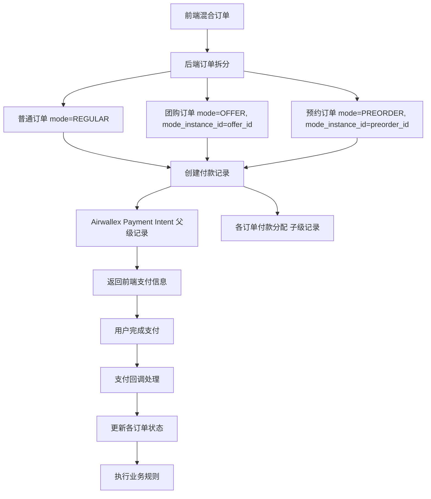
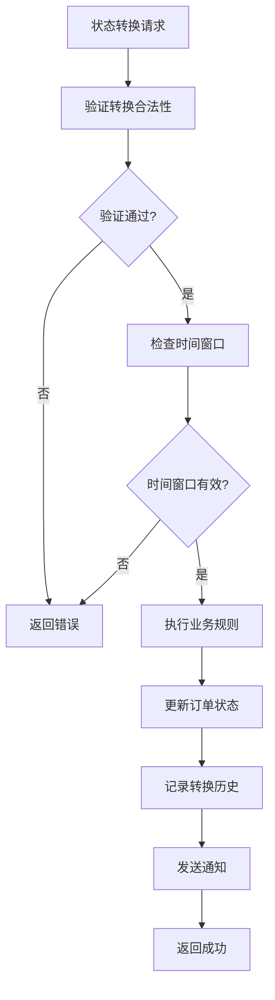
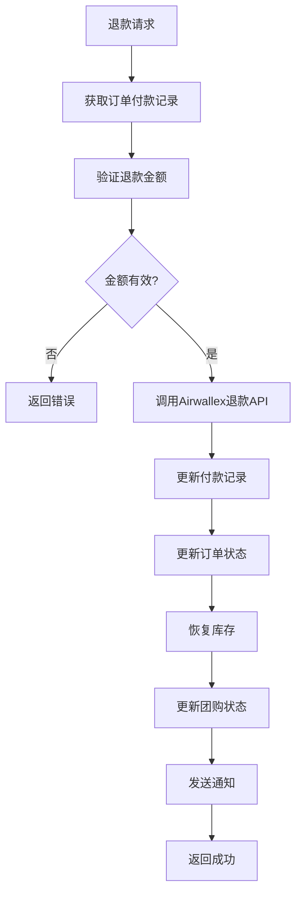
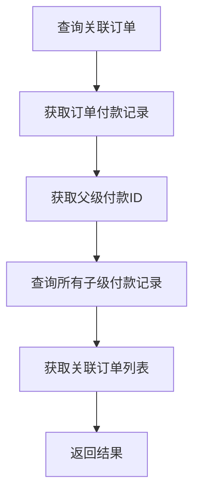

# 订单状态管理系统实施方案 (v2.0)

## 📋 项目概述

本方案实现了一个基于**订单拆分架构**的专业订单状态管理系统，支持多种订单模式（普通、团购、预约等）的独立处理，通过付款父子结构实现合并支付，确保系统架构简洁、业务逻辑清晰、维护成本低。

### 核心设计理念
- 🎯 **订单独立性**: 拆分后的订单完全独立，无业务逻辑关联
- 🔗 **付款关联**: 通过付款父子结构实现唯一关联
- 🏗️ **架构简洁**: 避免复杂的订单关联和状态聚合
- ⚡ **性能优化**: 查询效率高，无跨表复杂关联
- 🔧 **易于维护**: 代码简单，职责明确

### 核心特性
- ✅ 多订单模式支持（普通、团购、预约）
- ✅ 订单拆分和独立处理
- ✅ 付款父子结构管理
- ✅ 状态转换规则引擎
- ✅ 防重复操作机制
- ✅ 完整的状态转换历史记录
- ✅ 业务规则验证（支付、库存、Offer处理）
- ✅ 审计日志和合规支持
- ✅ 前端编辑界面集成

---

## 🏗️ 系统架构

### 订单拆分架构设计

```
前端混合订单 → 后端拆分处理 → 独立订单管理
├── 普通商品 → 普通订单 (mode: REGULAR)
├── 团购商品 → 团购订单 (mode: OFFER, mode_instance_id: offer_id)
└── 预约商品 → 预约订单 (mode: PREORDER, mode_instance_id: preorder_id)
```

### 数据库层设计

#### 核心订单表
```sql
orders (订单表)
├── id (主键)
├── order_number (订单号)
├── mode (订单模式: REGULAR/OFFER/PREORDER)
├── mode_instance_id (模式实例ID: offer_id/preorder_id等)
├── status (当前状态)
├── user_id, total_amount, delivery_fee, final_amount
├── delivery_address_snapshot, note
├── cancel_reason, refund_reason
└── 时间戳字段 (created_at, updated_at, paid_at等)

order_items (订单商品表)
├── id (主键)
├── order_id (外键)
├── product_id, quantity, price
├── mode_product_id (模式商品ID，如offer_product_id)
└── 其他商品信息
-- 注意：通过父级order.mode和order.mode_instance_id获取关联信息

order_status_transitions (状态转换记录表)
├── id (主键)
├── order_id (外键)
├── from_status, to_status (状态转换)
├── transition_type (AUTO/MANUAL/SYSTEM)
├── operator_id (操作人)
├── reason (变更原因)
├── amount (涉及金额)
├── payment_transaction_id (支付交易ID)
└── created_at, metadata
```

#### 付款管理表
```sql
order_payment_records (付款记录表)
├── id (主键)
├── parent_payment_id (父级付款ID - Airwallex Payment Intent，为null表示父级记录)
├── order_id (外键 - 关联的订单ID)
├── payment_type (PAYMENT/REFUND/PARTIAL_REFUND)
├── amount, currency, payment_method
├── transaction_id, status
├── refunded_amount (已退款金额)
├── reason, created_at, processed_at
└── metadata (额外信息)

-- 说明：此表同时保存父级和子级付款信息
-- 父级记录：parent_payment_id = null，对应Airwallex Payment Intent
-- 子级记录：parent_payment_id = 父级ID，对应具体订单的付款分配

-- 索引优化
CREATE INDEX idx_payment_records_order_id ON order_payment_records(order_id);
CREATE INDEX idx_payment_records_parent_payment_id ON order_payment_records(parent_payment_id);
```

#### 库存管理表
```sql
product_inventory (商品库存表)
├── id (主键)
├── product_id (商品ID)
├── available_stock (可用库存)
├── reserved_stock (预留库存)
├── total_stock (总库存)
└── updated_at

inventory_locks (库存锁定表)
├── id (主键)
├── product_id (商品ID)
├── order_id (订单ID)
├── quantity (锁定数量)
├── expires_at (过期时间)
└── created_at

inventory_transactions (库存交易记录表)
├── id (主键)
├── product_id (商品ID)
├── order_id (订单ID)
├── transaction_type (LOCK/UNLOCK/DEDUCT/RESTORE)
├── quantity (数量)
├── status (PENDING/COMPLETED/FAILED)
└── created_at, processed_at
```

#### 订单模式说明
```sql
-- 注意：不再需要单独的offer_orders表
-- 拆分后的order本身就是完整的团购订单记录
-- 通过以下方式查询团购订单：
-- SELECT * FROM orders WHERE mode = 'OFFER' AND mode_instance_id = 'offer_id'
-- SELECT * FROM orders WHERE mode = 'PREORDER' AND mode_instance_id = 'preorder_id'

-- 团购订单查询示例
-- 获取特定团购活动的所有订单
SELECT * FROM orders 
WHERE mode = 'OFFER' 
AND mode_instance_id = 'offer_123';

-- 获取特定预约活动的所有订单
SELECT * FROM orders 
WHERE mode = 'PREORDER' 
AND mode_instance_id = 'preorder_456';
```

### 服务层架构

#### 核心服务设计
```typescript
OrderStatusService (核心状态管理服务)
├── transitionOrderStatus() - 状态转换主入口
├── validateStatusTransition() - 状态转换验证
├── executeBusinessRule() - 业务规则执行
├── recordStatusTransition() - 记录状态转换
├── getOrderStatusHistory() - 历史记录查询
└── sendStatusChangeNotification() - 发送通知

PaymentProcessingService (付款处理服务)
├── processPayment() - 处理付款
├── processRefund() - 处理退款
├── getOrderPaymentRecords() - 获取付款记录
└── getRelatedOrders() - 通过付款记录查找关联订单

InventoryService (库存管理服务)
├── updateInventoryOnPayment() - 支付时扣减库存
├── restoreInventoryOnRefund() - 退款时恢复库存
├── checkStockAvailability() - 检查库存可用性
├── reserveStock() - 预留库存
├── releaseReservedStock() - 释放预留库存
└── getProductStock() - 获取商品库存

OrderModeService (订单模式处理服务)
├── processOfferOrder() - 处理团购订单
├── processPreorderOrder() - 处理预约订单
├── updateOrderModeOnRefund() - 退款时更新订单模式
├── getOrdersByMode() - 按模式获取订单
├── getModeSalesStats() - 获取模式销售统计
└── processExpiredModeOrders() - 处理过期模式订单

NotificationService (通知服务)
├── sendOrderStatusChangeNotification() - 发送状态变更通知
├── sendEmailNotification() - 邮件通知
├── sendSMSNotification() - 短信通知
└── sendWebSocketNotification() - 实时通知
```

### API层设计

#### 订单管理API
```typescript
// 订单状态管理
PUT /api/admin/orders/:id/status - 更新订单状态
POST /api/admin/orders/:id/validate-transition - 验证状态转换
GET /api/admin/orders/:id/status-history - 获取状态历史

// 付款管理
POST /api/admin/orders/:id/refund - 处理退款
GET /api/admin/orders/:id/payment-records - 获取付款记录
GET /api/admin/orders/:id/related-orders - 获取关联订单

// 订单查询（通用API + 查询参数）
GET /api/admin/orders - 获取订单列表
├── ?mode=OFFER - 获取团购订单
├── ?mode=PREORDER - 获取预约订单
├── ?mode=REGULAR - 获取普通订单
├── ?mode=OFFER&mode_instance_id=123 - 获取特定团购活动的订单
└── ?mode=PREORDER&mode_instance_id=456 - 获取特定预约活动的订单

// 订单模式管理
POST /api/admin/orders/split - 拆分混合订单
GET /api/admin/orders/mode-stats - 获取模式统计

// 库存管理
GET /api/admin/products/:id/inventory - 获取商品库存
POST /api/admin/products/:id/reserve-stock - 预留库存
```

---

## 📊 状态转换规则

### 订单状态枚举
```typescript
enum epOrderStatus {
  PENDING_PAYMENT = 'pending_payment',    // 待支付
  PAID = 'paid',                          // 已支付
  PROCESSING = 'processing',              // 处理中
  READY_FOR_DELIVERY = 'ready_for_delivery', // 待发货
  IN_DELIVERY = 'in_delivery',            // 配送中
  DELIVERED = 'delivered',                // 已送达
  CANCELLED = 'cancelled',                // 已取消
  REFUNDED = 'refunded'                   // 已退款
}

enum epOrderMode {
  REGULAR = 'REGULAR',      // 普通订单
  OFFER = 'OFFER',          // 团购订单
  PREORDER = 'PREORDER'     // 预约订单
}
```

### 合法转换路径
```typescript
const transitions = {
  'pending_payment': ['paid', 'cancelled'],
  'paid': ['processing', 'refunded'],
  'processing': ['ready_for_delivery', 'refunded'],
  'ready_for_delivery': ['in_delivery', 'refunded'],
  'in_delivery': ['delivered', 'refunded'],
  'delivered': ['refunded'],
  'cancelled': [],
  'refunded': []
};
```

### 时间窗口规则
```typescript
const timeWindows = {
  'pending_payment': 30,    // 30分钟内必须支付
  'processing': 60,         // 1小时内必须开始处理
  'ready_for_delivery': 120, // 2小时内必须发货
  'in_delivery': 1440       // 24小时内必须送达
};
```

### 业务规则定义
```typescript
enum epBusinessRule {
  VALIDATE_PAYMENT = 'validate_payment',           // 验证支付
  UPDATE_INVENTORY = 'update_inventory',           // 更新库存
  PROCESS_OFFERS = 'process_offers',               // 处理团购
  PROCESS_REFUND = 'process_refund',               // 处理退款
  RESTORE_INVENTORY = 'restore_inventory',         // 恢复库存
  UPDATE_OFFERS = 'update_offers',                 // 更新团购
  SEND_NOTIFICATION = 'send_notification'          // 发送通知
}

const specialTransitions = {
  'pending_payment': {
    'paid': ['validate_payment', 'update_inventory', 'process_offers', 'send_notification']
  },
  'paid': {
    'refunded': ['process_refund', 'restore_inventory', 'update_offers', 'send_notification']
  }
  // ... 其他转换规则
};
```

---

## 🔄 订单拆分逻辑详解

### 基础拆分规则
```typescript
// 当前实现：按类型拆分
const splitByType = (items: CartItem[]) => {
  const regular = items.filter(item => !item.offer_id && !item.preorder_id);
  const offers = items.filter(item => item.offer_id);
  const preorders = items.filter(item => item.preorder_id);
  
  return { regular, offers, preorders };
};
```

### 精细化拆分规则
```typescript
// 未来实现：按类型 + 实例ID分组
const splitByTypeAndInstance = (items: CartItem[]) => {
  const regular = items.filter(item => !item.offer_id && !item.preorder_id);
  
  // 按offer_id分组（不同团购活动需要拆分）
  const offerGroups = groupBy(items.filter(item => item.offer_id), 'offer_id');
  
  // 按preorder_id和交货日期分组（不同预约批次需要拆分）
  const preorderGroups = groupBy(
    items.filter(item => item.preorder_id), 
    ['preorder_id', 'delivery_date']
  );
  
  return { 
    regular: [regular], 
    offers: Object.values(offerGroups), 
    preorders: Object.values(preorderGroups) 
  };
};

// 拆分结果示例
const splitResult = {
  regular: [/* 普通商品 */],
  offers: [
    [/* offer_123的商品 */],
    [/* offer_456的商品 */]
  ],
  preorders: [
    [/* preorder_789 + 2024-01-15的商品 */],
    [/* preorder_789 + 2024-01-20的商品 */]
  ]
};
```

### 拆分后的订单结构
```typescript
// 普通订单
const regularOrder = {
  mode: 'REGULAR',
  mode_instance_id: null,
  items: [/* 普通商品 */]
};

// 团购订单（按offer_id拆分）
const offerOrders = [
  {
    mode: 'OFFER',
    mode_instance_id: 'offer_123',
    items: [/* offer_123的商品 */]
  },
  {
    mode: 'OFFER', 
    mode_instance_id: 'offer_456',
    items: [/* offer_456的商品 */]
  }
];

// 预约订单（按preorder_id + 交货日期拆分）
const preorderOrders = [
  {
    mode: 'PREORDER',
    mode_instance_id: 'preorder_789',
    delivery_date: '2024-01-15',
    items: [/* 2024-01-15交货的商品 */]
  },
  {
    mode: 'PREORDER',
    mode_instance_id: 'preorder_789', 
    delivery_date: '2024-01-20',
    items: [/* 2024-01-20交货的商品 */]
  }
];
```

---

## 🔄 核心业务流程

### 1. 订单创建流程



### 2. 状态转换流程



### 3. 退款处理流程



### 4. 关联订单查询流程



---

## 🚀 实施阶段

## 阶段一：基础架构搭建 ✅ 已完成

### 1.1 数据库设计
- [x] 创建 `order_status_transitions` 表
- [x] 创建 `order_payment_records` 表  
- [x] 创建 `offer_orders` 表
- [x] 创建 `product_inventory` 表
- [x] 创建 `inventory_locks` 表
- [x] 创建 `inventory_transactions` 表
- [x] 修改 `orders` 表结构（添加 mode, mode_instance_id 字段）

### 1.2 类型定义
- [x] 创建 `OrderStatusTransition` 类型定义
- [x] 创建 `OrderPaymentRecord` 类型定义
- [x] 创建 `OfferOrder` 类型定义
- [x] 创建 `ProductInventory` 类型定义
- [x] 创建状态转换规则常量
- [x] 创建业务规则枚举

### 1.3 实体注册
- [x] 在 `database.config.ts` 中注册所有新实体
- [x] 确保 TypeORM 能正确识别所有实体
- [x] 创建数据库迁移文件

### 1.4 核心服务
- [x] 实现 `OrderStatusService` 基础结构
- [x] 实现状态转换规则引擎
- [x] 实现防重复操作机制
- [x] 实现 `PaymentProcessingService` (集成Airwallex)
- [x] 实现 `InventoryService` (数据库驱动)
- [x] 实现 `OfferOrderService` (完整功能)
- [x] 实现 `NotificationService` (基础功能)

### 1.5 API控制器
- [x] 创建 `OrderStatusController`
- [x] 实现所有状态管理API端点
- [x] 修改 `AdminOrderController` 集成状态管理
- [x] 创建订单拆分API端点

### 1.6 前端集成
- [x] 更新订单列表页面添加编辑按钮
- [x] 创建订单编辑模态框
- [x] 实现状态选择和原因输入
- [x] 集成API调用

---

## 阶段二：订单拆分架构 🔄 进行中

### 2.1 订单拆分逻辑
- [ ] 实现前端混合订单提交
- [ ] 实现后端订单拆分服务
- [ ] 添加订单模式识别逻辑
- [ ] 实现模式实例ID管理
- [ ] 实现精细化拆分规则（按offer_id和交货日期分组）
- [ ] 更新order_items表结构（删除offer_id，添加mode_product_id）

### 2.2 付款父子结构
- [ ] 实现付款记录父子关系
- [ ] 添加关联订单查询功能
- [ ] 实现合并支付处理
- [ ] 添加付款状态同步

### 2.3 独立订单处理
- [ ] 实现各订单类型独立状态管理
- [ ] 添加订单类型特定业务规则
- [ ] 实现独立库存管理
- [ ] 添加独立通知处理
- [ ] 删除offer_orders表（不再需要）
- [ ] 更新API为通用查询参数模式

### 2.4 退款协调机制
- [ ] 实现基于付款记录的退款
- [ ] 添加部分退款支持
- [ ] 实现退款金额分配
- [ ] 添加退款历史查询

---

## 阶段三：高级功能 🎯 计划中

### 3.1 权限管理
- [ ] 实现基于角色的状态转换权限
- [ ] 添加操作审批流程
- [ ] 实现多级权限控制
- [ ] 添加订单类型特定权限

### 3.2 审计和合规
- [ ] 完善审计日志记录
- [ ] 实现数据加密
- [ ] 添加合规报告生成
- [ ] 实现数据备份和恢复

### 3.3 性能优化
- [ ] 实现Redis缓存
- [ ] 添加数据库索引优化
- [ ] 实现异步处理队列
- [ ] 添加监控和告警

### 3.4 高级功能
- [ ] 实现批量状态更新
- [ ] 添加状态转换模板
- [ ] 实现自动化工作流
- [ ] 添加数据分析面板

---

## 🔧 开发指南

### 添加新的订单模式

1. **更新订单模式枚举**
```typescript
// 在 order.type.ts 中添加新模式
export enum epOrderMode {
  // ... 现有模式
  NEW_MODE = 'NEW_MODE'
}
```

2. **添加模式特定业务规则**
```typescript
// 在 order-status-rules.enum.ts 中添加规则
export const ORDER_MODE_RULES = {
  [epOrderMode.NEW_MODE]: {
    transitions: { /* 特定转换规则 */ },
    businessRules: { /* 特定业务规则 */ }
  }
};
```

3. **实现模式特定服务**
```typescript
// 创建新模式的服务
class NewModeOrderService {
  async processNewModeOrder(order: Order) {
    // 实现新模式特定逻辑
  }
}
```

### 添加新的状态转换规则

1. **更新状态枚举**
```typescript
export enum epOrderStatus {
  // ... 现有状态
  NEW_STATUS = 'new_status'
}
```

2. **更新转换规则**
```typescript
export const ORDER_STATUS_RULES = {
  transitions: {
    // ... 现有规则
    [epOrderStatus.EXISTING_STATUS]: [epOrderStatus.NEW_STATUS]
  }
};
```

3. **添加业务逻辑**
```typescript
private async executeBusinessRule(rule: epBusinessRule, order: Order, newStatus: epOrderStatus) {
  switch (rule) {
    case epBusinessRule.NEW_BUSINESS_RULE:
      // 实现新的业务逻辑
      break;
  }
}
```

### 添加新的API端点

1. **在控制器中添加方法**
```typescript
async newEndpoint(req: Request, res: Response) {
  try {
    const { orderId } = req.params;
    const result = await this.orderStatusService.newMethod(orderId);
    res.json({ success: true, data: result });
  } catch (error) {
    res.status(400).json({ success: false, message: error.message });
  }
}
```

2. **在路由中注册**
```typescript
router.get('/new-endpoint/:orderId', orderStatusController.newEndpoint.bind(orderStatusController));
```

### 数据库迁移

1. **创建迁移文件**
```sql
-- migrations/YYYYMMDDHHMMSS_description.sql
CREATE TABLE new_table (
  id UUID PRIMARY KEY DEFAULT gen_random_uuid(),
  -- 其他字段
);

-- 添加索引
CREATE INDEX idx_new_table_field ON new_table(field);
```

2. **运行迁移**
```bash
cd xituan_backend
npm run migrate:dev
```

---

## 🧪 测试指南

### 单元测试
```bash
# 运行所有测试
npm test

# 运行特定测试
npm test -- --grep "OrderStatusService"
npm test -- --grep "PaymentProcessingService"
```

### API测试
```bash
# 测试状态更新
curl -X PUT http://localhost:3050/api/admin/orders/{orderId}/status \
  -H "Content-Type: application/json" \
  -H "Authorization: Bearer {token}" \
  -d '{"toStatus":"paid","reason":"测试"}'

# 测试关联订单查询
curl -X GET http://localhost:3050/api/admin/orders/{orderId}/related-orders \
  -H "Authorization: Bearer {token}"

# 测试退款处理
curl -X POST http://localhost:3050/api/admin/orders/{orderId}/refund \
  -H "Content-Type: application/json" \
  -H "Authorization: Bearer {token}" \
  -d '{"amount":100,"reason":"测试退款"}'
```

### 前端测试
1. 启动CMS: `cd xituan_cms && npm run dev`
2. 访问订单管理页面
3. 测试订单编辑功能
4. 测试状态更新功能

---

## 📝 常见问题

### Q: 订单拆分后如何查询关联订单？
A: 使用以下API：
```bash
GET /api/admin/orders/{orderId}/related-orders
```
系统会通过付款记录自动查找所有关联订单。

### Q: 如何查询特定类型的订单？
A: 使用通用API + 查询参数：
```bash
# 查询所有团购订单
GET /api/admin/orders?mode=OFFER

# 查询特定团购活动的订单
GET /api/admin/orders?mode=OFFER&mode_instance_id=123

# 查询预约订单
GET /api/admin/orders?mode=PREORDER
```

### Q: 如何处理混合订单的退款？
A: 每个订单独立处理退款：
1. 系统通过付款记录找到父级付款信息
2. 调用Airwallex API进行部分退款
3. 更新对应订单的状态和付款记录
4. 其他订单不受影响

### Q: 不同订单类型的库存如何管理？
A: 每种订单类型独立管理库存：
- 普通订单：使用常规库存
- 团购订单：使用团购专用库存
- 预约订单：使用预约库存
- 各类型之间无依赖关系

### Q: 为什么不需要offer_orders表？
A: 拆分后的order本身就是完整的团购订单记录：
- 通过order.mode = 'OFFER'和order.mode_instance_id可以查询
- 不需要额外的关联表
- 简化了数据结构和查询逻辑

### Q: 如何添加新的订单模式？
A: 按照以下步骤：
1. 在 `epOrderMode` 枚举中添加新模式
2. 在 `ORDER_MODE_RULES` 中定义特定规则
3. 创建对应的服务类
4. 实现模式特定的业务逻辑

### Q: 状态转换失败怎么办？
A: 检查以下几点：
1. 状态转换路径是否合法
2. 时间窗口是否超时
3. 业务规则验证是否通过
4. 数据库连接是否正常
5. 订单模式是否支持该转换

---

## 📚 相关文件

### 后端核心文件
- `src/domains/order/services/order-status.service.ts` - 核心状态管理服务
- `src/domains/order/services/order-split.service.ts` - 订单拆分服务
- `src/domains/order/controllers/order-status.controller.ts` - API控制器
- `src/domains/order/controllers/admin-order.controller.ts` - 管理端控制器
- `src/domains/payment/services/payment-processing.service.ts` - 付款处理服务
- `src/domains/inventory/services/inventory.service.ts` - 库存管理服务
- `src/domains/order/services/order-mode.service.ts` - 订单模式处理服务

### 数据库实体
- `src/domains/order/domain/order-status-transition.entity.ts` - 状态转换实体
- `src/domains/order/domain/order-payment-record.entity.ts` - 付款记录实体
- `src/domains/inventory/domain/product-inventory.entity.ts` - 库存实体
- `src/domains/inventory/domain/inventory-lock.entity.ts` - 库存锁定实体
- `src/domains/inventory/domain/inventory-transaction.entity.ts` - 库存交易实体

### 前端文件
- `src/pages/orders.tsx` - 订单列表页面
- `src/components/orders/OrderEditModal.tsx` - 订单编辑模态框
- `src/lib/api/order.api.ts` - API客户端

### 配置文件
- `migrations/` - 数据库迁移文件
- `submodules/xituan_codebase/typing_entity/` - 类型定义
- `submodules/xituan_codebase/constants/` - 常量定义

---

## 🎯 下一步行动

### 立即可以做的
1. 测试现有的状态转换功能
2. 验证前端编辑界面
3. 检查数据库记录完整性
4. 测试订单拆分逻辑

### 短期计划 (1-2周)
1. 完善订单拆分架构
2. 实现付款父子结构
3. 添加关联订单查询
4. 完善退款协调机制

### 中期计划 (1个月)
1. 完善权限管理
2. 添加审计功能
3. 性能优化
4. 添加监控告警

### 长期计划 (3个月)
1. 高级工作流功能
2. 数据分析面板
3. 移动端支持
4. 多语言支持

---

## 🔍 架构优势总结

### 1. 简洁性 ⭐⭐⭐⭐⭐
- 订单完全独立，无复杂关联
- 通过付款记录实现唯一关联
- 避免状态聚合的复杂性
- 代码维护成本低

### 2. 清晰性 ⭐⭐⭐⭐⭐
- 业务逻辑清晰，职责明确
- 每种订单类型独立处理
- 退款按订单独立处理
- 系统边界清晰

### 3. 可扩展性 ⭐⭐⭐⭐⭐
- 新增订单类型容易
- 新增业务规则简单
- 支持多种支付方式
- 支持多种通知渠道

### 4. 性能 ⭐⭐⭐⭐⭐
- 查询效率高
- 无跨表复杂关联
- 支持缓存优化
- 支持异步处理

### 5. 可维护性 ⭐⭐⭐⭐⭐
- 代码结构清晰
- 测试覆盖完整
- 文档详细准确
- 错误处理完善

---

*最后更新: 2025-01-12*
*版本: 2.1.0*
*状态: 阶段一完成，阶段二进行中*
*架构: 订单拆分 + 付款父子结构 + 精细化拆分规则*
*更新: 修正表结构设计，删除冗余表，优化API设计*