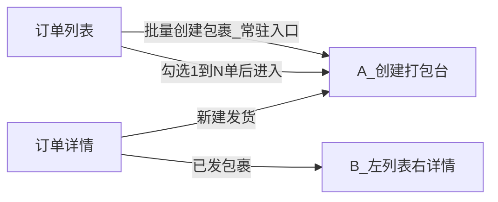
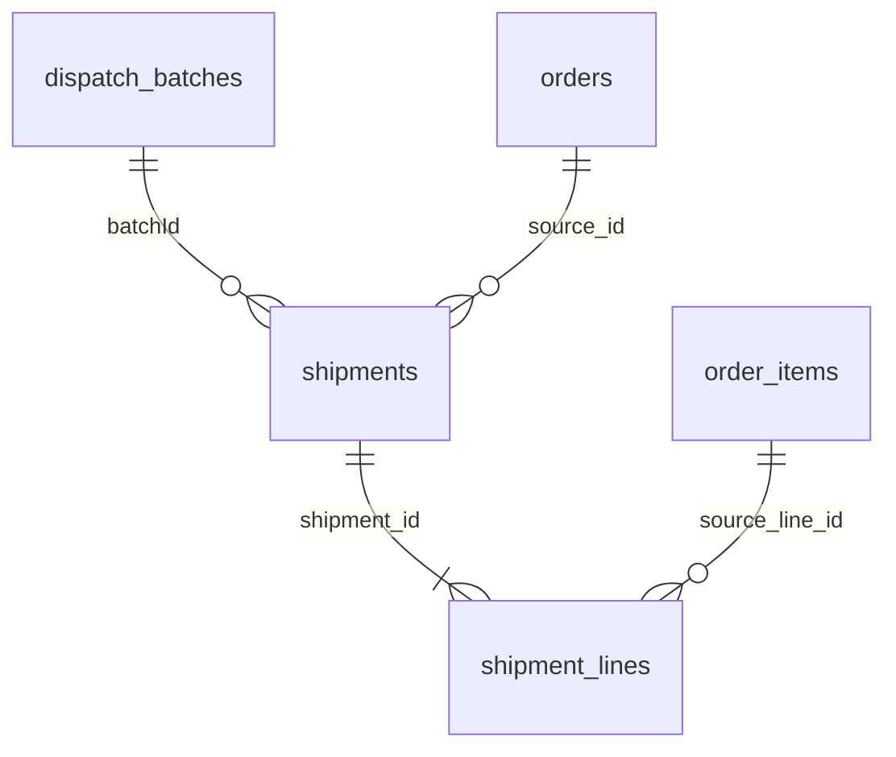
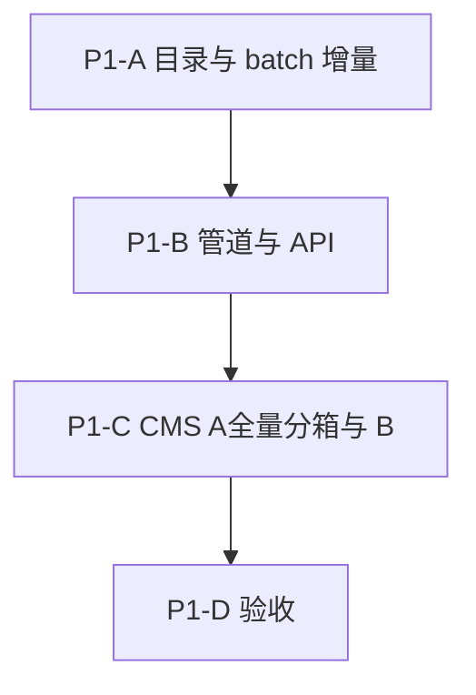

# 统一寄件流水线设计（Unified Dispatch Pipeline）

> 状态：设计（未实现）。本文件为方向定稿的设计文档，供后续拆分实现计划使用。
> Last updated: 2026-08-03（回退错误 P1 代码实施；更新 A 新建发货 UX：按订单独立打包台 + 列表外唯一 carrier）
> 范围：商户在 CMS 侧对已支付订单进行「打包 → 选承运商 → 询价 → 确认下单 → 落库 → 打印」的统一履约寄件流程。
> 业务地域：仅澳大利亚国内。
>
> **术语（强制）：** 全文与后续沟通一律用 **carrier（承运商）**，不再使用 vendor。  
> **`manual_entry` 是创建模式**（手填某 carrier + tracking），**不是**名为 `manual` 的 carrier code。
> **实施状态：** P1 代码实施已回退；以下为设计定稿，待按本文件重新实施。

相关文档：

- 旧方案（方向已变更，仅历史参考）：[`delivery-service-integration-plan.md`](./delivery-service-integration-plan.md)
- 轨迹分阶段思路：[`../../devGuide/logistics-tracking-phased-integration.md`](../../devGuide/logistics-tracking-phased-integration.md)

---

## 1. 目标与边界

### 1.1 目标

- 商户在 **CMS** 一次选择 1..N 个订单，进入统一「打包台」，把订单产品分配到包裹，选择同一个承运商（carrier），询价、确认、下单、落库、打印。
- 各承运商（当日 / 次日 / 多日）走 **同一套阶段管道**，只在需要的阶段按 carrier 定制；不需要的阶段按 carrier 能力位跳过。
- 复用并演进现有 `merchant.shipments` / `merchant.shipment_lines` 模型，C 端已有的 `deliveryShipments` 展示继续可用。

### 1.2 一期边界（不做）

- 不做微信商户面板入口（后续对齐同一后端 API）。
- 不做消费者下单时自动选承运商（C 端运费仍走现有距离计价 `domains/shipping`）。
- 不做 eParcel（合同账号）；一期仅 MyPost Business（BYOK）与其它 carrier。
- 不做跨订单「1 名快递员取 N 单 / 租 H 小时多单」的合并取件（合取）。
- 不做巨型「万能工作台」（同屏既跨单又跨 carrier）。

### 1.3 与现有模块的关系

- **运费计价 `domains/shipping`**：面向 C 端的距离×单价计费，与本模块无关。
- **履约寄件 `domains/shipment`**：本模块演进的核心（手工承运商 + 运单号 → 增加 API 下单能力）。

---

## 2. 术语模型

| 概念 | 含义 |
|------|------|
| **包裹 parcel** | 原子单位；落库为一张 `merchant.shipments` 票；挂 **一个**订单的部分或全部行；有自己的 carrier / 运单号 / 标签。 |
| **默认包裹** | 每个进入本批的订单的 **第一票**，不能为空。 |
| **附加包裹** | 从默认包裹拆分出的第 2+ 票（大件分箱用）。 |
| **批次 batch** | 一次 CMS「确认」会话；含 1..N 个包裹；同一次确认锁定 **一个** carrier。注意：batch ≠ 快递员合取。 |
| **carrier** | 承运商标识，落库于 `shipments.carrier`：内置 key（如 `australia_post`、`dhl`，见 `epShipmentCarrier`）或商户自定义名；API 集成 carrier 另有目录 code（如 `auspost` / `auspost_express` / `doordash` / `gopeople`），与运单上的 `carrier` 对齐或映射。 |
| **create_mode** | 创建方式：`api`（走 carrier adapter 询价/下单）或 `manual_entry`（手选/手填 carrier + tracking_number，跳过 Quote）。**无** `carrier=manual`。 |

---

## 3. CMS 界面分层：A 创建打包台 vs B 已发浏览

两阶段界面**完全分离**，避免创建流兼顾历史多 carrier 票的复杂度。

| 界面 | 职责 | 不做什么 |
|------|------|----------|
| **A 创建打包台** | 订单列表式打包：每单独立产品池与多包裹；列表外选 **唯一** carrier → 询价/确认下单 | 不展示 / 不编辑已存在包裹；不在包裹级选 carrier |
| **B 已发包裹浏览** | 左列表 + 右详情：历史票（可多 carrier）、运单号、标签、状态、轨迹 | 不负责新品分配与下单 |

订单详情建议提供两个区块 / Tab：「新建发货」进入 A；「已发包裹」进入 B。



### 3.1 创建流布局（已确认 2026-08-03 — 仅 A）

**统一 layout，单订单不例外：** A 始终是「订单列表 + 列表外唯一 carrier」。打开 1 单时，列表里只有这一张订单卡，不另做单订单专用 UI。

```text
A 创建打包台
├── [常驻] 批量创建包裹入口（订单列表页始终可见，不依赖是否已勾选）
├── 订单列表（1..N 张订单卡，纵向）
│     └── 订单卡 i = 该单独立打包台
│           ├── 本单剩余产品列表（仅本单；禁止跨单合并成一个大池）
│           ├── 本单包裹 1..K（默认包裹非空；`>`/`>>` 仅在本单内挪 qty）
│           └── 每包裹：箱型 / packaging（如 AusPost flat-rate vs 自备箱）等 carrier 参数位
└── 列表外（整批共用，只选一次）
      └── 唯一 carrier（+ manual_entry 时的 tracking 等）→ Quote / Confirm
```

固化：

| 规则 | 说明 |
|------|------|
| **批量入口常驻** | 「批量创建包裹」在订单列表页**持久显示**；未勾选时可点进空态/选单引导，不要求先选订单才出现按钮 |
| **按订单隔离** | 每个订单自己的产品列表与包裹集合；多包裹也只在该单内计算；**禁止**把所有订单产品并成一个合并待分配池 |
| **可开 1 或多单** | 勾选若干单进入，或从详情带入 1 单；layout 相同 |
| **唯一 carrier** | carrier 在**所有订单列表之后**选一次，整批共用；**不是**打包台里每个包裹各选一个 carrier |
| **包裹级参数** | 包裹内管产品归属；箱型 / packaging 等按包裹填写（特种 carrier 子面板，如 AusPost flat-rate vs 自备箱） |
| **一单多 carrier** | 提交一次后，对剩余行再开一次 A；历史不同 carrier 票在 B 查看 |

### 3.2 与错误实施的区别（勿再犯）

- ❌ 把多单产品合并进同一个 pool / 同一套包裹 Tab  
- ❌ 在每个包裹卡片上各选 carrier / tracking  
- ❌ 单订单走另一套「旧一体编辑」layout  
- ❌ 「批量创建」仅在 `selectedRowKeys.length > 0` 时才渲染  

---

## 4. 打包台交互规则（仅 A）

### 4.1 默认包裹 = 该订单第一票，不能为空

每个仍留在本批的订单卡内：**默认包裹 = 该单第一张票**，必须至少包含 1 件已分配 qty。Carrier 在列表外选定，与「默认是否非空」无关。

| 意图 | 操作 |
|------|------|
| 本单发这些行 | 留在该单默认或附加包裹 |
| 某行不进本批 | 取消勾选 / 留在该单待分配池（仍属本单，不跨单） |
| 某行进同单第 2+ 票 | 在**该订单卡内**新建附加包裹，从默认挪入 |
| 整单不进本批 | **从本批订单列表移除该订单卡** |

固化规则：

- 进入 A 时：每单独立一张默认包裹；该单剩余可发行进入**该单**产品池（默认可全部分配到默认包裹）。
- **默认包裹禁止为空**：至少 1 件；不允许把最后一件挪到附加包裹后仍保留该订单在本批。
- 想本单零发：只能**移除该订单卡**。
- 新建附加包裹仅在本单内；挪后默认仍非空。
- 提交：每个仍在本批的订单 → 默认包裹 1 票（必有）+ 每个非空附加包裹各 1 票；全部票共享列表外选定的同一 carrier。

### 4.2 分箱移动按钮（大件分箱，订单内）

- 仅在**同一订单卡**内：默认 → 附加 `>` / `>>`；附加 → 默认 `<` / `<<`。
- 移动以 **数量（qty）** 为单位；**禁止**跨订单挪货。

### 4.3 列表外唯一 Carrier 区（整批共用）

- 位置：所有订单卡**下方 / 侧栏固定区**（「最后选一次」），不是包裹表单字段。
- 内容：选 carrier（api 目录或 `manual_entry` 面板）+ 可选预约取货时间。
- 语义：本批所有订单、所有包裹走**同一承运商**。
- `manual_entry`：在此区手选/手填 **具体 carrier + tracking**（若业务需要每票不同运单号，仍属同一 carrier 身份下的票级字段——实现期定：P1 可整批一个 tracking，或多票各填 tracking 但 carrier 仍唯一）。
- 选中 carrier 后，各订单卡内包裹可展示该 carrier 的 packaging 子控件（如 AusPost 箱型）；未选 carrier 前箱型区可禁用或占位。

---

## 5. 已发包裹浏览（B）

- 左列表：该订单（或筛选范围）下的 shipments，显示 carrier、tracking、状态、batch 标记。
- 右详情：行明细、地址快照、标签入口、取消（按 carrier 能力）、轨迹。
- 「继续发剩余」跳回 A（带入 `orderId`）。
- 多单 batch：某票可显示 `batchId`，据此查看「同批其他包裹 / 订单」。

---

## 6. 剩余未发计算、性能与前端数据量

### 6.1 计算公式（以订单行为唯一键，不以 productId）

```text
allocatedQty(sourceLineId)
  = SUM(shipment_lines.quantity)
    WHERE source_line_id = sourceLineId
      AND shipment.status IN (pending, ready, shipped, booked)

remainingQty = GREATEST(order_item.quantity - allocatedQty, 0)
```

- 唯一键是 `order_item.id`（= `shipment_lines.source_line_id`），不能只用 `productId`：同单多行同产品、跨票部分数量都会错配。
- `cancelled` / `failed` 票不计入 allocated；`pending`（预占）必须计入，避免并发重复发货。
- 打包台草稿内部另维护 `draftAllocatedQtyBySourceLineId`；`>`/`>>` 只在同一总 remaining 内搬运，不改变服务器 remaining。

### 6.2 批量加载（禁止 N+1）

不得对所选订单逐单调用单订单汇总接口。固定为两类主查询：

1. 一条 SQL 批量取所选 `orderIds[]` 的订单头、地址、order items（只取打包台字段）。
2. 一条聚合 SQL 对全部所选订单 `GROUP BY source_line_id`，一次返回 `allocatedQty`。
3. 后端合并后只返回 `remainingQty > 0` 的行。

复杂度约为 `O(所选订单数 + 剩余订单行数)`，不是 `O(历史包裹数)`。

### 6.3 前端数据量控制

- 打包台 API **只**返回：订单号、收件信息、剩余订单行、产品名 / SKU、`remainingQty`、weight / LWH。
- **不**返回：历史包裹列表、标签 PDF、carrier 原始响应、产品大图、已发完的行。
- 历史票、标签由 B 组件按 shipment id 分页 / 懒加载。
- CMS 一次最多选择 **50** 个订单（默认值，放 platform settings 可配置）；超过分页分批处理。

### 6.4 索引

新增 migration 放 `xituan_backend/migrations/`（不改 `migrations_stable/`）：

- 现有 `shipments(merchant_id, source_type, source_id)`：定位所选订单的票。
- 现有 `shipment_lines(merchant_id, shipment_id)`：join。
- 新增 `shipment_lines(merchant_id, source_line_type, source_line_id)`：按订单行汇总与并发校验。
- 新增 `shipments(merchant_id, batch_id)`：同批反查。
- 新增 `dispatch_batches(merchant_id, idempotency_key)` unique：防重复确认。

结论：性能风险不在 qty 计算本身，而在逐订单汇总造成的 N+1 与缺 `source_line_id` 索引。按上面实现即可支撑 50 单、数百行。

---

## 7. 阶段管道（标准输入 / 输出）

每一阶段输入 / 输出均为平台规范化 DTO，不把 carrier 原始字段暴露到订单域。**跳过 = adapter 声明该 capability 关闭，orchestrator 透传上一阶段标准输出；禁止在各处散落 if-carrier 分支。**


| Stage | 标准输入 | 标准输出 | 可跳过场景 |
|-------|----------|----------|------------|
| BuildParcels | 打包台：`orderIds[]` + 勾选 / 包裹分配 | `parcelDrafts[]`（每票：orderId、lines[sourceLineId+qty]、weight、shipTo） | 否 |
| SelectCarrier | 列表外单 carrier + 商户凭证引用 | carrierCapabilities | 否 |
| QuotePreview | parcels + 箱型 | quoteLines（sender / receiver / price / pickup） | `manual_entry` 跳过 |
| ConfirmBook | quoteId + idempotencyKey | bookingResult（external ids、tracking、label） | 无显式支付（一期所有 carrier 都不弹支付窗） |
| PersistShipment | confirmed + external ids | shipmentIds[] + batchId | 否（手工也要落库） |
| PrintLabel | shipmentIds | labelAssets / printTemplateJob | carrier 无标签则走本地打印模板 |

> 一期不做 BookingOptions 里的 `batchPickupN` / `hireHoursH`（跨单合取）。预约取货时间作为 per-booking 可选字段保留。

---

## 8. 承运商范围与能力矩阵

集成目录中的 API carrier（日后按阶段开放）：

- `auspost`（MyPost Business 标准，约 1–3 天）
- `auspost_express`（Express，约 1 个工作日 / 次日）
- `doordash`（当日短半径；Drive On-Demand）
- `gopeople`（当日；含雇司机按时段与多单能力，但合取功能搁置）

另：**`create_mode=manual_entry`** — 不绑定上述目录 code；商户选择/填写 **具体 carrier**（`epShipmentCarrier` 或自定义名）+ **tracking_number** 落库。无平台承诺时效；跳过 Quote/API 下单。

**选 API carrier 即选固定时效**——不另建抽象 `serviceClass` 状态机。

| Capability | manual_entry | auspost | auspost_express | doordash | gopeople |
|------------|--------------|---------|-----------------|----------|----------|
| quoteApi（询价） | no | yes | yes | yes | yes |
| explicitPayUi（显式支付窗） | no | no | no | no | no |
| carrierLabelPdf（承运商标签） | no | yes | yes | 待对接确认 | 待对接确认 |
| customPrintTemplate（本地模板备用） | yes | fallback | fallback | fallback | fallback |
| trackingWebhook（轨迹/异常推送） | n/a | 必做 | 必做 | 必做 | 必做 |
| trackingUrlTemplate（手动查件外链） | 可选 | 可选 | 可选 | 可选 | 可选 |
| cancellableAfterHandover（交寄后可平台取消） | no | no | no | no | no |

探测脚本参考：`xituan_backend/scripts/doordash-quote-test.ts`、`gopeople-quote-test.ts`、`sherpa-quote-test.ts`、`zoom2u-quote-test.ts`（Sherpa/Zoom2u 仅比价探测，**非**正式集成 carrier）。

### 8.1 Adapter 与目录边界

```text
domains/dispatch/          # orchestrator + batch 实体（新）
domains/shipment/          # 现有票模型演进（Persist 写这里）
carriers/auspost-mpb/      # auspost + auspost_express 共享 MPB 对接
carriers/doordash/
carriers/gopeople/
carriers/manual-entry/     # create_mode=manual_entry（非 carrier code）
```

统一 port（仅实现该 create_mode / carrier 声明的 capability）：

```text
validateConnection | getQuotes | createBooking | getLabel | cancel | track
```

Admin/CMS API 挂在现有 admin 认证体系下（与 `/api/admin/shipments` 同级或扩展）。

### 8.2 DoorDash 选用门控（已确认 2026-07-31）

打包台 **仅当全部条件满足** 才展示 / 允许选 `doordash`；否则走 `auspost` / `auspost_express` / 其它：

| 门控 | 规则 |
|------|------|
| 物件合规 | 符合 DoorDash Drive 物件/尺寸/禁运要求；不符合则 **不提供** DD 选项 |
| 体量 | 小物件为主（餐饮、现做食品等多）；大件/超规不给 DD |
| 半径 / 服务区 | 短半径且落在 Drive 服务区；超距或 quote 拒服 → 不给 DD |
| 时效意图 | 需要 **当日短时效**（即时出餐或批量定时出餐）才用 DD；隔日 / 非急 → **AusPost**，不选 DD |

产品叙事（对内 / 对 DoorDash 商务）：西团是 **multi-merchant ordering SaaS（中间件）**——入驻商户在西团接单备货，备好后用集成的 Drive 预约派送；与 Olo/Toast 类「接单 → 派配送」同构。差别仅在顾客下单入口是西团 C 端而非餐厅官网。真正打到 DD 的单就是餐饮向、短半径、时效履约。

**Fallback（商务 Gate 或生产未开通时）：** 商户仍可自行在 [merchants.doordash.com](https://merchants.doordash.com/) 开通 Drive On-Demand，站外约车后在西团用 **`create_mode=manual_entry`** 回填具体 carrier + 运单号；不依赖平台嵌入生产 API。

### 8.3 车型偏好（已确认）

- 单件小物：carrier 支持 Bike / Motorbike 时 **优先选 Bike**（Zoom2u：`Bike`+`Bag`；Sherpa：motorbike）。
- **不**为「一次取多件」选型；跨单合取仍不做。仅当某 carrier **明确提供合取折扣产品** 且产品日后开启时再评估。
- 实测：部分 carrier Bike 与 Car **同价**，仍优先 Bike（容量/接单匹配），不为省钱强行 Car。

---

## 9. 凭证与费用（BYOK / 商户担责）

- **平台不垫付运费**；付款与履约责任主体 = **入驻商户**。
- **不要求**「每票实时刷商户卡」；下列均可接受：
  - 商户账号绑卡按单扣
  - DoorDash / 承运商 **向商户月结开票**
  - 经伙伴集成但 **发票/扣款对象仍是商户**
- **不可接受**：平台先付给承运商再向商户收（垫付/转售）；合同上平台为付款主债务人（除非商务明确可转嫁且产品接受）。
- 一期 **不弹支付窗**：商户侧已绑卡 / 月结；`manual_entry` 无扣款。
- 平台一期不记履约成本账；询价结果快照落库备查。
- **凭证自检 / 列表门控（已确认 2026-08-01）**：`create_mode=api` 时，打包台 **只展示「已开通且凭证验证通过」的集成 carrier**。保存配置时必须探活；失败则拒绝保存。`create_mode=manual_entry` 始终可选，无需 token，须指定具体 `carrier` + `tracking_number`。

### 9.1 DoorDash 账户模式（仅 D1，已确认）

| 路径 | 是否做 | 说明 |
|------|--------|------|
| **D1** 平台 Developer JWT + 每商户 Business/Store；DoorDash **向商户直票/商户付** | **做** | 平台只编排 API；商户付费担责 |
| D2 平台总票再向商户结算 | **不做** | 垫付 |
| D3 每商户自贴 Developer 三件套 | **不做** | 运维/webhook 过重 |

商务 Gate：谈妥「商户付费担责」即可推进生产；谈不成 → **生产环境隐藏** DD，但 **沙箱/demo 仍可实现并展示**（见 §16）。

### 9.2 Carrier 目录 + 平台凭证 + 商户开通（已确认 2026-08-02）

命名约定（本域例外）：**库表列名与 TypeScript 属性一律 `snake_case`（`_` 分词）**，与多数 carrier API 字段对齐；adapter 边界少做 camelCase 映射。其它业务域仍按项目既有 camelCase。

三层：

1. **`dispatch_carriers`** — 平台目录（能力 / 展示 / 计价模式）
2. **`platform_dispatch_carrier_credentials`** — 平台级 API 密钥（如 DoorDash Developer）
3. **`merchant_dispatch_carriers`** — 商户开通 + BYOK / 商户侧外部 ID

通用凭证三列（平台表与商户表同形）：

| 字段 | 语义槽（复用，非字面等于某家 API 名） |
|------|----------------------------------------|
| `client_id` | 客户端 / 业务实体 ID（OAuth `client_id`、DoorDash `developer_id` 或商户 `business_id` 等） |
| `api_key` | 第二密钥或第二 ID（OAuth `client_secret`、DoorDash `key_id`、商户 `store_id` 等） |
| `auth_token` | 主访问凭据或第三密钥（Partners token、Bearer token、`signing_secret`、`customer_id` 等） |

未用列允许 `NULL`。CMS 表单 label 按 carrier 显示真实含义（「Partners token」而非笼统 auth_token）。

**`dispatch_carriers`（目录）**

| 字段 | 说明 |
|------|------|
| `id` / `code` | 集成 carrier：`auspost` / `auspost_express` / `doordash` / `gopeople` / `uber_direct`…（**不含** `manual`） |
| `name` | 展示名 |
| `supports_multi_pickup` | 是否支持一收多发 |
| `multi_pickup_limit_default` | `1` 单发；正整数上限；`-1` 不限 |
| `pricing_model` | `weight` / `box_size` / `max_weight_or_cubic` / `auspost_packaging_choice`… |
| `service_codes` | jsonb，如 `["gobundle","gosameday","govip"]` |
| `merchant_credential_slots` | jsonb：本 carrier 商户侧哪几列必填 + UI label（见映射表） |
| `platform_credential_slots` | jsonb：平台侧必填列（无则空） |

**`platform_dispatch_carrier_credentials`（平台密钥，一行一 carrier）**

| 字段 | 说明 |
|------|------|
| `carrier_id` | FK → `dispatch_carriers` |
| `client_id` / `api_key` / `auth_token` | 通用三列；加密存储敏感列 |
| `validated_at` / `validation_status` | 平台配置探活（可选） |

**`merchant_dispatch_carriers`（商户开通）**

| 字段 | 说明 |
|------|------|
| `merchant_id` + `carrier_id` | 复合唯一 |
| `enabled` | 开关 |
| `multi_pickup` / `multi_pickup_limit` | 一收多发；一期默认 `false` / `1` |
| `client_id` / `api_key` / `auth_token` | 商户侧通用三列；敏感列加密 |
| `services_enabled` | jsonb 子服务白名单 |
| `validation_status` / `validated_at` / `validation_error` | 保存时探活；仅 `ok` 进预约列表 |

### 9.3 通用三列是否够？映射约定（已确认）

**够用（按语义槽复用），不再用 credentials jsonb 做主存储。** 平台密钥与商户 BYOK 分表，同一套三列。

| 场景 | `client_id` | `api_key` | `auth_token` |
|------|-------------|-----------|--------------|
| **商户 · AusPost MPB** | — | — | Partners token |
| **商户 · GoPeople** | — | — | Bearer API token |
| **商户 · Uber Direct** | OAuth `client_id` | OAuth `client_secret` | `customer_id` |
| **商户 · DoorDash D1** | `external_business_id` | `external_store_id` | — |
| **平台 · DoorDash D1** | `developer_id` | `key_id` | `signing_secret` |
| **manual_entry（任意手填 carrier）** | 三列皆空（不走商户凭证行） | | |

说明：

- DoorDash：**平台三件套**在 `platform_dispatch_carrier_credentials`；**商户 business/store** 在商户表 `client_id` / `api_key`（此处 `api_key` 存的是 store 外部 ID，不是密钥——以 `merchant_credential_slots` label 标明）。
- Uber：运行时用 `client_id`+`api_key` 换短期 `access_token`，**不把短期 token 写回 `auth_token`**（`auth_token` 固定存 `customer_id`）。
- 保存商户配置时 adapter 探活；失败拒绝 `validation_status=ok`。
- 若未来某家需要第 4 个长期值，再加通用列（如 `extra_id`），避免退回自由 jsonb 主路径。

### 9.4 GoPeople 子服务展示（已确认）

- 当前商务/账号现状：多数账号 **GoSAMEDAY Not eligible**；实用优先 **GoBUNDLE（雇司机 3h+）**。
- 实现 GoPeople 阶段时：打包台按 `services_enabled` **选择性展示**子服务：
  - 有 `gosameday`（且探活/权限确认）→ 可展示 SAMEDAY / setRun；
  - 否则只展示已开通项（如 `gobundle`；`govip` 按开通情况）。
- 不因「官网宣传悉尼有 SAMEDAY」而对所有商户强开；以账号权限为准。

---

## 10. 产品物理量、装箱与常备箱

### 10.1 产品字段（一等列）

- `weightGrams`（int）
- `lengthMm` / `widthMm` / `heightMm`（int，可空）
- 不单独存 `volumeCm3`，体积由三边即时计算。
- 商户稍后手动回填数据。

### 10.2 常备箱型（商户 settings）

放 **商户 settings**（扩展 `epMerchantSettingCategory.SHIPPING`），不同入驻商户各自配置；数量 **1..5** 个（最少 1，最多 5）：

```text
standardBoxes: [
  {
    code,
    name,
    innerLengthMm,
    innerWidthMm,
    innerHeightMm,
    tareGrams,             // 必填：空箱自重
    maxGrossWeightGrams?   // 可选：箱体允许的最大总重
  } x1..5
]
fallbackParcel: {
  defaultBoxCode?,                // 指向某个常备箱
  requireManualWeight: boolean    // 无尺寸数据兜底时是否强制人工填重量
}
```

预留：单件超出最大常备箱时的告警文案（i18n）。

### 10.3 三种数据完整度 → 询价测量来源

| 情况 | 处理 |
|------|------|
| **全部产品有重量 + 三边** | 自动跑 3D 装箱，选能装下的最小常备箱得出计费尺寸；重量 = Σ(件重) + 箱 tare；可直接询价 |
| **部分有** | 已知件重量求和；缺数据的件标红提示补录；该包裹尺寸退回人工选常备箱或整包人工填重量 + 箱型；不静默用 0 |
| **全部没有** | 走 `fallbackParcel`：人工填包裹总重量 + 选常备箱（或自定义三边）；`requireManualWeight=true` 时不填不让提交 |

要点：重量对所有 carrier 询价几乎必需；尺寸主要用于选箱 / 体积重。缺数据时降级到人工输入，而不是拿产品聚合硬凑。

### 10.4 3D 装箱与选箱

采用现成库 **`binpackingjs`（v4.x，MIT）**，不自造算法：

- 前后端通用：TS 全类型、零运行时依赖、ESM+CJS，Node 与浏览器都可用，`binpackingjs/3d` 可 tree-shake。
- API：`pack3D({ bins, items })` → `{ packedBins, unfitItems }`，支持旋转、多箱。

用法约定：

1. **能否放进某箱**：用箱体内部尺寸，`bins=[该常备箱]`、`items=包裹内各件`；`unfitItems` 为空且未超 `maxGrossWeightGrams` ⇒ 放得下。
2. **自动选箱**：按内部容积升序遍历所有常备箱，第一个全部装下且未超重的自动选中；CMS 可人工改选更大箱，但不得选装不下 / 超重的箱。
3. **超尺寸告警**：最大常备箱仍装不下，或任一单件任何朝向都放不进最大常备箱 ⇒ 前端告警「超出常备箱，请拆分为多个包裹或改用更大包装」，该包裹不允许自动询价（可转人工尺寸）。
4. **询价总重量**：`grossWeightGrams = Σ(product.weightGrams × quantity) + selectedBox.tareGrams`；不得漏算箱重。
5. **体积重**：以自动选中的箱体计费尺寸为准。一期只存一组三边即作为计费尺寸；日后若需区分内外尺寸再拆 `inner*` / `outer*`。

放置层：`domains/shipping` 或 `domains/dispatch` 下的 `parcel-box-fit.util.ts`（封装 binpackingjs，暴露 `fitIntoStandardBoxes(items, boxes)`），前端复用同一 util（共享层按 `xituan-codebase-change-scope` 决定）。引入依赖遵守项目规则，实现期确认版本与放置层。

### 10.5 选 carrier + 箱型：carrier 子级定制面板（已确认）

不同 carrier 的计费输入不同，打包台在选定 carrier 后进入 **该 carrier 的参数面板**（子组件按 `carrier.code` 注册），最终产出统一的 `CarrierQuoteBookParams`（再交给各 adapter 映射官方 API）。

| 计费模式（目录 `pricing_model`） | 典型 carrier | 面板要点 |
|--------------------------------|-------------|----------|
| 重量为主 | 部分同城 | 确认/手调 `grossWeightGrams` |
| 箱尺寸 / 体积 | 部分同城 | 选常备箱或手调 LWH |
| `max(实重, 体积重)` | 常见快递 | 展示两边与取大结果，允许改重/改箱后重算 |
| `auspostPackagingChoice` | AusPost MPB | **邮局标准箱 flat-rate** vs **自备箱走重量/尺寸价**；标准箱用官方尺寸档；自备箱用常备箱或手填三边 + 重量 |

面板能力（通用）：

- 产品缺重/缺尺寸：标红，允许本包裹 **手动覆盖** 最终重量 / 三边（不写回商品主数据，除非商户另点「同步到商品」）。
- 允许改选常备箱或「自定义外尺寸」。
- AusPost：选择 packaging 路径后，本地按官方规则预估 → 再调 quote API 校准。
- 输出：规范化 params（服务档、packagingType、weight、LWH、危险品声明等）→ `QuotePreview` / `ConfirmBook`。

一期不合批取件时，面板不展示「一收多发」控件；目录/商户表字段仍保留供后续阶段。

---

## 11. 数据模型与持久化（过程中 vs 确认后）

### 11.1 原则

| 阶段 | 存哪里 | 格式 |
|------|--------|------|
| 打包台进行中（勾选、`>`/`>>`、选 carrier、询价） | 不落库；CMS 会话内前端 state | 内存 DTO `DispatchSessionDraft` |
| 点击确认、调用 carrier 前 | 短事务重新校验剩余 qty，写 `pending` batch / shipment / lines 作数量预占 | 关系表；同一 `idempotency_key` 只允许一批 |
| carrier 成功后 | 预占票更新为 `booked/ready`，回填外部 ID、tracking、标签 | 关系表 + jsonb 快照 |
| carrier 失败后 | 预占票置 `failed/cancelled`，释放 qty；保留 batch 失败审计 | 不计入 allocatedQty |
| 订单主表 | 不把运单号铺回 `orders` 行；订单详情按 `source_type=order` + `source_id` 查 shipments | — |

订单本身（地址、行、金额）仍在 `merchant.orders` / order items；包裹只通过 `source_id` 挂订单。

### 11.2 会话草稿（确认前）

```text
DispatchSessionDraft
  merchantId
  create_mode                 // api | manual_entry
  carrier_code?               // api 时：auspost | auspost_express | doordash | ...（整批唯一）
  carrier?                    // 落库用：epShipmentCarrier key 或自定义名（manual_entry；整批唯一身份）
  tracking_number?            // manual_entry；整批或按票（实现期定，carrier 仍唯一）
  pickupAt?                   // timestamptz ISO
  quoteSnapshot?              // 询价规范化结果
  orders[]:                   // 订单列表；单订单时 length=1，layout 相同
    orderId
    poolLines[]               // 本单待分配（禁止跨单合并）
    parcels[]:                // [0] = 默认包裹，必有且 qty>0
      localKey
      packaging?              // 箱型 / auspost_packaging_choice 等（包裹级）
      lines[]: { sourceLineId, productId, quantity }
```

确认时不能只「成功后落库」：先在短事务中锁定涉及的 `order_item`、重新计算 qty、写入 pending 预占后提交，再调用 carrier（网络调用不持有数据库锁）。

### 11.3 确认后落库



**`merchant.dispatch_batches`**（同一次确认会话；≠ 快递员合取）

- `id`、`merchant_id`
- `carrier_code`
- `status`（pending / booked / partial_failed / cancelled…）
- `pickup_at`（timestamptz，可空）
- `quote_snapshot` jsonb（金额、服务码、carrier 原始 id）
- `external_batch_ref`（carrier 若有总单号，可空）
- `idempotency_key`
- `created_at` / `updated_at`

**`merchant.shipments`**（一张票 = 一个包裹；演进现表）

- 现有：`source_type=order`、`source_id=orderId`、`carrier`、`tracking_number`、`ship_from/to_snapshot`、`status`…
- 新增：`batch_id`、`external_shipment_id`、`label_meta` jsonb、`quoted_amount`、`pickup_at`；carrier 与 `carrier` 对齐。
- 多选订单一次确认：生成 N 张 shipment（每订单默认票 + 各附加票），共享同一 `batch_id`。

**`merchant.shipment_lines`**（结构不变，qty 级）

- `source_line_type=order_item`、`source_line_id=order_item.id`、`product_id`、`quantity`、`product_name_snapshot`。
- 同一 `order_item` 可出现在多张票上，qty 之和 ≤ 订单行 qty。

订单表不新增 `delivery_batch_id` 列（一单可多次提交、多票，挂订单上会乱）；反查同批一律走 `batch_id`。

### 11.4 后期怎么查

| 需求 | 查法 |
|------|------|
| 某订单所有包裹（B 左列表） | `shipments WHERE merchant_id=? AND source_type=order AND source_id=:orderId` |
| 某包裹明细 | `shipment` + `shipment_lines` |
| 同一次批量提交的所有票 | `shipments WHERE batch_id=:batchId` |
| 同批涉及哪些订单 | 上式 `DISTINCT source_id` |
| 从某票看同批其他订单 | 取该票 `batch_id` → 查同 batch 其他 `source_id` |
| 订单剩余可发 | 订单行 qty − `SUM(shipment_lines.quantity)`（同 source_line_id，排除 cancelled/failed 票） |
| C 端展示 | 现有 `deliveryShipments` by order（不变） |

「整批批量处理」在本期含义：CMS 一次选多单、一次确认、共享 `batch_id`，便于打印 / 对账 / 回看；不是 carrier 侧 1 人取 N 单。

### 11.5 并发、失败与幂等

- 确认请求带 `idempotencyKey`；相同 key 返回既有结果，不重复调用 carrier。
- 确认事务按稳定顺序锁定涉及的 `order_item`，重新聚合 allocatedQty；剩余不足则返回 collection `lineErrors`，前端刷新。
- 事务写 pending 预占后提交，再调用 carrier，避免长事务。
- 部分票成功：batch `partial_failed`；成功票保留，失败票改 `failed/cancelled` 并释放 qty。
- carrier 超时但结果未知：不立即释放，标 `confirmation_unknown`，按幂等 key 查询 carrier 结果后再确认或释放。
- 取消票：仅 carrier 取消成功（或手工票明确取消）后才释放 qty。

---

## 12. 订单状态与部分/全部打包

### 12.1 现状（延续，不新增状态）

沿用 [`order-shipment-status-sync.util.ts`](../../../xituan_backend/src/domains/shipment/utils/order-shipment-status-sync.util.ts)：

| 打包情况 | 订单 `status` 变化 |
|----------|-------------------|
| 部分产品 / 数量入票 | 不变（通常仍 `processing`），`resolveTargetOrderStatus` 返回 `null` |
| 全部数量入票且票均 `ready`/`shipped` | → `ready_for_delivery` |
| 全部数量入票且票均 `shipped` | → `in_delivery` |

部分打包没有独立订单状态；「是否还有货要包」的真相在 `shipment_lines` qty，不在 `orders.status`。

### 12.2 列表如何跳过「已全部备妥」

- 粗筛（订单状态）：选 `processing` + `deliveryOption=delivery`（及业务允许的其它未完结态），默认排除 `ready_for_delivery` / `in_delivery` / `delivered` / `cancelled`…
- 精筛（剩余 qty）：对粗筛结果批量算 `remainingQty`，`SUM(remaining)=0` 的订单不进打包台（防止状态滞后或手工改状态的脏数据）。

### 12.3 不新增「部分备妥」状态

新增 `partially_ready` 收益小、代价大（枚举、CMS/微信筛选、通知、取消/退款白名单、活动单查询、C 端展示、报表全要改），且「部分」本质是 qty，有状态也替代不了 `remainingQty` 校验。

替代方案（已确认）：CMS 列表加 **派生字段** `fulfillmentProgress: { allocatedQty, totalQty }`（及可选 `hasPartialShipment`），由聚合算出，不写进 `epOrderStatus`。

---

## 13. 履约闭环（时效 / 轨迹 / 取消）

### 13.1 时效

选 carrier 即选固定时效（见第 8 节）。能力矩阵写明各 carrier SLA 文案，打包台展示「本服务约…」。不建独立 serviceClass 状态机。

### 13.2 轨迹 / Webhook（P0，API carrier 必做）

- 已对接 API 的 carrier 必须提供轨迹 + 异常 webhook（或官方推送）→ 回写 `shipment` 状态 → 再驱动订单状态（如全部票 `shipped` → `in_delivery`；投递完成规则实现期定）。
- 异常事件：平台负责提醒 + 状态回写；深度异常处理（再投 / 退回工单）由商户与 carrier 线下协商，一期不做工单流程。

### 13.3 外链查件（含 manual_entry）

任意有「URL 模板 + tracking_number」的 carrier（含 `manual_entry` 落库票）在 CMS / C 端提供「在承运商站点查看」外链：

- 默认新窗口打开（`target="_blank"`、`rel="noopener noreferrer"`）。
- 仅当该承运商页面允许嵌入时才考虑 iframe，默认外链更稳。
- 对齐 [`logistics-tracking-phased-integration.md`](../../devGuide/logistics-tracking-phased-integration.md) 的分阶段思路。

### 13.4 取消边界（食品向）

- 默认：**已接单 / 已发出 / 已交承运商 → 不可在平台一键取消**。
- 需取消走人工协商（客服 / 商户与 carrier）。
- 状态机明确标注 `cancellable=false` 的节点；各 carrier「不可取消」精确映射到官方状态名，实现期对照 API。

### 13.5 Cutoff（商户自负 + 轻量防疏忽，不强制）

不做「过点禁止下单」的硬闸。可选轻量提醒：

1. 选当日类 carrier（DoorDash / GoPeople）且已过商户自填「建议最晚下单时刻」→ 黄灯警告，仍可提交。
2. 今日工作台列表：按 carrier 类型标「建议今日发出」的 `processing` 单（启发式）。
3. 设置页文案：平台不保证 cutoff，超时履约责任在商户。

日后要硬闸，再在商户 settings 加 `enforceCutoff: boolean`。

---

## 14. 标签打印与 PDF 存档

- 优先使用 carrier API 返回的 PDF / 文本标签素材。
- 无 API 标签的票（含 `manual_entry`）走本地打印模板（复用 CMS 现有 TemplateBatchPrinter 思路，`listColumnsPreset: 'shipment'`）。
- 打印内容按商户本地时间（business timezone）排版。

### 14.1 标签 PDF → S3（已确认）

下单成功拿到 PDF 后上传 S3，**key 与文件名写入 shipment**（如 `label_s3_key` / `label_file_name`）。

路径约定（与现有订单文档 `merchant/{merchantId}/orders/{orderId}/…` 同前缀）：

```text
merchant/{merchantId}/orders/{orderId}/{orderId}__{trackingId}.pdf
```

- 连接符固定为 **两个下划线 `__`**，避免 `orderId` / `trackingId` 自身含 `_` 时无法拆分。
- 同订单多包裹：各票 tracking 不同 → 多文件；`shipment` 一行对应一个 key。
- 读取：后端按 key 签临时 URL，B 已发详情提供下载/再打。

### 14.2 AusPost 交寄：是否要在包裹外展示内部物品？

**国内件（本期范围）：不必在外箱列出商品明细。**

- 打印标签 PDF → 贴牢 → 封箱 → 邮局交寄即可。
- 建单时需做 **危险品声明**（无危险品确认）；国内 **parcel contents 描述可选**，不是贴外箱清单义务。
- **国际件**才强制报关物品明细（本期不做国际）。

内部仍建议在 CMS/订单侧保留行明细备查；与「外箱是否印商品名」无关。

---

## 15. 时区与错误

- 存库统一 `timestamp with time zone`；客户端按规则自动转换显示。
- 打印按商户本地时间。
- 业务错误统一走 `eBusinessErrorCode`；确认阶段的行级校验失败用 collection `lineErrors`（参见业务错误 A/B/AB 规范）。

---

## 16. 实现分期

> 顺序（已确认 2026-08-02）：**P1 通用管道 + `manual_entry` → P2 AusPost 实装 → P3 DoorDash → P4 GoPeople**。  
> 等待澳邮 eCommerce Partner 期间：**不实现 AusPost 实时询价/下单/轨迹**；只留 adapter 接口与能力位。  
> 术语：**carrier**（不用 vendor）；**manual_entry = 创建模式**，不是 carrier code。

### 16.0 兼容性原则（全阶段共用）

「兼容」指 **统一业务流 + 统一 I/O**，各 carrier / create_mode 只在预定义阶段内定制细节：

| 层 | 约定 |
|----|------|
| 业务流 | 固定阶段：`BuildParcels` → `SelectCarrier` → `QuotePreview` → `ConfirmBook` → `PersistShipment` → `PrintLabel` / `GetTracking`；`manual_entry` 跳过 Quote |
| 统一 I/O | Orchestrator 入参/出参 DTO 稳定；adapter port：`validate_connection` / `get_quotes` / `create_booking` / `get_label` / `get_tracking` / `cancel` |
| 阶段内定制 | API carrier 在阶段内实现映射细节；不得另起一套创建流 |
| Carrier 特有 UI | **先**列表外选定唯一 carrier；再在各订单卡的**包裹级**挂 packaging 子面板（如 AusPost flat-rate vs 自备箱）；`manual_entry` 用列表外通用面板；输出归一为 `CarrierQuoteBookParams` |
| 轨迹查询预留 | 统一 `get_tracking`（status、events[]、carrier_tracking_url…）；P1 多为外链 + 空事件 |

### 16.1 一阶段详细计划（Phase 1 — 已拍板 2026-08-02）

**目标：** A 创建（含全量分箱）与 B 历史展示拆开；可上线路径仅 **`create_mode=manual_entry`**（具体 carrier + tracking_number）；统一管道/API/adapter 骨架；AusPost 等 stub。CMS 用新 A/B；微信仍走旧 shipment API。

**P1 不做：** 产品重量尺寸/常备箱（→ P2）；AusPost/DD/GP **实装**；微信改版；标签 S3；票作废重录；名为 `manual` 的 carrier code。

| # | 拍板 |
|---|------|
| 1 | A **全量**分箱：默认非空 + `>`/`>>` + 多选订单 |
| 2 | 产品物理量 + 常备箱 **挪 P2** |
| 3 | 建 `dispatch_carriers` / 平台凭证 / 商户凭证表；可预置 auspost 等；探活 stub；**无 manual 种子行** |
| 4 | `dispatch_batches` + shipments **`batch_id` 可空**；manual_entry 可无 batch 或单票一批 |
| 5 | CMS **新 A/B 替换**创建/历史；旧 admin/微信 shipment API 暂留 |
| 6 | B 中 READY/SHIPPED **不可改** tracking；作废+重录 P1 不做 |
| 7 | 落库始终是 **具体 carrier + tracking_number**（`epShipmentCarrier` 或自定义）；**没有** `carrier=manual` / `carrier_code=manual` |
| 8 | **A UX（2026-08-03）：** 批量入口常驻；每单独立产品池/包裹；列表外唯一 carrier；单订单同 layout（见 §3.1） |

#### P1-A 目录与增量库

| # | 交付 | 要点 |
|---|------|------|
| A1 | Carrier 三表 | 种子：集成 carrier 行（auspost…）默认不对商户开 API；**不**建 manual carrier 行 |
| A2 | shipments 增量 | `batch_id` 可空；可选 `create_mode` 列或由「无 external id」推断；`label_s3_key` 可空预留 |
| A3 | `dispatch_batches` | 可选；manual_entry 单票可不建或建一批 |

#### P1-B 管道与统一 API

| # | 交付 | 要点 |
|---|------|------|
| B1 | Orchestrator + Port | 阶段齐全；**manual_entry adapter** 完整；API carrier stub |
| B2 | 创建 API | A：分箱 + `create_mode=manual_entry` + carrier + tracking → 确认落库；幂等、qty、`lineErrors` |
| B3 | 查询 API | B / 订单：列表详情 carrier+tracking；`get_tracking` 形状预留（外链 + events=[]） |
| B4 | 订单状态 | 不新增状态；沿用 sync；`fulfillmentProgress` 派生字段 |

#### P1-C CMS A / B

| # | 交付 | 要点 |
|---|------|------|
| C1 | A 创建打包台 | **按订单卡隔离**产品池与包裹；统一 layout（单订单=列表仅 1 卡）；列表外**唯一** carrier；默认非空 + `>`/`>>`（订单内）；批量入口**常驻**；P1 仅 manual_entry 面板 |
| C2 | 子面板框架 | 选中 carrier 后，**包裹级**挂 packaging（P1 可先占位；AusPost flat-rate / 自备箱 → P2） |
| C3 | B 已发浏览 | 左列表右详情；carrier + tracking；外链；不可改；轨迹空态占位 |
| C4 | 订单入口 | 「批量创建包裹」常驻 + 勾选进入 A；详情「新建发货」→ A；「已发包裹」→ B |

#### P1-D 验收

① A 全量分箱 + manual_entry 落库；② B/订单展示 carrier+tracking；③ 不可改已发；④ `get_tracking` 形状稳定；⑤ API carrier stub 不可用且不挡 manual_entry；⑥ 微信旧录入仍可用。

**DoD：** CMS A/B 拆分可用；仅 manual_entry 可登记真实 carrier+运单号；不依赖澳邮 Partner。



### 16.2 二阶段（Phase 2 — 商品物理量 + AusPost 实装）

在 Partner / 凭证就绪后（可与商品表改造并行）：

| # | 交付 |
|---|------|
| 2.0 | 产品 `weight_grams` / LWH；商户常备箱 1..5 + tare（P1 刻意未做） |
| 2.1 | AusPost MPB adapter 实装：`validate_connection` / `get_quotes` / `create_booking` / `get_label` |
| 2.2 | 商户凭证：Partners token 探活；打包台展示 `auspost` / `auspost_express` |
| 2.3 | AusPost 子面板：`auspost_packaging_choice`（邮局 flat-rate 箱 vs 自备箱）+ 重量/尺寸 |
| 2.4 | 标签 PDF → S3（§14.1）；B 下载/再打 |
| 2.5 | 轨迹：轮询或可得的推送 → 填统一 `get_tracking`；驱动订单状态（沿用现 sync） |
| 2.6 | 交寄文案：国内贴标封箱；危险品声明 |

### 16.3 三阶段（Phase 3 — DoorDash D1）

- Sandbox adapter 先行；demo 可展示；生产仅 Gate 通过后开放，否则隐藏。
- 门控 §8.2；平台三件套 → `platform_dispatch_carrier_credentials`；商户 business/store → 商户表三列。
- 复用同一管道与子面板框架。

### 16.4 四阶段（Phase 4 — GoPeople）

- 按 `services_enabled` 展示；优先 Bundle；无 SAMEDAY 不展示。
- 轨迹 / webhook 或轮询接入统一 `get_tracking`。

### 16.5 更后

多 carrier 比价；cutoff 黄灯；一收多发；微信商户面板；C 端多运单；地址校验 / 保价 / 对账；多仓；合取；Checkout 实时询价；理赔 RMA。

---

## 17. 待确认 / 弱开放项

> P1 分箱/A-B/manual_entry/不可改/无 `manual` carrier code 等已拍板，见 §16.1。以下多为 P2+。

- DoorDash D1 商务 Gate（商户直票/商户付费）；未过则生产隐藏，demo/sandbox 仍保留。
- 各 carrier `merchant_credential_slots` / `platform_credential_slots` 的 UI label 文案与探活 API（实现期对照官方）。
- Uber Direct 是否进目录（表结构预留；实施分期另定）。
- 敏感列加密方案（KMS / 应用层加密）实现期定。
- `binpackingjs` 放置层（codebase 共享 vs 各 app 各自依赖）→ **P2+**。
- 常备箱 `maxGrossWeightGrams` 是否启用（`tareGrams` 必填并参与计费）→ **P2**。
- 各 carrier「不可取消」节点精确映射到官方状态名（实现期对照 API）。
- Cutoff 黄灯（默认：文案先做，黄灯可选）→ 非 P1。
- 投递完成 → 订单 `delivered` 的判定规则（依赖各 carrier 轨迹事件）。
- DoorDash 物件限制清单权威来源与产品字段校验映射。
- 票作废 + 重录流程（P1 不做；与「已发不可改」配套）。
