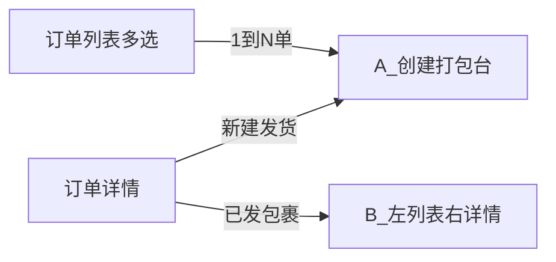
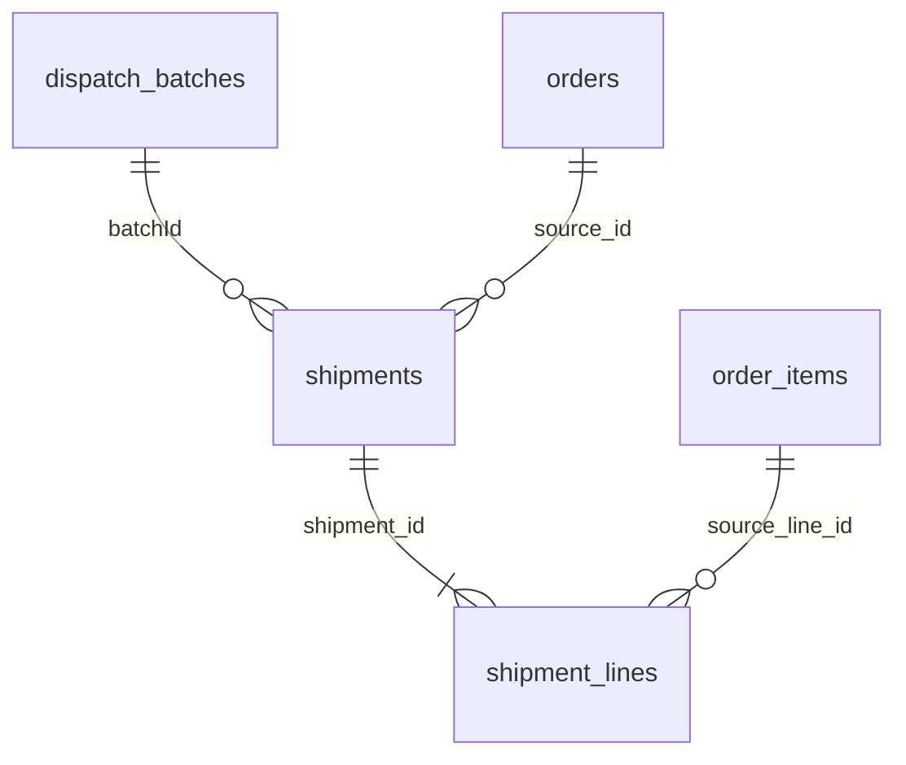

# 统一寄件流水线设计（Unified Dispatch Pipeline）

> 状态：设计（未实现）。本文件为方向定稿的设计文档，供后续拆分实现计划使用。
> 范围：商户在 CMS 侧对已支付订单进行「打包 → 选承运商 → 询价 → 确认下单 → 落库 → 打印」的统一履约寄件流程。
> 业务地域：仅澳大利亚国内。

相关文档：

- 旧方案（方向已变更，仅历史参考）：[`delivery-service-integration-plan.md`](./delivery-service-integration-plan.md)
- 轨迹分阶段思路：[`../../devGuide/logistics-tracking-phased-integration.md`](../../devGuide/logistics-tracking-phased-integration.md)

---

## 1. 目标与边界

### 1.1 目标

- 商户在 **CMS** 一次选择 1..N 个订单，进入统一「打包台」，把订单产品分配到包裹，选择同一个承运商（vendor），询价、确认、下单、落库、打印。
- 各承运商（当日 / 次日 / 多日）走 **同一套阶段管道**，只在需要的阶段按 vendor 定制；不需要的阶段按 vendor 能力位跳过。
- 复用并演进现有 `merchant.shipments` / `merchant.shipment_lines` 模型，C 端已有的 `deliveryShipments` 展示继续可用。

### 1.2 一期边界（不做）

- 不做微信商户面板入口（后续对齐同一后端 API）。
- 不做消费者下单时自动选承运商（C 端运费仍走现有距离计价 `domains/shipping`）。
- 不做 eParcel（合同账号）；一期仅 MyPost Business（BYOK）与其它 vendor。
- 不做跨订单「1 名快递员取 N 单 / 租 H 小时多单」的合并取件（合取）。
- 不做巨型「万能工作台」（同屏既跨单又跨 vendor）。

### 1.3 与现有模块的关系

- **运费计价 `domains/shipping`**：面向 C 端的距离×单价计费，与本模块无关。
- **履约寄件 `domains/shipment`**：本模块演进的核心（手工承运商 + 运单号 → 增加 API 下单能力）。

---

## 2. 术语模型

| 概念 | 含义 |
|------|------|
| **包裹 parcel** | 原子单位；落库为一张 `merchant.shipments` 票；挂 **一个**订单的部分或全部行；有自己的 vendor / 运单号 / 标签。 |
| **默认包裹** | 每个进入本批的订单的 **第一票**，不能为空。 |
| **附加包裹** | 从默认包裹拆分出的第 2+ 票（大件分箱用）。 |
| **批次 batch** | 一次 CMS「确认」会话；含 1..N 个包裹；同一次确认锁定 **一个** vendor。注意：batch ≠ 快递员合取。 |
| **vendor** | 承运商 + 服务档：`auspost` / `auspostExpress` / `doordash` / `gopeople` / `manual`。 |

---

## 3. CMS 界面分层：A 创建打包台 vs B 已发浏览

两阶段界面**完全分离**，避免创建流兼顾历史多 vendor 票的复杂度。

| 界面 | 职责 | 不做什么 |
|------|------|----------|
| **A 创建打包台** | 仅处理「尚未入票的剩余行」：勾选、拆默认/附加包裹、选 vendor、询价、确认下单 | 不展示 / 不编辑已存在包裹 |
| **B 已发包裹浏览** | 左列表 + 右详情：历史票（可多 vendor）、运单号、标签、状态、轨迹 | 不负责新品分配与下单 |

订单详情建议提供两个区块 / Tab：「新建发货」进入 A；「已发包裹」进入 B。订单列表多选只进入 A。



### 3.1 创建流的统一性

同一打包台组件覆盖单订单与多订单：

- 选 1 单：只有一张订单卡，体验等于「单订单打包」。
- 选 N 单：多张订单卡纵向排列，组件复用。
- 列表内：按订单把产品分配到包裹。
- 列表外：整批选定 **一个** vendor。
- 一单要多个 vendor：提交一次后，对剩余行再开一次 A；历史不同 vendor 票在 B 查看。

---

## 4. 打包台交互规则（仅 A）

### 4.1 默认包裹 = 第一票，不能为空

列表外选定 vendor 后，每个仍留在本批的订单，其**默认包裹就是该单的第一张票**，必须至少包含 1 件已勾选可发行。

| 意图 | 操作 |
|------|------|
| 本批发这些行 | 留在默认或附加包裹并勾选 |
| 某行不进本批 | 取消勾选 |
| 某行进同一 vendor 的第 2+ 票 | 新建附加包裹，从默认包裹挪入部分行 |
| 整单不进本批 | **取消选择该订单**（从打包台移除） |

固化规则：

- 进入 A 时：每单一张默认包裹，剩余可发行默认全选。
- **默认包裹禁止为空**：至少 1 件已勾选行；不允许把最后一件挪到附加包裹；不允许默认零勾选却仍保留该订单在本批。
- 想本单零发：只能**取消选择订单**（旧「把默认包裹全部挪空」流程已弃用）。
- 新建附加包裹 → activate；仅允许从默认挪入，且挪后默认仍非空。
- active 取消勾选 → 行退回默认包裹并保持未勾选。
- 提交：每个仍在本批的订单 → 默认包裹 1 票（必有）+ 每个非空附加包裹各 1 票。

### 4.2 分箱移动按钮（大件分箱）

- 默认 → 附加：`>`（挪出 1 件）/ `>>`（挪出该行全部可分配 qty）。
- 附加 → 默认：`<`（挪回 1 件）/ `<<`（挪回全部）。
- 移动以 **数量（qty）** 为单位，剩余未发计算随之按 qty 跟进（见第 6 节）。

### 4.3 列表外 Vendor 区

- 选择 vendor + 预约取货时间（per-booking 可选）。
- 语义：本批所有勾选包裹走**同一承运商**。

---

## 5. 已发包裹浏览（B）

- 左列表：该订单（或筛选范围）下的 shipments，显示 carrier、tracking、状态、batch 标记。
- 右详情：行明细、地址快照、标签入口、取消（按 vendor 能力）、轨迹。
- 「继续发剩余」跳回 A（带入 `orderId`）。
- 多单 batch：某票可显示 `batchId`，据此查看「同批其他包裹 / 订单」。

---

## 6. 剩余未发计算、性能与前端数据量

### 6.1 计算公式（以订单行为唯一键，不以 productId）

```text
allocatedQty(sourceLineId)
  = SUM(shipment_lines.quantity)
    WHERE source_line_id = sourceLineId
      AND shipment.status IN (pending, ready, shipped, booked)

remainingQty = GREATEST(order_item.quantity - allocatedQty, 0)
```

- 唯一键是 `order_item.id`（= `shipment_lines.source_line_id`），不能只用 `productId`：同单多行同产品、跨票部分数量都会错配。
- `cancelled` / `failed` 票不计入 allocated；`pending`（预占）必须计入，避免并发重复发货。
- 打包台草稿内部另维护 `draftAllocatedQtyBySourceLineId`；`>`/`>>` 只在同一总 remaining 内搬运，不改变服务器 remaining。

### 6.2 批量加载（禁止 N+1）

不得对所选订单逐单调用单订单汇总接口。固定为两类主查询：

1. 一条 SQL 批量取所选 `orderIds[]` 的订单头、地址、order items（只取打包台字段）。
2. 一条聚合 SQL 对全部所选订单 `GROUP BY source_line_id`，一次返回 `allocatedQty`。
3. 后端合并后只返回 `remainingQty > 0` 的行。

复杂度约为 `O(所选订单数 + 剩余订单行数)`，不是 `O(历史包裹数)`。

### 6.3 前端数据量控制

- 打包台 API **只**返回：订单号、收件信息、剩余订单行、产品名 / SKU、`remainingQty`、weight / LWH。
- **不**返回：历史包裹列表、标签 PDF、vendor 原始响应、产品大图、已发完的行。
- 历史票、标签由 B 组件按 shipment id 分页 / 懒加载。
- CMS 一次最多选择 **50** 个订单（默认值，放 platform settings 可配置）；超过分页分批处理。

### 6.4 索引

新增 migration 放 `xituan_backend/migrations/`（不改 `migrations_stable/`）：

- 现有 `shipments(merchant_id, source_type, source_id)`：定位所选订单的票。
- 现有 `shipment_lines(merchant_id, shipment_id)`：join。
- 新增 `shipment_lines(merchant_id, source_line_type, source_line_id)`：按订单行汇总与并发校验。
- 新增 `shipments(merchant_id, batch_id)`：同批反查。
- 新增 `dispatch_batches(merchant_id, idempotency_key)` unique：防重复确认。

结论：性能风险不在 qty 计算本身，而在逐订单汇总造成的 N+1 与缺 `source_line_id` 索引。按上面实现即可支撑 50 单、数百行。

---

## 7. 阶段管道（标准输入 / 输出）

每一阶段输入 / 输出均为平台规范化 DTO，不把 vendor 原始字段暴露到订单域。**跳过 = adapter 声明该 capability 关闭，orchestrator 透传上一阶段标准输出；禁止在各处散落 if-vendor 分支。**


| Stage | 标准输入 | 标准输出 | 可跳过场景 |
|-------|----------|----------|------------|
| BuildParcels | 打包台：`orderIds[]` + 勾选 / 包裹分配 | `parcelDrafts[]`（每票：orderId、lines[sourceLineId+qty]、weight、shipTo） | 否 |
| SelectVendor | 列表外单 vendor + 商户凭证引用 | vendorCapabilities | 否 |
| QuotePreview | parcels + 箱型 | quoteLines（sender / receiver / price / pickup） | manual 手填单号时跳过 |
| ConfirmBook | quoteId + idempotencyKey | bookingResult（external ids、tracking、label） | 无显式支付（一期所有 vendor 都不弹支付窗） |
| PersistShipment | confirmed + external ids | shipmentIds[] + batchId | 否（手工也要落库） |
| PrintLabel | shipmentIds | labelAssets / printTemplateJob | vendor 无标签则走本地打印模板 |

> 一期不做 BookingOptions 里的 `batchPickupN` / `hireHoursH`（跨单合取）。预约取货时间作为 per-booking 可选字段保留。

---

## 8. 承运商范围与能力矩阵

一期 vendor：

- `auspost`（MyPost Business 标准，约 1–3 天）
- `auspostExpress`（Express，约 1 个工作日 / 次日）
- `doordash`（当日）
- `gopeople`（当日；含雇司机按时段与多单能力，但合取功能搁置）
- `manual`（其它承运商，仅手填运单号，无平台承诺时效）

**选 vendor 即选固定时效**——不另建抽象 `serviceClass` 状态机，时效以 vendor 产品本身 + UI 文案 + 过滤表达。

| Capability | manual | auspost | auspostExpress | doordash | gopeople |
|------------|--------|---------|----------------|----------|----------|
| quoteApi（询价） | no | yes | yes | yes | yes |
| explicitPayUi（显式支付窗） | no | no | no | no | no |
| vendorLabelPdf（承运商标签） | no | yes | yes | 待对接确认 | 待对接确认 |
| customPrintTemplate（本地模板备用） | yes | fallback | fallback | fallback | fallback |
| trackingWebhook（轨迹/异常推送） | n/a | 必做 | 必做 | 必做 | 必做 |
| trackingUrlTemplate（手动查件外链） | 可选 | 可选 | 可选 | 可选 | 可选 |
| cancellableAfterHandover（交寄后可平台取消） | no | no | no | no | no |

探测脚本参考：`xituan_backend/scripts/gopeople-quote-test.ts`、`doordash-quote-test.ts`、`sherpa-quote-test.ts`。

### 8.1 Adapter 与目录边界

```text
domains/dispatch/          # orchestrator + batch 实体（新）
domains/shipment/          # 现有票模型演进（Persist 写这里）
vendors/auspost-mpb/       # auspost + auspostExpress 共享 MPB 对接
vendors/doordash/
vendors/gopeople/
vendors/manual/
```

统一 port（仅实现 vendor 声明的 capability）：

```text
validateConnection | getQuotes | createBooking | getLabel | cancel | track
```

Admin/CMS API 挂在现有 admin 认证体系下（与 `/api/admin/shipments` 同级或扩展）。

---

## 9. 凭证与费用（BYOK）

- **商户自带凭证（BYOK）**：API key / 识别 ID 属于商户；调用 API、下单、付款的责任人 = 商户账号侧。
- **不使用平台总账号**；**平台不垫付运费**。
- 一期 **不弹支付窗**：视为商户侧已绑卡自动扣款 / 合同账单，或 manual vendor 无扣款。
- 平台一期不记履约成本账；询价结果快照落库备查。
- **凭证自检**：打包台入口对凭证未就绪的 vendor 灰显并提示（避免批量确认中途失败）。

---

## 10. 产品物理量、装箱与常备箱

### 10.1 产品字段（一等列）

- `weightGrams`（int）
- `lengthMm` / `widthMm` / `heightMm`（int，可空）
- 不单独存 `volumeCm3`，体积由三边即时计算。
- 商户稍后手动回填数据。

### 10.2 常备箱型（商户 settings）

放 **商户 settings**（扩展 `epMerchantSettingCategory.SHIPPING`），不同入驻商户各自配置；数量 **1..5** 个（最少 1，最多 5）：

```text
standardBoxes: [
  {
    code,
    name,
    innerLengthMm,
    innerWidthMm,
    innerHeightMm,
    tareGrams,             // 必填：空箱自重
    maxGrossWeightGrams?   // 可选：箱体允许的最大总重
  } x1..5
]
fallbackParcel: {
  defaultBoxCode?,                // 指向某个常备箱
  requireManualWeight: boolean    // 无尺寸数据兜底时是否强制人工填重量
}
```

预留：单件超出最大常备箱时的告警文案（i18n）。

### 10.3 三种数据完整度 → 询价测量来源

| 情况 | 处理 |
|------|------|
| **全部产品有重量 + 三边** | 自动跑 3D 装箱，选能装下的最小常备箱得出计费尺寸；重量 = Σ(件重) + 箱 tare；可直接询价 |
| **部分有** | 已知件重量求和；缺数据的件标红提示补录；该包裹尺寸退回人工选常备箱或整包人工填重量 + 箱型；不静默用 0 |
| **全部没有** | 走 `fallbackParcel`：人工填包裹总重量 + 选常备箱（或自定义三边）；`requireManualWeight=true` 时不填不让提交 |

要点：重量对所有 vendor 询价几乎必需；尺寸主要用于选箱 / 体积重。缺数据时降级到人工输入，而不是拿产品聚合硬凑。

### 10.4 3D 装箱与选箱

采用现成库 **`binpackingjs`（v4.x，MIT）**，不自造算法：

- 前后端通用：TS 全类型、零运行时依赖、ESM+CJS，Node 与浏览器都可用，`binpackingjs/3d` 可 tree-shake。
- API：`pack3D({ bins, items })` → `{ packedBins, unfitItems }`，支持旋转、多箱。

用法约定：

1. **能否放进某箱**：用箱体内部尺寸，`bins=[该常备箱]`、`items=包裹内各件`；`unfitItems` 为空且未超 `maxGrossWeightGrams` ⇒ 放得下。
2. **自动选箱**：按内部容积升序遍历所有常备箱，第一个全部装下且未超重的自动选中；CMS 可人工改选更大箱，但不得选装不下 / 超重的箱。
3. **超尺寸告警**：最大常备箱仍装不下，或任一单件任何朝向都放不进最大常备箱 ⇒ 前端告警「超出常备箱，请拆分为多个包裹或改用更大包装」，该包裹不允许自动询价（可转人工尺寸）。
4. **询价总重量**：`grossWeightGrams = Σ(product.weightGrams × quantity) + selectedBox.tareGrams`；不得漏算箱重。
5. **体积重**：以自动选中的箱体计费尺寸为准。一期只存一组三边即作为计费尺寸；日后若需区分内外尺寸再拆 `inner*` / `outer*`。

放置层：`domains/shipping` 或 `domains/dispatch` 下的 `parcel-box-fit.util.ts`（封装 binpackingjs，暴露 `fitIntoStandardBoxes(items, boxes)`），前端复用同一 util（共享层按 `xituan-codebase-change-scope` 决定）。引入依赖遵守项目规则，实现期确认版本与放置层。

---

## 11. 数据模型与持久化（过程中 vs 确认后）

### 11.1 原则

| 阶段 | 存哪里 | 格式 |
|------|--------|------|
| 打包台进行中（勾选、`>`/`>>`、选 vendor、询价） | 不落库；CMS 会话内前端 state | 内存 DTO `DispatchSessionDraft` |
| 点击确认、调用 vendor 前 | 短事务重新校验剩余 qty，写 `pending` batch / shipment / lines 作数量预占 | 关系表；同一 `idempotency_key` 只允许一批 |
| vendor 成功后 | 预占票更新为 `booked/ready`，回填外部 ID、tracking、标签 | 关系表 + jsonb 快照 |
| vendor 失败后 | 预占票置 `failed/cancelled`，释放 qty；保留 batch 失败审计 | 不计入 allocatedQty |
| 订单主表 | 不把运单号铺回 `orders` 行；订单详情按 `source_type=order` + `source_id` 查 shipments | — |

订单本身（地址、行、金额）仍在 `merchant.orders` / order items；包裹只通过 `source_id` 挂订单。

### 11.2 会话草稿（确认前）

```text
DispatchSessionDraft
  merchantId
  vendorCode                  // auspost | auspostExpress | doordash | ...
  pickupAt?                   // timestamptz ISO
  quoteSnapshot?              // 询价规范化结果
  orders[]:
    orderId
    parcels[]:                // [0] = 默认包裹，必有且 qty>0
      localKey                // 前端临时 id
      lines[]: { sourceLineId, productId, quantity }
```

确认时不能只「成功后落库」：先在短事务中锁定涉及的 `order_item`、重新计算 qty、写入 pending 预占后提交，再调用 vendor（网络调用不持有数据库锁）。

### 11.3 确认后落库



**`merchant.dispatch_batches`**（同一次确认会话；≠ 快递员合取）

- `id`、`merchant_id`
- `vendor_code`
- `status`（pending / booked / partial_failed / cancelled…）
- `pickup_at`（timestamptz，可空）
- `quote_snapshot` jsonb（金额、服务码、vendor 原始 id）
- `external_batch_ref`（vendor 若有总单号，可空）
- `idempotency_key`
- `created_at` / `updated_at`

**`merchant.shipments`**（一张票 = 一个包裹；演进现表）

- 现有：`source_type=order`、`source_id=orderId`、`carrier`、`tracking_number`、`ship_from/to_snapshot`、`status`…
- 新增：`batch_id`、`external_shipment_id`、`label_meta` jsonb、`quoted_amount`、`pickup_at`；vendor 与 `carrier` 对齐。
- 多选订单一次确认：生成 N 张 shipment（每订单默认票 + 各附加票），共享同一 `batch_id`。

**`merchant.shipment_lines`**（结构不变，qty 级）

- `source_line_type=order_item`、`source_line_id=order_item.id`、`product_id`、`quantity`、`product_name_snapshot`。
- 同一 `order_item` 可出现在多张票上，qty 之和 ≤ 订单行 qty。

订单表不新增 `delivery_batch_id` 列（一单可多次提交、多票，挂订单上会乱）；反查同批一律走 `batch_id`。

### 11.4 后期怎么查

| 需求 | 查法 |
|------|------|
| 某订单所有包裹（B 左列表） | `shipments WHERE merchant_id=? AND source_type=order AND source_id=:orderId` |
| 某包裹明细 | `shipment` + `shipment_lines` |
| 同一次批量提交的所有票 | `shipments WHERE batch_id=:batchId` |
| 同批涉及哪些订单 | 上式 `DISTINCT source_id` |
| 从某票看同批其他订单 | 取该票 `batch_id` → 查同 batch 其他 `source_id` |
| 订单剩余可发 | 订单行 qty − `SUM(shipment_lines.quantity)`（同 source_line_id，排除 cancelled/failed 票） |
| C 端展示 | 现有 `deliveryShipments` by order（不变） |

「整批批量处理」在本期含义：CMS 一次选多单、一次确认、共享 `batch_id`，便于打印 / 对账 / 回看；不是 vendor 侧 1 人取 N 单。

### 11.5 并发、失败与幂等

- 确认请求带 `idempotencyKey`；相同 key 返回既有结果，不重复调用 vendor。
- 确认事务按稳定顺序锁定涉及的 `order_item`，重新聚合 allocatedQty；剩余不足则返回 collection `lineErrors`，前端刷新。
- 事务写 pending 预占后提交，再调用 vendor，避免长事务。
- 部分票成功：batch `partial_failed`；成功票保留，失败票改 `failed/cancelled` 并释放 qty。
- vendor 超时但结果未知：不立即释放，标 `confirmation_unknown`，按幂等 key 查询 vendor 结果后再确认或释放。
- 取消票：仅 vendor 取消成功（或手工票明确取消）后才释放 qty。

---

## 12. 订单状态与部分/全部打包

### 12.1 现状（延续，不新增状态）

沿用 [`order-shipment-status-sync.util.ts`](../../../xituan_backend/src/domains/shipment/utils/order-shipment-status-sync.util.ts)：

| 打包情况 | 订单 `status` 变化 |
|----------|-------------------|
| 部分产品 / 数量入票 | 不变（通常仍 `processing`），`resolveTargetOrderStatus` 返回 `null` |
| 全部数量入票且票均 `ready`/`shipped` | → `ready_for_delivery` |
| 全部数量入票且票均 `shipped` | → `in_delivery` |

部分打包没有独立订单状态；「是否还有货要包」的真相在 `shipment_lines` qty，不在 `orders.status`。

### 12.2 列表如何跳过「已全部备妥」

- 粗筛（订单状态）：选 `processing` + `deliveryOption=delivery`（及业务允许的其它未完结态），默认排除 `ready_for_delivery` / `in_delivery` / `delivered` / `cancelled`…
- 精筛（剩余 qty）：对粗筛结果批量算 `remainingQty`，`SUM(remaining)=0` 的订单不进打包台（防止状态滞后或手工改状态的脏数据）。

### 12.3 不新增「部分备妥」状态

新增 `partially_ready` 收益小、代价大（枚举、CMS/微信筛选、通知、取消/退款白名单、活动单查询、C 端展示、报表全要改），且「部分」本质是 qty，有状态也替代不了 `remainingQty` 校验。

替代方案（已确认）：CMS 列表加 **派生字段** `fulfillmentProgress: { allocatedQty, totalQty }`（及可选 `hasPartialShipment`），由聚合算出，不写进 `epOrderStatus`。

---

## 13. 履约闭环（时效 / 轨迹 / 取消）

### 13.1 时效

选 vendor 即选固定时效（见第 8 节）。能力矩阵写明各 vendor SLA 文案，打包台展示「本服务约…」。不建独立 serviceClass 状态机。

### 13.2 轨迹 / Webhook（P0，API vendor 必做）

- 已对接 API 的 vendor 必须提供轨迹 + 异常 webhook（或官方推送）→ 回写 `shipment` 状态 → 再驱动订单状态（如全部票 `shipped` → `in_delivery`；投递完成规则实现期定）。
- 异常事件：平台负责提醒 + 状态回写；深度异常处理（再投 / 退回工单）由商户与 vendor 线下协商，一期不做工单流程。

### 13.3 手动 vendor 查件

`manual`（及任何有固定「URL 模板 + 运单号」的承运商）在 CMS / C 端提供「在承运商站点查看」外链：

- 默认新窗口打开（`target="_blank"`、`rel="noopener noreferrer"`）。
- 仅当该承运商页面允许嵌入时才考虑 iframe，默认外链更稳。
- 对齐 [`logistics-tracking-phased-integration.md`](../../devGuide/logistics-tracking-phased-integration.md) 的分阶段思路。

### 13.4 取消边界（食品向）

- 默认：**已接单 / 已发出 / 已交承运商 → 不可在平台一键取消**。
- 需取消走人工协商（客服 / 商户与 vendor）。
- 状态机明确标注 `cancellable=false` 的节点；各 vendor「不可取消」精确映射到官方状态名，实现期对照 API。

### 13.5 Cutoff（商户自负 + 轻量防疏忽，不强制）

不做「过点禁止下单」的硬闸。可选轻量提醒：

1. 选当日类 vendor（DoorDash / GoPeople）且已过商户自填「建议最晚下单时刻」→ 黄灯警告，仍可提交。
2. 今日工作台列表：按 vendor 类型标「建议今日发出」的 `processing` 单（启发式）。
3. 设置页文案：平台不保证 cutoff，超时履约责任在商户。

日后要硬闸，再在商户 settings 加 `enforceCutoff: boolean`。

---

## 14. 标签打印

- 优先使用 vendor API 返回的 PDF / 文本标签素材。
- 无标签能力的 vendor（如 `manual`）走本地打印模板（复用 CMS 现有 TemplateBatchPrinter 思路，`listColumnsPreset: 'shipment'`）。
- 打印内容按商户本地时间（business timezone）排版。

---

## 15. 时区与错误

- 存库统一 `timestamp with time zone`；客户端按规则自动转换显示。
- 打印按商户本地时间。
- 业务错误统一走 `eBusinessErrorCode`；确认阶段的行级校验失败用 collection `lineErrors`（参见业务错误 A/B/AB 规范）。

---

## 16. 实现分期

1. 本设计文档 + 旧文档交叉引用 + 能力缺口路线图（本任务）。
2. 产品 `weightGrams` / LWH 列 + 汇总 util/API；CMS 商品可编辑字段；商户常备箱 1..5（含 tare）。
3. `dispatch_batches` + `shipments` / `shipment_lines` 扩展 + qty 分配校验 + 索引。
4. CMS A 创建打包台（`>`/`>>`、默认非空、取消订单）+ manual vendor（含 tracking URL 模板）。
5. CMS B 已发浏览（左列表右详情）。
6. AusPost MPB（`auspost` + `auspostExpress`）+ 轨迹 / webhook。
7. DoorDash / GoPeople + 轨迹 / webhook。
8. 标签：vendor 素材优先，本地模板备用。
9. P1：多 vendor 询价对比；可选 cutoff 黄灯提醒。

后续（非本轮范围）：微信商户面板对齐同一 API；C 端多运单展示；商品×vendor 运输限制；地址校验 / 保价 / 对账；多仓、合取路径、Checkout 实时询价、理赔 RMA。

---

## 17. 待确认 / 弱开放项

- DoorDash / GoPeople 具体 auth 字段名以官方 onboarding 为准。
- `binpackingjs` 放置层（codebase 共享 vs 各 app 各自依赖）实现期定。
- 常备箱 `maxGrossWeightGrams` 是否一期启用（`tareGrams` 已确认必填并参与计费）。
- 各 vendor「不可取消」节点精确映射到官方状态名（实现期对照 API）。
- Cutoff 黄灯是否一期就做（默认：文案 + 设置说明先做，黄灯可选）。
- 投递完成 → 订单 `delivered` 的判定规则（依赖各 vendor 轨迹事件）。
